

  
Universidad Peruana de Ciencias Aplicadas 
Carrera de Ingeniería de Software  

<strong>1ACC0238</strong>  
<strong>Aplicaciones para Dispositivos Móviles</strong>

NRC  
<strong>4950</strong>

<strong>Informe del Trabajo Final</strong>

Docente  
<strong>Mayta Guillermo, Jorge Luis</strong>  

Equipo  
<strong>CollabTech</strong>

Proyecto  
<strong>CollabPro</strong>  

<strong>Integrantes</strong> 

<table border="0" style="border-collapse: collapse; border: none; margin: 0 auto; background-color: transparent;">
  <tr style="border: none;">
    <th style="border: none; text-align: center; padding: 5px 15px;">Código</th>
    <th style="border: none; text-align: left; padding: 5px 15px;">Apellidos y Nombres</th>
  </tr>
  <tr style="border: none;">
    <td style="border: none; text-align: center; padding: 5px 15px;">U201717085</td>
    <td style="border: none; text-align: left; padding: 5px 15px;">Revilla Quispe, Renzo Zamir</td>
  </tr>
  <tr style="border: none;">
    <td style="border: none; text-align: center; padding: 5px 15px;">U20241D922</td>
    <td style="border: none; text-align: left; padding: 5px 15px;">Quispe Serrano, Julio Frank</td>
  </tr>
  <tr style="border: none;">
    <td style="border: none; text-align: center; padding: 5px 15px;">U20221C803</td>
    <td style="border: none; text-align: left; padding: 5px 15px;">Rocca Leon, Anhelo Rodrigo</td>
  </tr>
  <tr style="border: none;">
    <td style="border: none; text-align: center; padding: 5px 15px;">U20231H059</td>
    <td style="border: none; text-align: left; padding: 5px 15px;">Garcia Villanueva, Leonardo Rafael</td>
  </tr>
  <tr style="border: none;">
    <td style="border: none; text-align: center; padding: 5px 15px;">U20211D989</td>
    <td style="border: none; text-align: left; padding: 5px 15px;">Vallejo Trujillo, Fabio Cesar</td>
  </tr>
</table>

  
<strong>Período 202620</strong> 
<strong>Setiembre 2026</strong>  

---

# Registro de Versiones del Informe

El objetivo de esta sección es resumir las modificaciones relevantes que se realizan al informe durante el ciclo de vida del proyecto.

| Versión | Fecha      | Autor            | Descripción de modificación                                                                                                                                                                                           |
| ------- | ---------- | ---------------- | --------------------------------------------------------------------------------------------------------------------------------------------------------------------------------------------------------------------- |
| V1.0    | 10/09/2026 | Equipo CollabTech | Creación de la primera versión del informe para la entrega AV1. Se incluyen las secciones preliminares, el Capítulo I (Startup Profile, Solution Profile, Segmentos) y el Capítulo II (Requirements y Strategic DDD). |

---

## Project Report Collaboration Insights

El repositorio para el Project Report se encuentra alojado en la organización de GitHub del equipo: `https://github.com/AppMoviles2026/report`.

**- AV1**

Durante la entrega AV1, las actividades de elaboración del informe se gestionaron utilizando un enfoque de trabajo en paralelo. Cada integrante clonó el repositorio y trabajó en su rama correspondiente según la división de los capítulos I y II.

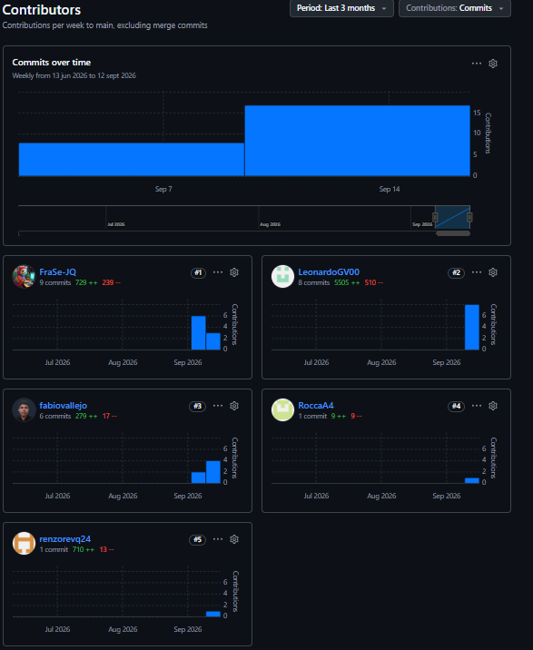

Repositorio del reporte: https://github.com/AppMoviles2026/report 

---

## Contenido

- [Registro de Versiones del Informe](#registro-de-versiones-del-informe)
- [Project Report Collaboration Insights](#project-report-collaboration-insights)
- [Student Outcome](#student-outcome)
- [Objetivos SMART](#objetivos-smart)
- [Capítulo I: Presentación](#capítulo-i-presentación)
  - [1.1. Startup Profile](#11-startup-profile)
    - [1.1.1. Descripción de la Startup](#111-descripción-de-la-startup)
    - [1.1.2. Perfiles de integrantes del equipo](#112-perfiles-de-integrantes-del-equipo)
  - [1.2. Solution Profile](#12-solution-profile)
    - [1.2.1. Antecedentes y problemática](#121-antecedentes-y-problemática)
    - [1.2.2. Lean UX Process](#122-lean-ux-process)
  - [1.3. Segmentos objetivo](#13-segmentos-objetivo)
- [Capítulo II: Requirements Development and Software Solution Design](#capítulo-ii-requirements-development-and-software-solution-design)
  - [2.1. Competidores](#21-competidores)
    - [2.1.1. Análisis competitivo](#211-análisis-competitivo)
    - [2.1.2. Estrategias y tácticas frente a competidores](#212-estrategias-y-tácticas-frente-a-competidores)
  - [2.2. Entrevistas](#22-entrevistas)
    - [2.2.1. Diseño de entrevistas](#221-diseño-de-entrevistas)
    - [2.2.2. Registro de entrevistas](#222-registro-de-entrevistas)
    - [2.2.3. Análisis de entrevistas](#223-análisis-de-entrevistas)
  - [2.3. Needfinding](#23-needfinding)
    - [2.3.1. User Personas](#231-user-personas)
    - [2.3.2. User Task Matrix](#232-user-task-matrix)
    - [2.3.3. User Journey Mapping](#233-user-journey-mapping)
    - [2.3.4. Empathy Mapping](#234-empathy-mapping)
    - [2.3.5. Big Picture EventStorming](#235-big-picture-eventstorming)
    - [2.3.6. Ubiquitous Language](#236-ubiquitous-language)
  - [2.4. Requirements Specification](#24-requirements-specification)
    - [2.4.1. User Stories](#241-user-stories)
    - [2.4.2. Impact Mapping](#242-impact-mapping)
    - [2.4.3. Product Backlog](#243-product-backlog)
  - [2.5. Strategic-Level Domain-Driven Design](#25-strategic-level-domain-driven-design)
    - [2.5.1. EventStorming](#251-eventstorming)
    - [2.5.2. Context Mapping](#252-context-mapping)
    - [2.5.3. Software Architecture](#253-software-architecture)
  - [2.6. Tactical-Level Domain-Driven Design](#26-tactical-level-domain-driven-design)

- [Conclusiones](#conclusiones)
- [Glosario](#glosario)
- [Bibliografía](#bibliografía)
- [Anexos](#anexos)

---

## Student Outcome

**ABET EAC - Student Outcome 7:** La capacidad de adquirir y aplicar nuevos conocimientos según sea necesario, utilizando estrategias de aprendizaje apropiadas.

| Criterio específico                                                                                                                         | Acciones realizadas                                                                                                                                                                                                                                                                                                                                                                                                                                                                                                                                                                                                                                                                                                                                                                                                                                                                                                                                                                                                                                                                                                                                                                                                                                                                                                                                                                                                                                                                                                                                            | Conclusiones                                                                                                                                                                                                                                                                                                                        |
| ------------------------------------------------------------------------------------------------------------------------------------------- | -------------------------------------------------------------------------------------------------------------------------------------------------------------------------------------------------------------------------------------------------------------------------------------------------------------------------------------------------------------------------------------------------------------------------------------------------------------------------------------------------------------------------------------------------------------------------------------------------------------------------------------------------------------------------------------------------------------------------------------------------------------------------------------------------------------------------------------------------------------------------------------------------------------------------------------------------------------------------------------------------------------------------------------------------------------------------------------------------------------------------------------------------------------------------------------------------------------------------------------------------------------------------------------------------------------------------------------------------------------------------------------------------------------------------------------------------------------------------------------------------------------------------------------------------------------- | ----------------------------------------------------------------------------------------------------------------------------------------------------------------------------------------------------------------------------------------------------------------------------------------------------------------------------------- |
| **Actualiza conceptos y conocimientos necesarios para su desarrollo profesional y en especial para su proyecto en soluciones de software.** | **Quispe Serrano, Julio Frank:** AV1: Actualicé mis conocimientos investigando de forma autónoma la metodología ágil Lean UX y la técnica de las 5W's y 2H's para redactar correctamente el Solution Profile, los Assumptions y el Canvas del proyecto.  **Vallejo Trujillo, Fabio Cesar:** AV1: Aprendí a utilizar la herramienta UXPressia de manera autodidacta para estructurar el Needfinding (User Personas y Journey Maps) y actualicé mis nociones sobre métricas para el análisis competitivo de plataformas de marketing.  **Garcia Villanueva, Leonardo Rafael:** AV1: En este avance tuve que realizar la especificación de los requisitos del proyecto, y para ello actualicé mis conocimientos técnicos sobre Behavior-Driven Development (BDD), estudiando a fondo la sintaxis del estándar Gherkin para redactar historias de usuario sin ambigüedades.  **Revilla Quispe, Renzo Zamir:** AV1: Tuve que investigar y actualizar mis conocimientos teóricos sobre Domain-Driven Design (DDD) y modelado EventStorming para poder definir correctamente el lenguaje ubicuo y los Bounded Contexts a nivel estratégico.  **Rocca León, Anhelo:** AV1: Para el desarrollo de la arquitectura, investigué de manera autónoma los fundamentos del modelo C4 (Context, Container, Component, Code) y cómo aplicarlo para diagramar la infraestructura técnica del sistema.                                                                                                                                                    | **AV1:** Durante esta entrega, todo el equipo demostró la capacidad de investigar y aplicar metodologías y estándares de la industria (como Lean UX, Gherkin, DDD y C4 Model) que no se dominaban del todo al inicio del ciclo, integrándolos exitosamente en la documentación formal de requerimientos y arquitectura del sistema. |
| **Reconoce la necesidad del aprendizaje permanente para el desempeño profesional y el desarrollo de proyectos en soluciones de software.**  | **Quispe Serrano, Julio Frank:** AV1: Comprendí que estructurar un modelo de negocio B2B requiere investigar constantemente el mercado y validar las hipótesis (Hypothesis Statements) iterativamente para asegurar que el software brinde valor real.  **Vallejo Trujillo, Fabio Cesar:** AV1: Reconocí la importancia de adaptar las herramientas de investigación a los usuarios reales; entender las frustraciones de los creadores de contenido me exigió buscar continuamente nuevos enfoques de empatía (Empathy Mapping).  **Garcia Villanueva, Leonardo Rafael:** AV1: Identifiqué que mis conocimientos sobre Gherkin para la elaboración de las User Stories necesitaban ser reforzados, y también reconocí la necesidad de continuar investigando y aprendiendo sobre la correcta gestión del Product Backlog y la elaboración del Impact Mapping para aplicarlos correctamente durante el desarrollo de este proyecto y así mejorar tanto como mi desempeño como la calidad del proyecto.  **Revilla Quispe, Renzo Zamir:** AV1: Asimilé que el diseño a nivel estratégico nunca es estático; dominar los flujos de dominio y la delimitación de contextos (Context Mapping) me exigió mantener una postura de estudio constante de la literatura técnica.  **Rocca León, Anhelo:** AV1: Evidencié la necesidad de consultar fuentes académicas y documentación oficial constantemente para justificar decisiones de arquitectura de bases de datos y garantizar la viabilidad del despliegue tecnológico. | **AV1:** Como equipo, comprendemos que el ecosistema de startups y las tecnologías de desarrollo evolucionan rápidamente. Reconocemos que adoptar una postura proactiva hacia la lectura de documentación oficial y literatura especializada es fundamental para el éxito y la escalabilidad del proyecto.                          |

## Objetivos SMART

**Quispe Serrano, Julio Frank:**

Plan: Al finalizar mi carrera, continuaré fortaleciendo mis competencias en desarrollo de software y arquitectura de soluciones, complementando los conocimientos adquiridos durante mi formación universitaria con nuevas tecnologías y buenas prácticas utilizadas en proyectos profesionales. Buscaré mejorar progresivamente mis habilidades técnicas mediante proyectos propios, certificaciones y experiencias prácticas que me permitan asumir mayores responsabilidades dentro de equipos de desarrollo.

Objetivo SMART 1: Durante los primeros 9 meses después de finalizar la carrera, desarrollaré y desplegaré al menos 2 proyectos de software de complejidad media utilizando tecnologías de backend, frontend, bases de datos y servicios cloud. En cada proyecto aplicaré buenas prácticas de arquitectura de software y documentaré las decisiones técnicas tomadas, con el objetivo de fortalecer mi portafolio profesional y demostrar mi capacidad para desarrollar soluciones completas.

Objetivo SMART 2: Durante los primeros 12 meses después de finalizar la carrera, obtendré al menos 2 certificaciones o completaré 2 programas de especialización relacionados con arquitectura de software, computación en la nube o DevOps. Aplicaré los conocimientos adquiridos en al menos uno de mis proyectos personales, incorporando aspectos como despliegue en la nube, integración continua o contenerización para fortalecer mis competencias profesionales.

 

**Vallejo Trujillo, Fabio Cesar:**

Plan: Al terminar mi carrera, continuaré desarrollando mis conocimientos en arquitectura de software, infraestructura cloud y desarrollo de aplicaciones, buscando fortalecer especialmente mi capacidad para diseñar soluciones mantenibles y escalables. Complementaré la experiencia obtenida en proyectos universitarios con formación especializada y proyectos que me permitan aplicar diferentes patrones, arquitecturas y servicios tecnológicos.

Objetivo SMART 1: En los primeros 12 meses después de finalizar la carrera, diseñaré e implementaré al menos 2 aplicaciones utilizando principios de arquitectura limpia y buenas prácticas de desarrollo, documentando su arquitectura mediante diagramas y explicando las principales decisiones técnicas. Al menos uno de estos proyectos será desplegado utilizando servicios cloud para demostrar conocimientos tanto de desarrollo como de infraestructura.

Objetivo SMART 2: Durante los primeros 6 meses posteriores a mi graduación, completaré al menos 2 cursos o certificaciones relacionados con arquitectura cloud, DevOps o diseño de sistemas escalables. Como evidencia de aprendizaje, implementaré al menos 3 mejoras técnicas en mis proyectos personales, tales como pipelines de integración y despliegue continuo, contenerización, monitoreo o servicios administrados en la nube.

 

**Garcia Villanueva, Leonardo Rafael:**

Plan: Al concluir con mi carrera, continuaré desarrollando mis competencias profesionales mediante un proceso de aprendizaje continuo donde practicaré el desarrollo de software con las nuevas tecnologías relevantes que salgan en el mercado, incluyendo las emergentes como la inteligencia artificial, agentes de IA y automatización de procesos de programación. De este modo reforzaré mis conocimientos adquiridos durante la carrera e incorporaré nuevos conocimientos que me permitan tener un perfil profesional actualizado.

Objetivo SMART 1: En los 6 primeros meses después de haber finalizado la carrera ampliaré mis conocimientos y habilidades para el desarrollo Full Stack, enfocándome principalmente en Java con Spring Boot para el backend, Vue.js para el frontend y MongoDB para la base de datos. Para ello, crearé 2 proyectos personales de complejidad media y alta, con el propósito de consolidar mi aprendizaje y tener un portafolio que demuestre mi crecimiento profesional.

Objetivo SMART 2: Durante los primeros 9 meses después de haber finalizado la carrera tomaré 2 o más cursos relacionados con las tecnologías emergentes, priorizando especialmente áreas como el uso profesional y ético de inteligencia artificial, agentes de IA y automatización aplicada al desarrollo de software. Luego, aplicaré lo aprendido elaborando un proyecto personal pequeño o mediano por cada curso finalizado, para mantener actualizados mis conocimientos y reforzar mi perfil como Ingeniero de Software.

 

**Revilla Quispe, Renzo Zamir:**

Plan: Al finalizar mi carrera, continuaré fortaleciendo mis conocimientos en desarrollo web y móvil, enfocándome también en mejorar mis competencias en diseño y organización de sistemas de software. Buscaré complementar mis conocimientos técnicos con habilidades de gestión y trabajo colaborativo que me permitan participar progresivamente en proyectos de mayor complejidad y asumir responsabilidades dentro de equipos de desarrollo.

Objetivo SMART 1: Durante los primeros 12 meses después de finalizar la carrera, desarrollaré al menos 2 aplicaciones, una orientada al entorno web y otra al entorno móvil, aplicando principios de Domain-Driven Design y buenas prácticas de arquitectura. Cada proyecto contará con documentación técnica y repositorio público que evidencie el proceso de desarrollo y las decisiones tomadas.

Objetivo SMART 2: En los primeros 12 meses posteriores a mi graduación, completaré al menos 2 cursos especializados relacionados con Domain-Driven Design, arquitectura de software o gestión de proyectos de desarrollo. Aplicaré los conocimientos adquiridos participando en al menos un proyecto colaborativo en el que pueda asumir responsabilidades relacionadas con planificación, organización técnica o coordinación del equipo.

 

**Rocca Leon, Anhelo Rodrigo:**

Plan: Después de finalizar mi carrera, continuaré desarrollando mis competencias en diseño de soluciones de software, experiencia de usuario y arquitectura, buscando complementar mis conocimientos de programación y bases de datos con herramientas que me permitan participar en todo el proceso de construcción de un producto digital. Mantendré un aprendizaje continuo mediante cursos especializados y proyectos prácticos que integren tanto aspectos técnicos como de diseño.

Objetivo SMART 1: Durante los primeros 9 meses después de finalizar la carrera, desarrollaré al menos 2 proyectos de software en los que participe tanto en la definición de la experiencia de usuario como en su implementación técnica. Para cada proyecto elaboraré prototipos, flujos de interacción y una aplicación funcional, con el objetivo de fortalecer mi capacidad para transformar necesidades de usuarios en soluciones digitales.

Objetivo SMART 2: En un periodo máximo de 9 meses después de finalizar la carrera, completaré al menos 2 cursos o certificaciones relacionados con UX/UI, arquitectura de software o diseño de soluciones digitales. Aplicaré los conocimientos obtenidos mejorando al menos 2 proyectos de mi portafolio mediante prototipos, diagramas de arquitectura o evaluaciones de usabilidad que permitan evidenciar mi crecimiento profesional.

---

## Capítulo I: Presentación

### 1.1. Startup Profile

#### 1.1.1. Descripción de la Startup

CollabTech es una startup de tecnología conformada por estudiantes de Ingeniería de Software de la Universidad Peruana de Ciencias Aplicadas (UPC), orientada al desarrollo de soluciones digitales para pequeñas y medianas empresas.

Nuestra propuesta de valor se materializa en CollabPro, un marketplace B2B que conecta empresas con creadores de contenido para gestionar colaboraciones de marketing de forma estructurada, segura y medible. La plataforma permite publicar campañas, definir entregables y compensaciones, gestionar postulaciones y verificar el cumplimiento de las colaboraciones.

CollabPro busca reemplazar la gestión informal mediante mensajes directos y otros canales dispersos por un proceso centralizado que genere mayor confianza entre empresas y creadores y permita medir el rendimiento de las campañas realizadas.

#### 1.1.2. Perfiles de integrantes del equipo

|                        Foto                         | Apellidos y Nombres                |   Código   | Carrera                | Resumen                                                                                                                                                                                                                                                                                                                                                                                                                                                                                                                |
| :-------------------------------------------------: | :--------------------------------- | :--------: | :--------------------- | :--------------------------------------------------------------------------------------------------------------------------------------------------------------------------------------------------------------------------------------------------------------------------------------------------------------------------------------------------------------------------------------------------------------------------------------------------------------------------------------------------------------------- |
|               | Quispe Serrano, Julio Frank        | U20241D922 | Ingeniería de Software | Soy Julio Frank Quispe Serrano, alumno de 5to ciclo de Ingeniería de Software en la UPC. Cuento con una marcada inclinación hacia la programación y la gestión eficiente del tiempo. Mi aporte principal a este grupo de trabajo será la resolución de conflictos técnicos y operativos, aportando una visión pragmática que permita superar eventuales estancamientos en las fases de elaboración del proyecto.                                                                                                       |
|  | Vallejo Trujillo, Fabio Cesar      | U20211D989 | Ingeniería de Software | Soy estudiante de séptimo ciclo de Ingeniería de Software. Me caracterizo por tener conocimientos técnicos en múltiples áreas de software y mantener en orden mis equipos de trabajo para mantener entregables de alta calidad. Puedo aportar al proyecto con mis conocimientos de arquitectura limpia, infraestructura cloud, programación y manteniendo al equipo organizado.                                                                                                                                        |
|              | Garcia Villanueva, Leonardo Rafael | U20231H059 | Ingeniería de Software | Actualmente soy estudiante de sexto ciclo de la carrera de Ingeniería de Software. Tengo conocimientos sobre el manejo de bases de datos, varios lenguajes de programación, y de metodologías ágiles. Además, puedo dar solución a problemas que requieran de un enfoque lógico y creativo mediante el desarrollo de software. Dentro del equipo puedo aportar con la resolución de dificultades técnicas o de documentación que se presenten de forma eficiente.                                                      |
|                 | Revilla Quispe, Renzo Zamir        | U201717085 | Ingenieria de Software | Soy Renzo Revilla, estudiante de Ingenieria de Software en la Universidad Peruana de Ciencias Aplicadas, con experiencia en desarrollo web y movil. Me destaco por mis habilidades en comunicacion efectiva y trabajo en equipo, lo que facilita la coordinación y el cumplimiento de objetivos dentro del grupo. Disfruto de la natacion y del aprendizaje continuo. Mi aporte al equipo se centra en el desarrollo tecnico y en la gestion del proyecto, contribuyendo a mantener un trabajo organizado y eficiente. |
|          | Rocca Leon, Anhelo Rodrigo         | U20221C803 | Ingeniería de Software | Soy estudiante de Ingeniería de Software. Cuento con conocimientos en programación, bases de datos y desarrollo de soluciones digitales, utilizando tecnologías como C++, Python y SQL. Asimismo, me desenvuelvo con facilidad en Bash. En el equipo, aporto en actividades relacionadas con experiencia de usuario, flujos de interacción, mock-ups y documentación visual del producto. Mi contribución se enfoca en que el productor tenga una experiencia clara, ordenada y útil para sus usuarios.                |

### 1.2. Solution Profile

CollabPro es una plataforma B2B que profesionaliza las colaboraciones entre pequeñas y medianas empresas y creadores de contenido. La solución permite a las empresas publicar campañas estructuradas con objetivos, requisitos, entregables, plazos y compensaciones, mientras que los creadores pueden postular y gestionar sus colaboraciones desde un mismo espacio.

La plataforma también incorpora un proceso de validación que permite verificar el cumplimiento de los entregables antes de liberar la compensación y un panel de métricas para que las empresas puedan evaluar el rendimiento de sus campañas y tomar mejores decisiones de marketing.

#### 1.2.1. Antecedentes y problemática

**Who (¿Quiénes son los afectados?)**

Los principales afectados son dos grupos claramente identificables. En primer lugar, las pequeñas y medianas empresas que necesitan utilizar las redes sociales y el marketing de creadores para promocionar sus productos o servicios, pero que no cuentan con procesos estructurados para encontrar, contratar y supervisar creadores de contenido.

En segundo lugar, los creadores de contenido, especialmente aquellos que trabajan con pequeñas marcas o negocios locales, quienes reciben propuestas mediante mensajes directos y otros canales informales, sin contar necesariamente con acuerdos claros sobre los entregables, plazos, condiciones de publicación y compensación.

**What (¿Cuál es el problema?)**

Las colaboraciones entre pequeñas y medianas empresas y creadores de contenido suelen gestionarse mediante mensajes directos de Instagram, WhatsApp, correo electrónico u otros canales no especializados. Esta informalidad dificulta establecer acuerdos claros sobre los objetivos de una campaña, los entregables esperados, los plazos y la compensación.

Como consecuencia, las empresas pueden recibir contenido que no cumple con sus requisitos, enfrentar retrasos o tener dificultades para verificar si una publicación realmente cumplió las condiciones acordadas. Además, al no existir un proceso centralizado para registrar y medir las campañas, las empresas tienen dificultades para determinar el alcance obtenido y evaluar el retorno de su inversión.

Por otro lado, los creadores también pueden enfrentar problemas relacionados con cambios en los acuerdos, falta de claridad sobre los requisitos de la campaña o incertidumbre respecto al cumplimiento de la compensación.

**Where (¿Dónde ocurre?)**

El problema se presenta principalmente en los canales digitales utilizados actualmente para coordinar colaboraciones entre empresas y creadores, especialmente redes sociales como Instagram, además de WhatsApp, correo electrónico y otros medios de comunicación.

La problemática resulta especialmente relevante en mercados urbanos como Lima Metropolitana, donde existe una alta presencia de pequeñas y medianas empresas que utilizan las redes sociales como canal de promoción y adquisición de clientes.

**When (¿Cuándo ocurre?)**

El problema se manifiesta durante todo el ciclo de una colaboración entre una empresa y un creador. Comienza cuando la empresa busca un creador adecuado, continúa durante la negociación de las condiciones y se hace más evidente durante la ejecución de la campaña, cuando deben verificarse los entregables y el cumplimiento de los acuerdos.

También se presenta después de la publicación del contenido, cuando la empresa necesita determinar si la colaboración generó resultados suficientes para justificar la inversión realizada.

**Why (¿Por qué es un problema?)**

La informalidad de las colaboraciones genera incertidumbre tanto para las empresas como para los creadores.

Las empresas pueden invertir recursos económicos o productos sin tener mecanismos adecuados para garantizar que el contenido entregado cumpla con los requisitos definidos. Además, la ausencia de métricas centralizadas dificulta comparar campañas y determinar cuáles colaboraciones generan mejores resultados.

Los creadores, por su parte, pueden recibir instrucciones ambiguas, modificaciones de última hora o enfrentar incertidumbre respecto a cuándo y bajo qué condiciones recibirán su compensación.

Esta situación reduce la confianza entre ambas partes y limita la posibilidad de establecer relaciones comerciales recurrentes.

**How (¿Cómo se manifiesta?)**

La problemática se manifiesta mediante conversaciones dispersas por mensajes directos, acuerdos informales o verbales, ausencia de contratos formales, entregables poco definidos, retrasos en las publicaciones y dificultades para auditar el cumplimiento comercial. De acuerdo con el Instituto Nacional de Defensa de la Competencia y de la Protección de la Propiedad Intelectual (INDECOPI, 2024), una parte significativa de las colaboraciones comerciales locales se realiza bajo modalidades como canjes, envíos de productos o acuerdos verbales sin contratos integrales que precisen los deberes de las partes, tales como el control editorial, la acreditación de testimonios auténticos o el cumplimiento de las normas de autenticidad publicitaria.

Asimismo, las empresas suelen tener que recopilar manualmente información de las publicaciones para analizar métricas como alcance, visualizaciones e interacciones, dificultando la evaluación objetiva del rendimiento de cada campaña.

**How much (¿Cuál es la magnitud?)**

La relevancia de esta problemática se sustenta en el acelerado crecimiento del ecosistema publicitario digital en el Perú. De acuerdo con el Informe de Inversión Publicitaria Digital 2024 elaborado por IAB Perú y PwC (2024), el gasto publicitario digital en el país alcanzó los 296 millones de dólares en 2024, consolidando una trayectoria de expansión continua desde los 140 millones reportados en 2020.

Sin embargo, a pesar de este importante flujo de capital, las micro, pequeñas y medianas empresas enfrentan serias limitaciones para profesionalizar su participación dentro del ecosistema digital. Si bien las redes sociales representan el canal de entrada más accesible frente a los altos costos de los medios tradicionales, la gestión de colaboraciones con creadores de contenido se mantiene atomizada. La falta de herramientas estructuradas para pactar compensaciones, supervisar entregables bajo estándares regulatorios vigentes y auditar el retorno sobre la inversión frena la capacidad de las pymes para escalar estas estrategias de micro-marketing de manera predecible y formal.

En este contexto, existe una oportunidad para desarrollar una plataforma especializada que permita estructurar las colaboraciones entre empresas y creadores, reduciendo la informalidad y facilitando la medición de los resultados obtenidos.

**Figura 1** Evolución de la inversión en publicidad digital en el Perú (2014-2024)

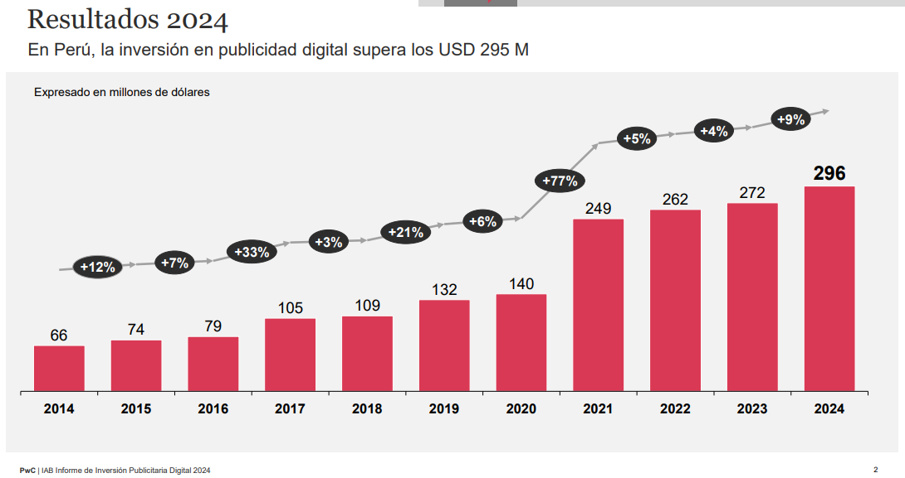

_Nota._ Adaptado de Informe de Inversión Publicitaria Digital 2024 (p. 2), por PwC e Interactive Advertising Bureau Perú (IAB Perú), 2024.

#### 1.2.2. Lean UX Process

##### 1.2.2.1. Lean UX Problem Statements

Las pequeñas y medianas empresas necesitan utilizar las redes sociales para promocionar sus productos y servicios, pero muchas colaboraciones con creadores de contenido se gestionan mediante mensajes directos de Instagram, WhatsApp y otros canales informales. En este contexto, las empresas enfrentan dificultades para definir acuerdos claros, verificar los entregables, controlar los plazos y medir el retorno de inversión de sus campañas.

Al mismo tiempo, los creadores de contenido reciben propuestas poco estructuradas y pueden enfrentar incertidumbre respecto a los requisitos de la colaboración y la compensación correspondiente.

Hemos observado un factor crítico que afecta a este ecosistema: las empresas necesitan mayor control y trazabilidad sobre sus campañas, mientras que los creadores necesitan condiciones claras para aceptar y ejecutar las colaboraciones.

Estas necesidades son interdependientes, ya que una empresa requiere confianza en el cumplimiento de los entregables y el creador requiere confianza en que las condiciones acordadas serán respetadas.

**¿Cómo podemos desarrollar una plataforma que permita a las pymes gestionar campañas con creadores de forma estructurada, mientras proporciona a los creadores condiciones claras de colaboración y un mecanismo confiable para recibir su compensación?**

##### 1.2.2.2. Lean UX Assumptions

**Business Assumptions**

- Creemos que existe una necesidad de profesionalizar las colaboraciones entre pymes y creadores de contenido, debido a que actualmente gran parte del proceso se realiza mediante canales informales.

- Creemos que las pymes estarán dispuestas a utilizar CollabPro si pueden publicar campañas estructuradas, definir requisitos específicos y acceder posteriormente a métricas que les permitan evaluar el rendimiento de sus colaboraciones.

- Creemos que los creadores de contenido utilizarán CollabPro si pueden encontrar campañas relevantes, conocer claramente los requisitos antes de postular y contar con mayor seguridad respecto a las condiciones de compensación.

- Creemos que un sistema de validación de entregables y liberación de la compensación después del cumplimiento de las condiciones acordadas aumentará la confianza entre empresas y creadores.

- Creemos que el modelo SaaS mediante suscripción mensual será atractivo para las empresas si el costo de la plataforma es compensado por el ahorro de tiempo, la reducción de errores y la posibilidad de medir el rendimiento de sus campañas.

- Creemos que CollabPro puede diferenciarse de los canales tradicionales de colaboración al centralizar en una sola plataforma la publicación de campañas, postulación de creadores, gestión de entregables y seguimiento de métricas.

- Sabremos que estamos equivocados si las empresas abandonan la plataforma durante los primeros 60 días porque consideran que gestionar sus campañas mediante CollabPro no aporta suficiente valor frente a continuar utilizando Instagram, WhatsApp u otros canales tradicionales.

**User Assumptions**

- **¿Quién es el usuario?**

  Los principales usuarios son las pequeñas y medianas empresas que buscan promocionar sus productos o servicios mediante creadores de contenido y los creadores de contenido que buscan oportunidades de colaboración con marcas y negocios.

- **¿Dónde encaja nuestro producto en su vida?**

  Para las empresas, CollabPro encaja dentro de sus actividades de marketing y promoción digital, especialmente cuando necesitan planificar y ejecutar campañas con creadores.

  Para los creadores, la plataforma forma parte de su proceso para encontrar oportunidades comerciales, postular a campañas y gestionar los compromisos adquiridos con las empresas.

- **¿Qué problemas resuelve?**

  Reduce la informalidad en las colaboraciones, centraliza la comunicación y las condiciones de las campañas, estructura los entregables, facilita la validación del contenido y permite a las empresas consultar métricas para evaluar el rendimiento de sus colaboraciones.

- **¿Cuándo y cómo es usado?**

  Las empresas utilizan CollabPro cuando necesitan crear y administrar campañas con creadores, revisar postulaciones, establecer condiciones y analizar los resultados obtenidos.

  Los creadores utilizan la plataforma para descubrir campañas, revisar sus requisitos, postular, entregar el contenido solicitado y verificar el estado de sus colaboraciones.

- **¿Qué características son importantes?**

  Publicación de campañas estructuradas, definición de objetivos y entregables, postulación de creadores, gestión de compensaciones, validación de publicaciones, seguimiento de campañas y visualización de métricas de rendimiento.

- **¿Cómo debe verse y comportarse?**

  La plataforma debe presentar una interfaz limpia, profesional, responsiva, rápida y accesible (a11y), con una navegación intuitiva para usuarios con diferentes niveles de familiaridad tecnológica. Asimismo, debe proporcionar información clara sobre el estado de cada campaña, sus entregables y las acciones pendientes.

##### 1.2.2.3. Lean UX Hypothesis Statements

- **Hipótesis 1:** "Creemos que las empresas podrán reducir el tiempo y la incertidumbre asociados a la gestión de colaboraciones mediante el uso de campañas estructuradas que permitan definir objetivos, entregables, plazos y compensaciones.

  Sabremos que esto es verdad cuando al menos el 70% de las empresas que utilicen CollabPro completen la configuración de una campaña sin requerir asistencia externa durante las primeras 4 semanas de uso."

- **Hipótesis 2:** "Creemos que los creadores de contenido tendrán mayor claridad sobre las colaboraciones al disponer de campañas con requisitos y condiciones previamente definidos.

  Sabremos que esto es verdad cuando al menos el 75% de los creadores que postulen a una campaña revisen y acepten sus condiciones antes de iniciar la colaboración durante las primeras 4 semanas."

- **Hipótesis 3:** "Creemos que las empresas tendrán mayor confianza en las colaboraciones al contar con un mecanismo de validación de entregables antes de liberar la compensación acordada.

  Sabremos que esto es verdad cuando al menos el 80% de las colaboraciones finalizadas utilicen correctamente el proceso de validación antes de liberar la compensación durante los primeros 3 meses de operación."

- **Hipótesis 4:** "Creemos que las empresas percibirán mayor valor en CollabPro al poder consultar métricas centralizadas del rendimiento de las publicaciones realizadas por sus creadores contratados.

  Sabremos que esto es verdad cuando al menos el 70% de las empresas activas consulten el panel de métricas después de finalizar una campaña durante los primeros 3 meses de uso."

##### 1.2.2.4. Lean UX Canvas

| Sección                                                                                      | Contenido                                                                                                                                                                                                                                                                                                                                                                                                                                      |
| :------------------------------------------------------------------------------------------- | :--------------------------------------------------------------------------------------------------------------------------------------------------------------------------------------------------------------------------------------------------------------------------------------------------------------------------------------------------------------------------------------------------------------------------------------------- |
| **1. Business Problem**                                                                      | Las pequeñas y medianas empresas gestionan muchas de sus colaboraciones con creadores de contenido mediante mensajes directos de Instagram, WhatsApp y otros canales informales. Esto genera dificultades para definir acuerdos, controlar entregables, verificar publicaciones y medir el retorno de inversión de las campañas.                                                                                                               |
| **2. Business Outcomes**                                                                     | Lograr que el 75% de las empresas completen la configuración de su primera campaña durante los primeros 15 días. Alcanzar una retención del 80% de empresas suscritas durante los primeros 3 meses. Conseguir que al menos el 70% de las empresas activas consulten las métricas de sus campañas después de finalizar una colaboración.                                                                                                        |
| **3. Users**                                                                                 | Los principales usuarios de CollabPro son las pequeñas y medianas empresas que buscan realizar campañas de marketing con creadores de contenido y los creadores que buscan oportunidades de colaboración con marcas y negocios.                                                                                                                                                                                                                |
| **4. User Outcomes & Benefits**                                                              | Las empresas buscan reducir la informalidad, controlar los entregables y obtener información que les permita medir el rendimiento de sus campañas. Los creadores buscan encontrar oportunidades relevantes, conocer claramente las condiciones de cada colaboración y contar con mayor seguridad respecto al cumplimiento de los acuerdos y la compensación.                                                                                   |
| **5. Solution Ideas**                                                                        | Plataforma B2B para publicación de campañas estructuradas. Postulación de creadores a campañas. Definición de objetivos, requisitos, entregables y plazos. Gestión de compensaciones mediante efectivo, crédito corporativo o productos de valor. Sistema de validación de entregables antes de liberar la compensación. Panel de métricas para empresas. Historial de colaboraciones. Seguimiento del estado de cada campaña.                 |
| **6. Hypotheses**                                                                            | Las empresas completan la configuración de una campaña en un 75% durante los primeros 15 días. Los creadores revisan y aceptan las condiciones de las campañas antes de iniciar una colaboración en un 75%. Las colaboraciones utilizan el proceso de validación antes de liberar la compensación en un 80%. Las empresas consultan las métricas de sus campañas en un 70% después de finalizar una colaboración durante los primeros 3 meses. |
| **7. What's the most important thing we need to learn first?**                               | ¿Las pymes perciben suficiente valor en CollabPro como para reemplazar o complementar sus métodos actuales de negociación con creadores y pagar una suscripción mensual por gestionar sus campañas?                                                                                                                                                                                                                                            |
| **8. What's the least amount of work we need to do to learn the next most important thing?** | Realizar entrevistas con 3 a 5 responsables de marketing, propietarios o administradores de pequeñas y medianas empresas que hayan realizado o considerado realizar colaboraciones con creadores de contenido, con el objetivo de validar sus principales problemas, disposición al cambio y funcionalidades imprescindibles antes de desarrollar el MVP.                                                                                      |

### 1.3. Segmentos objetivo

CollabPro está dirigido a dos segmentos principales que forman parte del ecosistema del marketing de creadores de contenido.

- **Segmento 1: Pequeñas y Medianas Empresas (Pymes)**

  El primer segmento está conformado por pequeñas y medianas empresas que utilizan o desean utilizar las redes sociales como canal de promoción y adquisición de clientes. Dentro de este segmento pueden encontrarse restaurantes, tiendas, emprendimientos, marcas de productos, servicios profesionales y otros negocios que buscan aumentar su visibilidad mediante colaboraciones con creadores de contenido.

  Estas empresas pueden contar con recursos limitados para desarrollar campañas de marketing y, en muchos casos, gestionan directamente las colaboraciones con creadores mediante Instagram, WhatsApp u otros canales informales. Esta situación dificulta comparar propuestas, establecer condiciones claras, controlar los entregables y determinar si una colaboración generó resultados suficientes para justificar la inversión.

- **Segmento 2: Creadores de Contenido**

  El segundo segmento está conformado por creadores de contenido que utilizan plataformas digitales como Instagram, TikTok, YouTube u otras redes sociales para desarrollar y compartir contenido con sus comunidades.

  Dentro de este segmento pueden coexistir creadores pequeños y medianos, microcreadores especializados en determinados nichos y creadores que buscan establecer relaciones comerciales con marcas y negocios. A pesar de sus diferencias en tamaño y alcance, todos comparten la necesidad de encontrar oportunidades de colaboración y conocer claramente las condiciones antes de aceptar una campaña.

---

## Capítulo II: Requirements Development and Software Solution Design

### 2.1. Competidores

#### 2.1.1. Análisis competitivo

El análisis considera competidores directos que conectan marcas con creadores o gestionan ese ciclo de campaña. La comparación se construyó a partir de las funcionalidades y condiciones publicadas en los sitios oficiales de cada empresa (consultados el 12 de septiembre de 2026); por ello, las debilidades y oportunidades son inferencias competitivas para el segmento de pymes de Lima y deben validarse con entrevistas y pruebas de mercado.

| Competitive analysis landscape              | CollabPro                                                                                                                                                                                                                                     | BrandMe                                                                                                                                                                           | SocialPubli                                                                                                                                                        | Influencity                                                                                                                                                                   |
| :------------------------------------------ | :-------------------------------------------------------------------------------------------------------------------------------------------------------------------------------------------------------------------------------------------- | :-------------------------------------------------------------------------------------------------------------------------------------------------------------------------------- | :----------------------------------------------------------------------------------------------------------------------------------------------------------------- | :---------------------------------------------------------------------------------------------------------------------------------------------------------------------------- |
| **Overview**                                | Marketplace B2B para que pymes publiquen campañas y los creadores postulen. Centraliza objetivos, entregables, plazos, compensación, validación y métricas.                                                                                   | Hub de influencer marketing: buscador, análisis de perfiles, gestión y medición de campañas; combina software, marketplace y servicio gestionado.                                 | Plataforma de influencer marketing para crear campañas, analizar perfiles, seleccionar creadores y aprobar publicaciones antes de su difusión.                     | Plataforma SaaS de gestión de influencers: descubrimiento, CRM, campañas, briefs, entregables, pagos, reportes y social listening. Declara no ser un marketplace.             |
| **Ventaja competitiva / valor ofrecido**    | Flujo simple y trazable diseñado desde el problema de la pyme: campaña estructurada, aceptación explícita de condiciones, evidencia de entrega y liberación de compensación tras validación. Enfoque inicial en creadores y negocios de Lima. | Escala, datos y experiencia: su sitio declara más de 750 000 influencers y empresas; ofrece filtros, análisis de autenticidad/audiencia, automatización y servicios expertos.     | Facilita campañas con creadores de distinto tamaño —incluidos nano y microinfluencers— y permite controlar/aprobar el avance antes de publicar.                    | Suite internacional con una base declarada de más de 300 millones de perfiles, filtros de audiencia, automatización y analítica de desempeño en tiempo real.                  |
| **Mercado objetivo**                        | Pymes urbanas de Lima que realizan o desean realizar marketing con creadores y microcreadores que buscan acuerdos claros.                                                                                                                     | Marcas y agencias de habla hispana e internacionales que requieren software o ejecución experta de campañas.                                                                      | Marcas, empresas y anunciantes que buscan ejecutar campañas con creadores de redes sociales; atiende desde nano hasta megainfluencers.                             | Marcas, agencias y equipos de marketing que gestionan campañas a escala y necesitan un repositorio global de creadores.                                                       |
| **Estrategias de marketing**                | Captación bilateral local: pilotos con pymes, referidos de creadores y contenido educativo sobre campañas, brief y cumplimiento. Prueba social basada en casos locales.                                                                       | Marketing de contenidos, comunidad de creadores, prueba/demo del software, planes de membresía y venta consultiva de servicios completos.                                         | Promoción de la plataforma como medio para crear, gestionar y medir campañas; enfatiza beneficios del influencer marketing y oportunidades de pago para creadores. | Prueba o demo del SaaS, contenido especializado y posicionamiento como plataforma integral para marcas y agencias; presencia internacional.                                   |
| **Productos y servicios**                   | Publicación y postulación a campañas; definición de requisitos, entregables, plazo y compensación; seguimiento de estado; validación antes de liberar la compensación; panel de métricas e historial.                                         | BrandMe Finder, análisis de cuentas, suite de campañas y métricas, marketplace de propuestas y servicios personalizados.                                                          | Creación de campañas, selección/análisis de influencers, seguimiento y aprobación de publicaciones; campañas en redes sociales.                                    | Descubrimiento y análisis de creadores, IRM/CRM, outreach, campañas, seguimiento de contenido, pagos, reportes, social media management y social listening.                   |
| **Precios y costos**                        | Modelo SaaS de suscripción mensual para empresas, pendiente de validación de precio. La modalidad de cobro por tipo de usuario y la compensación de cada campaña se definirán y validarán con los pilotos.                                    | Plan gratuito limitado y plan Marca Premium publicado a US$150 mensuales (US$1 560 anuales); los servicios gestionados se cotizan por propuesta.                                  | No publica una tarifa única en la página de campañas; el presupuesto depende de la campaña y de los creadores seleccionados.                                       | No publica una tarifa estándar en su página de plataforma; invita a solicitar prueba o demo.                                                                                  |
| **Canales de distribución (web y/o móvil)** | Plataforma web responsiva; captación mediante redes sociales, alianzas con comunidades de emprendimiento y creadores, y referidos.                                                                                                            | Plataforma web, demostraciones, servicio consultivo y comunidad digital de creadores.                                                                                             | Plataforma web para marcas y creadores; captación por contenido y presencia en redes sociales.                                                                     | Plataforma web/SaaS, prueba o demo, contenidos y ventas dirigidas a equipos de marketing y agencias.                                                                          |
| **FODA: fortalezas**                        | Propuesta enfocada en reducir la informalidad: condiciones visibles, entregables verificables y compensación condicionada. Especialización inicial en la realidad operativa de las pymes de Lima.                                             | Ecosistema amplio de creadores y marcas, capacidades de búsqueda, medición y acompañamiento experto.                                                                              | Modelo de conexión marca-creador y mecanismo de aprobación previa a la publicación.                                                                                | Cobertura funcional muy amplia, datos globales y automatización para operaciones complejas.                                                                                   |
| **FODA: debilidades**                       | Startup en etapa temprana: red de usuarios, reputación, integración de pagos y datos históricos aún deben construirse y validarse.                                                                                                            | Para una pyme local, el plan Premium y la amplitud de funciones pueden representar una barrera de presupuesto o aprendizaje; su propuesta no se especializa públicamente en Lima. | La información pública se centra en la campaña y no detalla una propuesta localizada para pymes peruanas ni un flujo de liberación condicionada de pagos.          | No es un marketplace: la marca debe identificar y gestionar la relación con creadores; su amplitud funcional puede exceder las necesidades y capacidades de una pyme inicial. |
| **FODA: oportunidades**                     | Convertir la coordinación informal de Instagram/WhatsApp en un flujo confiable para microcampañas; construir una red local de microcreadores por rubro y generar datos de desempeño relevantes para pymes.                                    | Profundizar su presencia y alianzas locales en Perú, aprovechando la demanda de marketing de creadores en Latinoamérica.                                                          | Aumentar la oferta de campañas de micro y nanocreadores y facilitar presupuestos de entrada para pequeños negocios.                                                | Traducir su capacidad global en ofertas accesibles para pymes y ampliar el soporte/localización para mercados latinoamericanos.                                               |
| **FODA: amenazas**                          | Efectos de red y recursos de plataformas consolidadas; dependencia de APIs y reglas de redes sociales; desintermediación por acuerdos directos fuera de la plataforma; riesgos de fraude o incumplimiento.                                    | Competencia de suites globales y marketplaces especializados; cambios en datos disponibles por las redes sociales y presión de precios en autoservicio.                           | Competencia de marketplaces con mayor analítica, CRM o localización; cambios en políticas de plataformas sociales y confianza en la calidad de creadores.          | Marketplaces que ofrecen una red cerrada de creadores y servicio gestionado; cambios en acceso a datos de redes sociales y presión por herramientas más simples y económicas. |

**Lectura del landscape.** BrandMe es el competidor directo de mayor alcance porque combina marketplace, gestión de campañas y servicios; SocialPubli compite por el flujo de campañas y su acceso a microcreadores; Influencity representa la referencia funcional de una suite de gestión. CollabPro no debe intentar igualar su escala inicial. Su ventaja defendible a corto plazo es resolver con menor fricción la colaboración de bajo y mediano presupuesto entre pymes y microcreadores locales, haciendo visibles las condiciones y el estado de cumplimiento.

#### 2.1.2. Estrategias y tácticas frente a competidores

La estrategia competitiva inicial será **especialización local + confianza operativa + simplicidad**. En lugar de competir por una base global de millones de perfiles o por una suite empresarial completa, CollabPro buscará ser la alternativa más clara y asequible para una pyme de Lima que ejecuta sus primeras campañas con creadores.

| Estrategia                                                   | Tácticas preliminares                                                                                                                                                                                                                                                                                                 | Fortaleza/debilidad competitiva que aborda                                                                                                                 | Indicador de validación                                                                                                           |
| :----------------------------------------------------------- | :-------------------------------------------------------------------------------------------------------------------------------------------------------------------------------------------------------------------------------------------------------------------------------------------------------------------- | :--------------------------------------------------------------------------------------------------------------------------------------------------------- | :-------------------------------------------------------------------------------------------------------------------------------- |
| **1. Diferenciación por confianza y cumplimiento**           | Implementar una ficha de campaña obligatoria con objetivo, entregables, fecha, compensación y criterios de aceptación; registrar evidencias de entrega/publicación; usar una secuencia visible de “pendiente–en revisión–aprobado–compensación liberada”; habilitar calificación bilateral y un canal de incidencias. | Responde a la informalidad que CollabPro busca resolver y evita competir solo por volumen de creadores frente a BrandMe o Influencity.                     | Al menos 80% de colaboraciones finalizadas pasan por validación antes de liberar la compensación durante los primeros tres meses. |
| **2. Entrada asequible para pymes**                          | Ofrecer plan piloto o freemium con una campaña; diseñar planes mensuales por número de campañas activas, no por funcionalidades complejas; transparentar desde el brief el presupuesto y la compensación; medir disposición a pagar antes de fijar el precio definitivo.                                              | Contrarresta la posible barrera de costo y complejidad de suites premium; reconoce que SocialPubli y BrandMe ya poseen alternativas gratuitas o variables. | 75% de pymes piloto completa su primera campaña y al menos 30% declara intención de continuar con un plan pagado.                 |
| **3. Densidad de oferta local y microcreadores verificados** | Lanzar por verticales con alta presencia local (gastronomía, belleza, retail y servicios); captar 20–30 creadores por vertical mediante referidos; verificar identidad, ciudad, red social y portafolio; mostrar etiquetas de nicho, distrito y tipo de compensación.                                                 | Reduce la desventaja inicial de red frente a los catálogos globales de BrandMe e Influencity y mejora la relevancia para una pyme limeña.                  | Por cada campaña piloto, obtener al menos cinco postulaciones pertinentes y concretar una colaboración en un máximo de 14 días.   |
| **4. Onboarding guiado y educación práctica**                | Usar plantillas de brief, entregables y criterios de aceptación; asistente de creación de campaña en pocos pasos; guías cortas sobre publicidad con influencers y buenas prácticas de disclosure; soporte por chat durante las primeras campañas.                                                                     | Aprovecha la oportunidad de atender negocios sin especialista de marketing y reduce la curva de aprendizaje de herramientas empresariales amplias.         | 70% de las empresas crea una campaña sin asistencia externa en sus primeras cuatro semanas.                                       |
| **5. Métricas accionables, no solo reportes**                | Mostrar un tablero por campaña con publicaciones verificadas, alcance, interacción, costo por resultado y comparación con campañas previas; pedir a la pyme definir una métrica principal antes de publicar; usar enlaces o códigos rastreables cuando corresponda.                                                   | Equipara el valor analítico que ofrecen los competidores, pero lo presenta en un nivel comprensible para pymes.                                            | 70% de empresas activas consulta el tablero después de finalizar una campaña y puede identificar su métrica principal.            |
| **6. Retención y defensa frente a la desintermediación**     | Mantener dentro de la plataforma el historial de campañas, plantillas, evidencia, evaluación y métricas; ofrecer beneficios por colaboración recurrente, no penalizaciones; realizar recordatorios de plazos y renovaciones de campaña.                                                                               | Mitiga la amenaza de que marca y creador vuelvan a negociar por mensajes directos después de conocerse.                                                    | Alcanzar que 40% de las empresas piloto cree una segunda campaña y que 25% repita con un creador evaluado positivamente.          |

Estas tácticas deben priorizarse como un MVP: primero campaña estructurada, postulación, validación y tablero básico; después, reputación, pagos integrados, automatización y expansión geográfica. Así se evita replicar prematuramente las suites completas de los competidores y se valida la propuesta de valor central de CollabPro.

### 2.2. Entrevistas

#### 2.2.1. Diseño de entrevistas

- **Segmento 1: Pequeñas y Medianas Empresas**

1. ¿Actualmente utilizan redes sociales para promocionar su negocio? ¿Cuáles utilizan principalmente?
2. ¿Han realizado alguna colaboración con un creador de contenido o influencer? Cuéntame cómo fue esa experiencia.
3. ¿Cómo encuentran actualmente a los creadores con los que trabajan?
4. ¿Cómo suelen negociar las condiciones de una colaboración, como precio, productos, publicaciones, fechas y entregables?
5. ¿Alguna vez han tenido problemas porque un creador no entregó el contenido acordado, lo publicó tarde o no cumplió con los requisitos? ¿Qué ocurrió?
6. ¿Cómo verifican actualmente que una colaboración cumplió con lo que habían acordado?
7. Después de realizar una colaboración, ¿cómo determinan si realmente valió la pena la inversión? ¿Qué métricas revisan?
8. ¿Qué es lo que más tiempo o esfuerzo les toma cuando trabajan con creadores?
9. Si pudieran mejorar una sola cosa del proceso actual de trabajar con creadores, ¿qué cambiarían?
10. ¿Estarían dispuestos a pagar una suscripción mensual por una plataforma que les permita encontrar creadores, estructurar campañas, controlar entregables y medir resultados? ¿Qué tendría que ofrecer para que consideren que vale la pena pagar?

- **Segmento 2: Creadores de Contenido**

1. ¿Actualmente creas contenido en redes sociales? ¿En cuáles y qué tipo de contenido produces?
2. ¿Has realizado colaboraciones pagadas o mediante intercambio de productos con alguna marca o negocio? Cuéntame sobre la última.
3. ¿Cómo suelen llegar actualmente las propuestas de colaboración?
4. ¿Qué información te proporciona normalmente una empresa cuando te propone una colaboración?
5. ¿Alguna vez has aceptado una colaboración y posteriormente descubriste que los requisitos eran diferentes a lo que esperabas? ¿Qué ocurrió?
6. ¿Has tenido problemas con empresas respecto al pago, productos ofrecidos, cambios en los requisitos o fechas de entrega?
7. Antes de aceptar una colaboración, ¿qué información consideras indispensable conocer?
8. ¿Qué dificultades tienes actualmente para encontrar marcas o negocios que realmente encajen con tu contenido y audiencia?
9. ¿Qué opinas de un sistema donde puedas ver campañas disponibles, revisar sus requisitos antes de postular y conocer claramente la compensación? ¿Qué ventajas o problemas tendría para ti?
10. ¿Qué tendría que ofrecer una plataforma de este tipo para que prefieras utilizarla en lugar de negociar directamente por Instagram o WhatsApp?

#### 2.2.2. Registro de entrevistas

- **Segmento 1: Pequeñas y Medianas Empresas (Pymes)**

**Entrevista 1: Frank Loayza**

| Campo                             | Detalle                                                        |
| --------------------------------- | -------------------------------------------------------------- |
| **Nombre y Apellidos**            | Frank Loayza                                                   |
| **Edad**                          | 24                                                             |
| **Distrito / Zona de residencia** | Santiago de Surco                                              |
| **Segmento**                      | Pequeñas y Medianas Empresas (Pymes)                           |
| **Inicio en video**               | 0:00                                                           |
| **Fin de video**                  | 14:30                                                          |
| **Duración**                      | 14:30                                                          |
| **URL del video**                 | [https://youtu.be/dvb_GWTTWyg](https://youtu.be/dvb_GWTTWyg)   |
| **Screenshot**                    |  |

## Resumen Descriptivo de la Entrevista

### Características Objetivas y Entorno

Frank es un joven emprendedor que, junto con un socio, dirige desde hace más de un año un negocio de makis y sushi operado exclusivamente bajo el formato de dark kitchen o full delivery (sin atención en mesa). El negocio cuenta con un catálogo de más de 20 variedades y tiene a dos empleados adicionales.

El 80% de su público objetivo está compuesto por clientes jóvenes, por lo que su estrategia de exposición digital se centra en plataformas como TikTok e Instagram, descartando Facebook por considerarlo para un segmento de mayor edad.

### Herramientas y Proceso Actual

Actualmente, el manejo del marketing y la creación de contenido se realizan de manera empírica. El negocio no emplea plataformas formales para contactar influencers ni agencias de publicidad.

El proceso actual se basa en:

- Creación de contenido orgánico y casero con los propios trabajadores.
- Contacto informal con conocidos o "amigos de amigos" de la etapa universitaria que poseen cierta audiencia (ej. 8,000 seguidores en Instagram).
- Negociación directa vía mensajes (DM) para realizar "canjes": a cambio de productos (ej. 72 cortes de makis), el creador publica historias promocionales.
- El seguimiento de resultados se hace observando empíricamente el aumento de visualizaciones, likes, comentarios y percibiendo si hay un ligero pico de demanda temporal en los días posteriores a la publicación.

### Problemas Detectados (Pain Points)

El entrevistado expone limitaciones claras en su proceso de marketing de influencers:

- **Red de contactos limitada:** Al depender de amigos, es difícil escalar la exposición o encontrar creadores nuevos de forma constante.
- **Dificultad de segmentación (Match):** Considera "una gestión tremenda" encontrar perfiles de creadores cuya audiencia haga match exacto con su público objetivo juvenil.
- **Falta de tiempo:** Al ser dos socios liderando la empresa en fase de arranque, están enfocados en la operación y desarrollo del producto, relegando la búsqueda de influencers.
- **Presupuesto restringido:** No cuentan con capital para inversiones grandes o contrataciones formales recurrentes.

### Necesidades y Oportunidades

Frank muestra interés en profesionalizar su búsqueda de creadores, pero requiere herramientas que se adapten a la realidad de un negocio emergente.

Valora positivamente una plataforma que le ofrezca:

- Un espacio (Marketplace) para recibir postulaciones de creadores alineados a su nicho, sin tener que buscarlos manualmente.
- Herramientas integradas para medir con precisión las métricas de rendimiento (vistas, interacción) y controlar los entregables.
- Opciones de pago justas, mostrando preferencia inicial por modelos de pago basados en resultados (pago por interacción, vistas o rendimiento) en lugar de cargos fijos.

### Aspectos Subjetivos y Comportamiento

Frank es un emprendedor cauteloso con los gastos y fuertemente enfocado en el núcleo de su negocio operativo. Su toma de decisiones es pragmática y consensuada (siempre consulta con su socio).

Es receptivo a probar nuevas tecnologías o plataformas, pero exige que la herramienta demuestre su valor agregado, especialmente en el área analítica (métricas exactas que le eviten hacer estimaciones manuales).

No busca fama inmediata, sino exposición rentable y dirigida exclusivamente al nicho universitario/juvenil.

### Tecnología y Riesgos Percibidos

El riesgo principal que percibe Frank frente a la propuesta de valor es el modelo de negocio por suscripción mensual.

Para un emprendimiento en fase de crecimiento y con poco capital sobrante, asumir un costo fijo mensual solo para acceder a una plataforma de contacto representa una barrera de entrada alta.

Estaría dispuesto a evaluar la herramienta y pagar si se le demuestra que la automatización, las métricas y la calidad de los creadores compensan el gasto de la suscripción mensual.

### Validación del Arquetipo

Los hallazgos validan el arquetipo del **Emprendedor de Pequeña Empresa con Recursos Limitados**.

Se confirma que este segmento reconoce el valor del marketing de influencers, pero necesita soluciones que reduzcan la fricción de gestión (tiempo) y ofrezcan modelos de entrada de bajo riesgo financiero.

Esto respalda la necesidad de desarrollar funciones dentro de la plataforma enfocadas en:

- **Algoritmos de Matchmaking preciso por nicho de mercado:** filtros por audiencia joven/delivery.
- **Panel de control automatizado para medir ROI (Retorno de Inversión):** mediante vistas e interacciones.
- **Flexibilidad en los modelos de contratación:** canjes estandarizados, pagos por resultados o suscripciones escalables adaptadas a pymes.

- **Segmento 1: Pequeñas y Medianas Empresas (Pymes)**

#### Entrevista 2: Andy Pillaca

| Campo                             | Detalle                                                                                                                                          |
| --------------------------------- | ------------------------------------------------------------------------------------------------------------------------------------------------ |
| **Nombre y Apellidos**            | Andy Pillaca                                                                                                                                     |
| **Edad**                          | 29                                                                                                                                               |
| **Distrito / Zona de residencia** | Santiago de Surco                                                                                                                                |
| **Segmento**                      | Pequeñas y Medianas Empresas (Pymes)                                                                                                             |
| **Inicio en video**               | 0:00                                                                                                                                             |
| **Fin de video**                  | 4:23                                                                                                                                             |
| **Duración**                      | 4:23                                                                                                                                             |
| **URL del video**                 | [https://drive.google.com/file/d/1z8S2-whw5Wi0ZabnAjMTSdbTEb_XWkOh/view](https://drive.google.com/file/d/1z8S2-whw5Wi0ZabnAjMTSdbTEb_XWkOh/view) |
| **Screenshot**                    |                                                                                             |

### Resumen Descriptivo de la Entrevista

#### Características Objetivas y Entorno

Andy forma parte del personal encargado del marketing de una pequeña empresa que utiliza activamente las redes sociales para promocionar sus productos. La empresa mantiene presencia principalmente en Instagram, Facebook y TikTok, canales mediante los cuales busca incrementar su alcance y llegar a nuevos clientes.

La empresa cuenta con experiencia previa realizando colaboraciones con diferentes creadores de contenido, incluyendo streamers. Por ello, el entrevistado conoce directamente las dificultades asociadas con la búsqueda, coordinación, seguimiento y evaluación de este tipo de campañas.

#### Herramientas y Proceso Actual

Actualmente, la empresa encuentra potenciales colaboradores principalmente mediante redes sociales y recomendaciones de otras personas. Antes de trabajar con un creador, intentan conocer referencias sobre su responsabilidad, puntualidad y cumplimiento de compromisos anteriores.

La negociación de las colaboraciones se realiza principalmente mediante mensajes y llamadas. Durante estas conversaciones se establecen aspectos como:

- Precio o compensación de la colaboración.
- Tipo de contenido que deberá producirse.
- Fechas de publicación.
- Condiciones generales de la colaboración.

Una vez iniciada la campaña, el seguimiento se realiza de manera manual. El personal revisa las publicaciones realizadas por el creador para comprobar si se respetaron los contenidos y fechas acordadas.

Después de finalizar una colaboración, la empresa analiza principalmente las visualizaciones, interacciones y seguidores obtenidos. Cuando existe la posibilidad de relacionar directamente una campaña con ventas, también utilizan las ventas generadas como indicador de rendimiento.

#### Problemas Detectados (Pain Points)

Durante la entrevista se identificaron los siguientes problemas principales:

- **Coordinación dispersa:** La comunicación con los creadores se realiza mediante diferentes mensajes y llamadas, dificultando mantener toda la información organizada.
- **Dificultad para encontrar creadores adecuados:** La empresa dedica tiempo a buscar perfiles que, además de ser relevantes para la marca, sean responsables y cumplan con los plazos establecidos.
- **Incumplimiento de fechas:** El entrevistado recordó una situación en la que un creador publicó el contenido después de la fecha acordada, obligando a la empresa a insistir para conseguir el cumplimiento.
- **Seguimiento manual:** La verificación de publicaciones, contenido y fechas se realiza manualmente.
- **Información distribuida:** Los acuerdos y el seguimiento de una campaña pueden encontrarse repartidos entre diferentes conversaciones y medios de comunicación.
- **Esfuerzo operativo elevado:** Buscar al creador adecuado y supervisar sus entregables son las actividades que consumen mayor tiempo.

#### Necesidades y Oportunidades

Andy identifica como principal oportunidad la posibilidad de **centralizar todo el proceso de colaboración en un único lugar**.

De acuerdo con sus respuestas, una solución de este tipo debería facilitar:

- La búsqueda de creadores de contenido.
- La estructuración de campañas.
- El registro de las condiciones acordadas.
- El seguimiento de entregables y fechas.
- La verificación del cumplimiento.
- La visualización de métricas de rendimiento.
- La medición de resultados obtenidos después de cada campaña.

Esta necesidad coincide directamente con la propuesta de CollabPro de reemplazar la coordinación distribuida en redes sociales, mensajes y llamadas por un proceso estructurado y trazable.

#### Aspectos Subjetivos y Comportamiento

El entrevistado demuestra especial preocupación por la responsabilidad y puntualidad de los creadores. Al momento de seleccionar un colaborador, no considera únicamente su alcance en redes sociales, sino también referencias sobre su comportamiento en colaboraciones anteriores.

Asimismo, la empresa parece mantener un proceso de marketing orientado a resultados, ya que después de una campaña revisa diferentes indicadores como visualizaciones, interacciones, crecimiento de seguidores y, cuando es posible, ventas generadas.

Andy considera que una herramienta especializada podría aportar valor si efectivamente reduce el esfuerzo requerido para administrar las campañas.

#### Disposición de Pago y Riesgos Percibidos

El entrevistado manifestó que la empresa estaría dispuesta a pagar una suscripción mensual por una plataforma especializada siempre que esta permita ahorrar tiempo, controlar las campañas y medir sus resultados.

Sin embargo, también señaló como condición importante que los precios sean accesibles para el contexto de una pequeña empresa.

Esto demuestra que existe interés por un modelo de suscripción, pero que la disposición de pago dependerá de dos factores:

1. Que la plataforma demuestre un ahorro real de tiempo y esfuerzo.
2. Que el precio se encuentre dentro de las posibilidades económicas de una pyme.

#### Validación del Arquetipo

La entrevista con Andy refuerza el arquetipo de la **Pyme que necesita profesionalizar la gestión de sus colaboraciones con creadores**.

A diferencia de un negocio que recién comienza a experimentar con influencer marketing, la empresa entrevistada ya ha realizado varias colaboraciones. Sin embargo, continúa gestionando actividades importantes mediante mensajes, llamadas y verificaciones manuales.

Los hallazgos respaldan especialmente el desarrollo de funcionalidades relacionadas con:

- **Marketplace y búsqueda de creadores**, incluyendo información que ayude a determinar su confiabilidad.
- **Campañas estructuradas** con requisitos, entregables, fechas y compensaciones claramente establecidas.
- **Seguimiento de entregables** y estados de cumplimiento.
- **Historial o reputación del creador**, que permita conocer su desempeño previo.
- **Panel de métricas**, incluyendo visualizaciones, interacciones, seguidores y resultados comerciales cuando puedan ser medidos.
- **Centralización de la comunicación y coordinación** de cada colaboración.
- **Planes de precios accesibles para pequeñas empresas.**

### Segmento 2: Creadores de Contenido

Actualmente no se cuenta con una entrevista registrada para este segmento. Los perfiles, necesidades y puntos de dolor planteados para los creadores de contenido deben considerarse hipótesis hasta realizar entrevistas con participantes pertenecientes directamente a este segmento.

## 2.2.3. Análisis de entrevistas

Para esta primera etapa de investigación se analizaron dos entrevistas correspondientes al segmento de pequeñas y medianas empresas. La primera fue realizada a Frank Loayza, propietario de un emprendimiento de comida mediante delivery, y la segunda a Andy Pillaca, integrante del personal de marketing de una pequeña empresa.

Aunque ambos entrevistados presentan contextos diferentes, se identificaron patrones comunes que permiten comprender cómo las pequeñas empresas administran actualmente sus colaboraciones con creadores de contenido.

### Búsqueda y selección de creadores

Uno de los principales hallazgos es que la búsqueda de creadores continúa realizándose de manera poco estructurada.

Frank depende principalmente de conocidos, recomendaciones y contactos indirectos para encontrar personas que puedan promocionar su negocio. Esta situación limita la cantidad de perfiles disponibles y dificulta encontrar creadores cuya audiencia coincida con el público objetivo de su emprendimiento.

Andy también indicó que la búsqueda se realiza principalmente mediante redes sociales y recomendaciones. Sin embargo, además de encontrar un perfil adecuado, su empresa intenta conocer si el creador es responsable, puntual y cumple los acuerdos establecidos.

Por lo tanto, ambos casos demuestran que la selección de un creador no depende únicamente de su cantidad de seguidores. También existe la necesidad de evaluar aspectos como:

- Nicho y audiencia.
- Responsabilidad.
- Puntualidad.
- Experiencia previa.
- Cumplimiento de colaboraciones anteriores.

Este hallazgo respalda la necesidad de incorporar mecanismos de búsqueda, filtrado e historial de colaboraciones dentro de CollabPro.

### Coordinación y definición de acuerdos

Otro patrón encontrado es el uso de canales informales para coordinar las colaboraciones.

En ambos casos, las condiciones se negocian mediante conversaciones directas, mensajes o llamadas. Aspectos importantes como la compensación, el contenido esperado y las fechas pueden quedar distribuidos entre diferentes conversaciones.

Esta situación aumenta la posibilidad de generar confusiones y dificulta consultar posteriormente qué condiciones fueron establecidas originalmente.

Los resultados respaldan la propuesta de utilizar campañas estructuradas donde se registren previamente:

- Objetivo de la campaña.
- Tipo de contenido solicitado.
- Entregables.
- Fechas de entrega y publicación.
- Compensación.
- Criterios de aceptación.

De esta manera, las condiciones de la colaboración podrían consultarse desde un único punto durante todo el proceso.

### Seguimiento y cumplimiento de entregables

La supervisión de los creadores representa otro problema relevante.

Andy indicó que su empresa ha experimentado retrasos en la publicación del contenido y que fue necesario insistir al creador para que cumpliera con el acuerdo establecido. Asimismo, explicó que actualmente verifican de forma manual si las publicaciones cumplen con los contenidos y fechas acordadas.

En el caso de Frank, aunque su experiencia se encuentra principalmente relacionada con colaboraciones mediante canje, también existe la necesidad de controlar que el creador realice correctamente aquello que fue acordado.

Ambas entrevistas muestran una oportunidad para implementar un flujo de seguimiento en el que una colaboración pueda pasar por estados claramente identificables, por ejemplo:

**Pendiente → En proceso → Entregado → En revisión → Aprobado → Finalizado.**

También resulta relevante permitir que el creador adjunte evidencias de cumplimiento y que la empresa pueda aprobar o solicitar modificaciones cuando sea necesario.

### Medición de resultados

Los dos entrevistados demostraron interés en conocer los resultados obtenidos después de trabajar con un creador.

Frank actualmente analiza de manera empírica indicadores como visualizaciones, likes, comentarios y posibles incrementos temporales en los pedidos.

Andy utiliza métricas similares, considerando principalmente:

- Visualizaciones.
- Interacciones.
- Seguidores obtenidos.
- Ventas generadas cuando pueden ser identificadas.

Por lo tanto, las entrevistas respaldan la necesidad de un panel que concentre las principales métricas de cada colaboración y permita que las empresas comparen los resultados obtenidos entre campañas.

La información debería presentarse de manera sencilla, ya que el objetivo de este segmento no necesariamente es realizar análisis avanzados de marketing, sino determinar rápidamente si la inversión realizada generó resultados suficientes.

### Tiempo y esfuerzo requerido

Otro patrón claramente identificado es el tiempo invertido en administrar las colaboraciones.

Frank señaló que, debido a que debe concentrarse en las operaciones principales de su negocio, dispone de poco tiempo para buscar nuevos creadores.

De manera similar, Andy indicó que las actividades que demandan mayor esfuerzo son encontrar creadores adecuados y realizar seguimiento a todo lo que deben entregar.

Esto permite identificar dos actividades especialmente problemáticas:

**Encontrar al creador adecuado → Gestionar y supervisar la colaboración.**

Reducir el tiempo requerido para estas actividades representa una de las principales oportunidades de valor para CollabPro.

### Disposición de pago

La disposición a pagar por una plataforma especializada existe, aunque presenta condiciones importantes.

Frank se muestra cauteloso frente a una suscripción mensual debido a las restricciones presupuestarias de un negocio pequeño. Su preferencia se orienta hacia alternativas de menor riesgo económico y modelos relacionados con los resultados obtenidos.

Andy manifestó una mayor apertura hacia una suscripción mensual, siempre que la plataforma permita ahorrar tiempo, controlar las campañas y medir sus resultados. Sin embargo, también destacó que el precio deberá ser accesible para una pequeña empresa.

Por tanto, la hipótesis de que las pymes pagarían una suscripción mensual se encuentra **parcialmente respaldada**, pero todavía no puede considerarse completamente validada.

Los resultados indican que el precio y el modelo comercial deberán probarse posteriormente mediante pilotos. Algunas alternativas que podrían evaluarse son:

- Plan de entrada económico.
- Suscripción escalonada según cantidad de campañas.
- Periodo de prueba.
- Una campaña inicial gratuita.
- Modelos mixtos de suscripción y comisión.

### Hallazgos comunes

A partir de ambas entrevistas se identifican cinco necesidades principales del segmento de pequeñas y medianas empresas:

1. **Encontrar creadores adecuados con mayor facilidad.**
2. **Centralizar las condiciones y comunicaciones relacionadas con cada colaboración.**
3. **Controlar los entregables y fechas acordadas.**
4. **Reducir el tiempo requerido para realizar seguimiento.**
5. **Medir de manera objetiva los resultados obtenidos.**

Estos hallazgos respaldan la problemática planteada inicialmente por CollabPro, especialmente respecto a la fragmentación del proceso actual y la ausencia de una herramienta centralizada para administrar las colaboraciones.

### Diferencias entre los entrevistados

Aunque existen necesidades comunes, también se identificaron diferencias relevantes.

Frank representa un emprendimiento pequeño en una fase relativamente temprana, con recursos económicos y humanos limitados. Sus colaboraciones se encuentran fuertemente vinculadas a canjes y contactos personales, y su principal preocupación es conseguir exposición rentable sin asumir elevados costos.

Andy representa un contexto donde las colaboraciones con creadores ya se realizan con mayor frecuencia. Por este motivo, sus problemas están más relacionados con la coordinación, el cumplimiento de fechas, el seguimiento y la medición.

Estas diferencias sugieren que CollabPro deberá atender empresas con distintos niveles de madurez en influencer marketing. Para negocios con poca experiencia deberá facilitar principalmente el descubrimiento y estructuración de campañas, mientras que para empresas con mayor experiencia deberá aportar control, seguimiento y métricas.

### Validación de las hipótesis de CollabPro

Las entrevistas permiten realizar una primera evaluación de las principales hipótesis planteadas para la solución.

| Hipótesis                                                                                  | Resultado preliminar           | Evidencia encontrada                                                                                                                                                       |
| ------------------------------------------------------------------------------------------ | ------------------------------ | -------------------------------------------------------------------------------------------------------------------------------------------------------------------------- |
| Las pymes tienen dificultades para administrar colaboraciones mediante canales informales. | **Respaldada**                 | Ambas entrevistas muestran procesos basados principalmente en mensajes, redes sociales y coordinación manual.                                                              |
| Las empresas necesitan encontrar creadores adecuados con mayor facilidad.                  | **Respaldada**                 | Frank presenta una red limitada de contactos y Andy identifica la búsqueda de creadores responsables como una de las actividades que más tiempo consume.                   |
| Las campañas estructuradas pueden reducir problemas de coordinación.                       | **Respaldada preliminarmente** | Andy plantea directamente la necesidad de centralizar el proceso, mientras que ambos entrevistados negocian actualmente las condiciones mediante conversaciones dispersas. |
| Las empresas necesitan controlar los entregables.                                          | **Respaldada**                 | Andy reportó retrasos en publicaciones y actualmente realiza verificaciones manuales.                                                                                      |
| Las métricas centralizadas aportarían valor a las pymes.                                   | **Respaldada**                 | Ambos entrevistados utilizan métricas para intentar evaluar los resultados y muestran interés por obtener información más clara.                                           |
| Las pymes pagarían una suscripción mensual.                                                | **Parcialmente respaldada**    | Andy estaría dispuesto si existe ahorro de tiempo y un precio accesible; Frank presenta mayor sensibilidad frente a un costo mensual fijo.                                 |
| Los creadores necesitan mayor claridad y seguridad en sus colaboraciones.                  | **Pendiente de validación**    | Todavía no se cuenta con entrevistas directas pertenecientes al segmento de creadores de contenido.                                                                        |

### Implicaciones para el MVP

Los resultados permiten priorizar un primer conjunto de funcionalidades para CollabPro.

El MVP debería concentrarse inicialmente en:

- Registro y perfil de empresas y creadores.
- Búsqueda y filtrado de creadores por nicho y características relevantes.
- Creación de campañas con condiciones estructuradas.
- Postulación de creadores.
- Registro explícito de entregables, fechas y compensaciones.
- Seguimiento del estado de cada colaboración.
- Entrega de evidencias.
- Validación de entregables.
- Panel básico de métricas.
- Historial de colaboraciones y cumplimiento.

Funciones más avanzadas, como sistemas complejos de recomendación automática, automatización integral de pagos o analítica avanzada, pueden evaluarse posteriormente después de validar las necesidades de ambos segmentos.

### Limitaciones de la investigación

Hasta el momento se dispone de dos entrevistas pertenecientes al segmento de pequeñas y medianas empresas. Esto permite identificar patrones iniciales, pero no garantiza que representen a todas las pymes.

Además, todavía no se cuenta con entrevistas reales del segmento de creadores de contenido. Por este motivo, las necesidades definidas para dicho segmento continúan siendo hipótesis y deberán ser contrastadas mediante entrevistas con creadores reales antes de considerar completamente validada la propuesta bilateral de CollabPro.

En consecuencia, el siguiente paso de investigación debe consistir en entrevistar a creadores de contenido pequeños o medianos que hayan realizado colaboraciones con marcas, especialmente mediante canjes o acuerdos gestionados a través de Instagram, TikTok o WhatsApp.

### 2.3. Needfinding

#### 2.3.1. User Personas

**Persona 1: Emprendedor de pequeña empresa con recursos limitados**

Frank representa al propietario de una pyme que busca promocionar su negocio mediante creadores de contenido, pero dispone de poco tiempo, una red de contactos limitada y un presupuesto restringido. Sus principales necesidades son encontrar creadores alineados con su público, definir condiciones claras, controlar los entregables y medir objetivamente los resultados de una colaboración.

**Persona 2: Creadora de contenido y microinfluencer**

Camila representa a una creadora de contenido que busca campañas relacionadas con su audiencia y necesita conocer los requisitos, fechas y compensación antes de aceptar una colaboración. Sus principales necesidades son recibir propuestas completas, evitar cambios de última hora, enviar evidencias de sus entregables y contar con mayor seguridad respecto al cumplimiento de la compensación. Esta persona es una proto-persona y sus características deben validarse con investigación adicional.

#### 2.3.2. User Task Matrix

En esta sección se presentan las tareas que realizan los dos segmentos de CollabPro para cumplir sus objetivos durante una colaboración de marketing. Las tareas describen actividades que las personas realizan independientemente de la existencia de una solución de software; por ello, no se consideran funcionalidades como publicar una campaña, consultar un dashboard o recibir notificaciones. Se consideran las personas **Frank Loayza**, representante del segmento de pequeñas y medianas empresas, y **Camila Rojas**, representante del segmento de creadores de contenido.

La frecuencia se interpreta de la siguiente manera: **Alta** significa que la tarea ocurre habitualmente en el ciclo de una colaboración o se repite con frecuencia; **Media** significa que ocurre en algunas colaboraciones o en momentos puntuales; y **Baja** significa que ocurre ocasionalmente. La importancia indica cuánto afecta la tarea al logro del objetivo del segmento.

<table>
  <thead>
    <tr>
      <th rowspan="2">User task</th>
      <th colspan="2">Frank Loayza <em>Pyme</em></th>
      <th colspan="2">Camila Rojas <em>Creadora de contenido</em></th>
    </tr>
    <tr>
      <th>Frecuencia</th>
      <th>Importancia</th>
      <th>Frecuencia</th>
      <th>Importancia</th>
    </tr>
  </thead>
  <tbody>
    <tr>
      <td>Definir el objetivo de la colaboración</td>
      <td>Alta</td>
      <td>Alta</td>
      <td>Media</td>
      <td>Alta</td>
    </tr>
    <tr>
      <td>Identificar el público objetivo y el nicho adecuado</td>
      <td>Alta</td>
      <td>Media</td>
      <td>Media</td>
      <td>Alta</td>
    </tr>
    <tr>
      <td>Buscar posibles colaboradores o campañas</td>
      <td>Media</td>
      <td>Alta</td>
      <td>Alta</td>
      <td>Alta</td>
    </tr>
    <tr>
      <td>Evaluar si existe compatibilidad entre la marca, el creador y la audiencia</td>
      <td>Alta</td>
      <td>Alta</td>
      <td>Alta</td>
      <td>Alta</td>
    </tr>
    <tr>
      <td>Contactar al posible colaborador e intercambiar una propuesta</td>
      <td>Alta</td>
      <td>Alta</td>
      <td>Alta</td>
      <td>Alta</td>
    </tr>
    <tr>
      <td>Negociar la compensación y las condiciones de la colaboración</td>
      <td>Alta</td>
      <td>Alta</td>
      <td>Alta</td>
      <td>Alta</td>
    </tr>
    <tr>
      <td>Acordar entregables, fechas y criterios de aceptación</td>
      <td>Alta</td>
      <td>Alta</td>
      <td>Alta</td>
      <td>Alta</td>
    </tr>
    <tr>
      <td>Preparar los productos, recursos o contenido necesarios</td>
      <td>Media</td>
      <td>Alta</td>
      <td>Alta</td>
      <td>Alta</td>
    </tr>
    <tr>
      <td>Publicar o entregar el contenido acordado</td>
      <td>Media</td>
      <td>Alta</td>
      <td>Alta</td>
      <td>Alta</td>
    </tr>
    <tr>
      <td>Verificar el cumplimiento y entregar evidencias</td>
      <td>Alta</td>
      <td>Alta</td>
      <td>Alta</td>
      <td>Alta</td>
    </tr>
    <tr>
      <td>Gestionar y confirmar la compensación</td>
      <td>Alta</td>
      <td>Alta</td>
      <td>Alta</td>
      <td>Alta</td>
    </tr>
    <tr>
      <td>Medir y evaluar el desempeño de la colaboración</td>
      <td>Alta</td>
      <td>Alta</td>
      <td>Baja</td>
      <td>Media</td>
    </tr>
    <tr>
      <td>Decidir si se mantiene o repite la relación comercial</td>
      <td>Media</td>
      <td>Media</td>
      <td>Media</td>
      <td>Media</td>
    </tr>
  </tbody>
</table>

Las tareas de mayor frecuencia e importancia para ambos segmentos son evaluar la compatibilidad, contactar al posible colaborador, negociar las condiciones, acordar los entregables, cumplir con la publicación y gestionar la compensación. Estas actividades son críticas porque determinan si la colaboración será clara, confiable y beneficiosa para ambas partes.

La principal diferencia entre los segmentos se observa en la etapa posterior a la publicación. Para la pyme, medir el desempeño y determinar si la inversión generó resultados es una tarea de alta importancia y frecuencia. Para el creador, esta actividad es menos frecuente porque su prioridad es producir, publicar y demostrar que cumplió con los entregables. Asimismo, la búsqueda de campañas es más frecuente para el creador, mientras que la pyme suele buscar colaboradores únicamente cuando necesita ejecutar una campaña.

La principal coincidencia es que ambos segmentos necesitan claridad sobre el acuerdo, los entregables, las fechas y la compensación. Actualmente estas tareas se realizan mediante conversaciones dispersas en Instagram, WhatsApp u otros canales, lo que genera pérdida de información, cambios de última hora, dificultades para verificar el cumplimiento e incertidumbre sobre los resultados.

#### 2.3.3. User Journey Mapping

**Journey 1: Pyme**

El journey de la pyme muestra que el proceso comienza con la necesidad de aumentar la exposición del negocio y continúa con la búsqueda informal de creadores, la negociación mediante mensajes directos, el envío de productos, la verificación manual de publicaciones y la evaluación empírica de los resultados. Los principales puntos de dolor son la dificultad para encontrar perfiles adecuados, la falta de trazabilidad de los acuerdos, el riesgo de incumplimiento y la ausencia de métricas centralizadas.

**Journey 2: Creador de contenido**

El journey del creador de contenido muestra un proceso basado en propuestas recibidas por Instagram o WhatsApp. El creador debe solicitar información adicional, negociar las condiciones, producir y publicar el contenido y esperar la confirmación de la empresa y la compensación acordada. Los principales puntos de dolor son los briefs incompletos, los cambios posteriores al acuerdo, la incertidumbre sobre la aprobación del contenido y la falta de seguimiento del pago. Este journey se considera una hipótesis de trabajo debido a que aún no se cuenta con entrevistas directas a creadores.

#### 2.3.4. Empathy Mapping

Los mapas de empatía permiten sintetizar lo que cada segmento necesita realizar, observa, escucha, dice, hace, piensa y siente durante el proceso de colaboración entre una pyme y un creador de contenido. También permiten organizar sus principales problemas y beneficios esperados.

**Empathy Map 1: Pyme**

El mapa de empatía de la pyme se construyó a partir de la entrevista realizada a Frank Loayza. El segmento busca promocionar su negocio y llegar a una audiencia joven, pero enfrenta dificultades para encontrar creadores adecuados, coordinar las condiciones, verificar los entregables y medir el retorno de inversión. Sus principales beneficios esperados son ahorrar tiempo, encontrar colaboradores relevantes, reducir el riesgo de las campañas y obtener métricas objetivas.

**Empathy Map 2: Creador de contenido**

El mapa de empatía del creador de contenido representa una proto-persona basada en los supuestos identificados para este segmento. El creador busca encontrar campañas compatibles con su audiencia, conocer los requisitos antes de aceptar, publicar el contenido acordado y recibir una compensación clara y puntual. Sus principales problemas son las propuestas incompletas, los cambios de última hora, la falta de confirmación y la coordinación dispersa mediante distintos canales. Este mapa deberá validarse mediante entrevistas con creadores reales.

#### 2.3.5. Big Picture EventStorming

El equipo aplicó **Big Picture EventStorming** para representar visualmente el ciclo general de una colaboración entre una pyme y un creador de contenido. La sesión parte de los hallazgos de las entrevistas, User Personas, User Journey Maps y Empathy Maps de CollabPro. Los eventos se ordenan cronológicamente y se complementan con actores, acciones, reglas y puntos problemáticos del dominio.

El flujo central que debe observarse en los post-its es: **Promotion need identified → Campaign objective defined → Creator discovered → Proposal exchanged → Agreement reached → Content published → Evidence submitted → Deliverable approved → Compensation released → Campaign evaluated**. También deben representarse los caminos alternativos: propuesta rechazada, colaboración cancelada, entregable rechazado, solicitud de revisión, disputa y compensación retrasada.

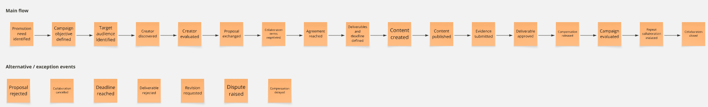

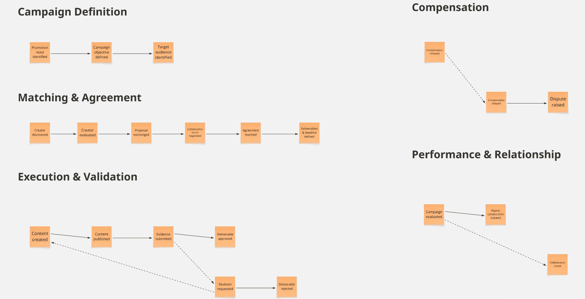

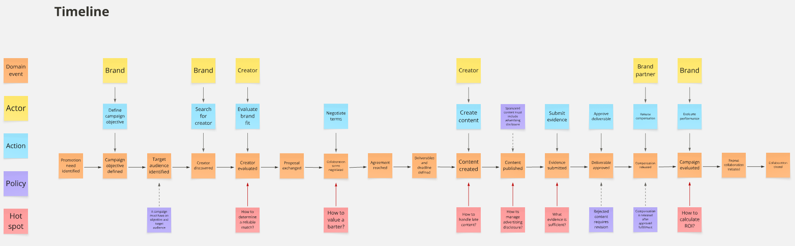

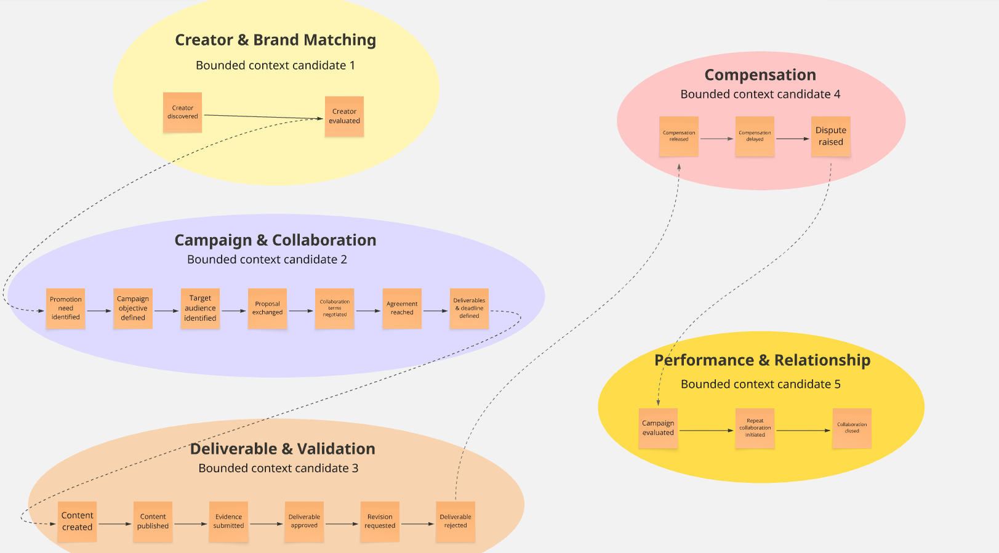

Enlace del Miro: https://miro.com/app/board/uXjVHl9jh_M=/?share_link_id=159650084488

#### 2.3.6. Ubiquitous Language

El siguiente glosario define los términos del dominio de marketing de creadores utilizados por el equipo de CollabPro. Los conceptos se mantienen en inglés para establecer un lenguaje común con los stakeholders y las referencias de la industria. Las definiciones buscan evitar ambigüedades entre la perspectiva de la pyme y la del creador de contenido. No se incluyen términos técnicos de ingeniería de software.

| Term (equivalente en español)                         | Definition                                                                                                                                                                 |
| ----------------------------------------------------- | -------------------------------------------------------------------------------------------------------------------------------------------------------------------------- |
| **Brand (Marca)**                                     | Business or organization that promotes a product or service and initiates or finances a collaboration with a creator.                                                      |
| **Creator (Creador de contenido)**                    | Person who produces and publishes original content for an audience through one or more social media channels.                                                              |
| **Influencer (Influencer)**                           | Creator whose opinions, recommendations or presence can influence the behavior or purchasing decisions of an audience. Not every creator must be considered an influencer. |
| **Micro-creator (Microcreador)**                      | Creator with a relatively small and specific audience who may offer strong relevance and interaction within a particular niche.                                            |
| **Audience (Audiencia)**                              | Group of people who follow, view or interact with a creator's content.                                                                                                     |
| **Niche (Nicho)**                                     | Specific category, interest or market segment around which a creator produces content or a brand offers products.                                                          |
| **Campaign (Campaña)**                                | Time-bound marketing initiative with an objective, target audience, deliverables, deadline and compensation.                                                               |
| **Collaboration (Colaboración)**                      | Commercial relationship in which a brand and a creator agree to exchange content and value under defined conditions.                                                       |
| **Brief (Brief de campaña)**                          | Concise description of the campaign objective, message, audience, requirements, deliverables, dates and acceptance criteria.                                               |
| **Proposal (Propuesta)**                              | Offer made by a brand or creator that describes the intended collaboration and its initial conditions.                                                                     |
| **Agreement (Acuerdo)**                               | Set of conditions accepted by both the brand and the creator before the collaboration begins.                                                                              |
| **Deliverable (Entregable)**                          | Specific piece of content or activity that the creator must produce or complete as part of the agreement.                                                                  |
| **Deadline (Fecha límite)**                           | Date or time by which a deliverable, publication or other agreed activity must be completed.                                                                               |
| **Content (Contenido)**                               | Material created for an audience, such as a story, post, video, reel, review or live stream.                                                                               |
| **Sponsored content (Contenido patrocinado)**         | Content created in exchange for compensation or another commercial benefit from a brand.                                                                                   |
| **Compensation (Compensación)**                       | Value received by the creator for fulfilling the agreement. It may be cash, products, services, credits or a combination of these.                                         |
| **Barter (Canje)**                                    | Collaboration arrangement in which products or services are exchanged for content instead of, or in addition to, cash.                                                     |
| **Evidence (Evidencia de cumplimiento)**              | Proof that a creator completed or published an agreed deliverable, such as a link, screenshot or publication record.                                                       |
| **Approval (Aprobación)**                             | Confirmation by the brand that a submitted deliverable satisfies the agreed requirements.                                                                                  |
| **Disclosure (Declaración publicitaria)**             | Clear indication that a piece of content is part of a commercial collaboration or has received compensation from a brand.                                                  |
| **Brand fit (Compatibilidad con la marca)**           | Degree to which the creator's content, values, style and audience are aligned with the brand and its campaign objective.                                                   |
| **Match (Coincidencia)**                              | Degree to which the characteristics of a brand, campaign, creator and audience correspond to one another.                                                                  |
| **Reach (Alcance)**                                   | Number of unique people who have seen or may have seen a piece of content.                                                                                                 |
| **Impressions (Impresiones)**                         | Total number of times a piece of content has been displayed, including repeated views by the same person.                                                                  |
| **Engagement (Interacción)**                          | Actions generated by content, such as likes, comments, shares, saves, clicks or replies.                                                                                   |
| **Conversion (Conversión)**                           | Desired action attributed to a campaign, such as a purchase, inquiry, registration or visit.                                                                               |
| **Performance (Desempeño)**                           | Results achieved by a campaign or piece of content in relation to its objective and expected outcomes.                                                                     |
| **Return on investment — ROI (Retorno de inversión)** | Relationship between the value generated by a collaboration and the money, products or resources invested in it.                                                           |
| **Repeat collaboration (Colaboración recurrente)**    | New collaboration between the same brand and creator after a previous collaboration has been completed.                                                                    |

Para mantener la consistencia del lenguaje, el equipo utilizará **Brand** para referirse a la pyme que contrata o propone una colaboración y **Creator** para referirse a la persona que produce el contenido. **Compensation** es el término general e incluye dinero, productos, servicios o créditos; **Barter** se utilizará únicamente cuando la compensación consista en un intercambio de productos o servicios. Finalmente, **Reach**, **Impressions**, **Engagement** y **Conversion** representan métricas diferentes y no deben utilizarse como sinónimos.

### 2.4. Requirements specification

#### 2.4.1. User Stories

<table>
<thead>
<tr>
<th>Epic ID</th>
<th>Título</th>
<th>Descripción</th>
</tr>
</thead>
<tbody>

<tr>
<td><strong>EP-01</strong></td>
<td>Presentación inicial de CollabPro</td>
<td>Presentar la propuesta de valor de CollabPro, explicar su funcionamiento y facilitar el contacto y acceso inicial con los usuarios potenciales.</td>
</tr>

<tr>
<td><strong>EP-02</strong></td>
<td>Cuentas y perfiles</td>
<td>Permitir que empresas y creadores de contenido se registren, accedan a la plataforma y administren la información necesaria para participar en colaboraciones.</td>
</tr>

<tr>
<td><strong>EP-03</strong></td>
<td>Campañas y colaboraciones</td>
<td>Permitir que las empresas publiquen campañas de búsqueda y que los creadores encuentren estas oportunidades, se postulen y participen en colaboraciones bajo condiciones previamente establecidas.</td>
</tr>

<tr>
<td><strong>EP-04</strong></td>
<td>Facturaciones y pagos</td>
<td>Gestionar los medios de pago, las suscripciones, las compensaciones, la validación del cumplimiento y la consulta de resultados verificables de las colaboraciones.</td>
</tr>

<tr>
<td><strong>EP-05</strong></td>
<td>Servicios e integraciones técnicas de CollabPro</td>
<td>Proporcionar los servicios y las funcionalidades técnicas necesarias relacionadas con RESTful API para el soporte de CollabPro.</td>
</tr>

<tr>
<td><strong>EP-06</strong></td>
<td>Investigación técnica sobre servicios de terceros y extracción de métricas </td>
<td>Investigar, analizar y validar la viabilidad técnica y funcional de los servicios de terceros y mecanismos de extracción de métricas necesarias.</td>
</tr>

 

</tbody>
</table>

<table border="1" width="100%" cellspacing="0" cellpadding="8">
<thead>
<tr>
<th>Story ID</th>
<th>User</th>
<th>Priority</th>
<th>Epic</th>
</tr>
</thead>
<tbody>
<tr>
<td><strong>US-01</strong></td>
<td>Visitante del segmento de pymes</td>
<td>Alta</td>
<td>EP-01</td>
</tr>
<tr>
<th>Title:</th>
<td colspan="3">Presentación de CollabPro para empresas</td>
</tr>
<tr>
<th colspan="4">Description:</th>
</tr>
<tr>
<td colspan="4">
Como visitante del segmento de pymes, quiero conocer la propuesta de valor de CollabPro,
para determinar si la plataforma puede ayudarme a gestionar colaboraciones con creadores de contenido.
</td>
</tr>
<tr>
<th colspan="4">Acceptance Criteria:</th>
</tr>
<tr>
<td colspan="4">
<strong>Escenario 1: Comprensión de la propuesta</strong>  
<strong>Dado que</strong> el visitante ingresa a la Landing Page  
<strong>Cuando</strong> consulta la información principal de CollabPro  
<strong>Entonces</strong> comprende que la plataforma permite gestionar campañas con creadores de contenido de forma profesional y justa.  
<strong>Escenario 2: Identificación de beneficios</strong>  
<strong>Dado que</strong> el visitante consulta la propuesta de valor  
<strong>Cuando</strong> revisa los beneficios de CollabPro  
<strong>Entonces</strong> identifica que puede centralizar campañas, requisitos, entregables, compensaciones y seguimiento.
</td>
</tr>
</tbody>
</table>

<table border="1" width="100%" cellspacing="0" cellpadding="8">
<thead>
<tr>
<th>Story ID</th>
<th>User</th>
<th>Priority</th>
<th>Epic</th>
</tr>
</thead>
<tbody>
<tr>
<td><strong>US-02</strong></td>
<td>Visitante del segmento de creadores</td>
<td>Alta</td>
<td>EP-01</td>
</tr>
<tr>
<th>Title:</th>
<td colspan="3">Presentación de CollabPro para creadores</td>
</tr>
<tr>
<th colspan="4">Description:</th>
</tr>
<tr>
<td colspan="4">
Como visitante del segmento de creadores, quiero conocer la propuesta de
valor de CollabPro, para determinar si la plataforma puede ayudarme a
encontrar y gestionar colaboraciones con empresas.
</td>
</tr>
<tr>
<th colspan="4">Acceptance Criteria:</th>
</tr>
<tr>
<td colspan="4">
<strong>Escenario 1: Comprensión de la propuesta</strong>  
<strong>Dado que</strong> el visitante ingresa a la Landing Page  
<strong>Cuando</strong> consulta la información principal de CollabPro  
<strong>Entonces</strong> comprende que la plataforma permite encontrar y gestionar campañas con empresas.  
<strong>Escenario 2: Identificación de beneficios</strong>  
<strong>Dado que</strong> el visitante consulta los beneficios de la plataforma  
<strong>Cuando</strong> revisa las características principales  
<strong>Entonces</strong> identifica que puede conocer los requisitos, entregables, fechas y compensaciones de una empresa antes de aceptar una colaboración.
</td>
</tr>
</tbody>
</table>

<table border="1" width="100%" cellspacing="0" cellpadding="8">
<thead>
<tr>
<th>Story ID</th>
<th>User</th>
<th>Priority</th>
<th>Epic</th>
</tr>
</thead>
<tbody>
<tr>
<td><strong>US-03</strong></td>
<td>Visitante del segmento de pymes</td>
<td>Media</td>
<td>EP-01</td>
</tr>
<tr>
<th>Title:</th>
<td colspan="3">Información sobre el funcionamiento de CollabPro para empresas</td>
</tr>
<tr>
<th colspan="4">Description:</th>
</tr>
<tr>
<td colspan="4">
Como visitante del segmento de pymes, quiero conocer cómo se desarrolla una
colaboración en CollabPro, para saber cómo manejar correctamente la herramienta antes de registrarme.
</td>
</tr>
<tr>
<th colspan="4">Acceptance Criteria:</th>
</tr>
<tr>
<td colspan="4">
<strong>Escenario 1: Proceso de colaboración</strong>  
<strong>Dado que</strong> el visitante revisa el funcionamiento de CollabPro  
<strong>Cuando</strong> revisa el proceso de colaboración  
<strong>Entonces</strong> identifica las etapas de creación de campaña, recepción de postulaciones, selección, ejecución y validación.  
<strong>Escenario 2: Cumplimiento de colaboración</strong>  
<strong>Dado que</strong> el visitante revisa el proceso de una colaboración  
<strong>Cuando</strong> consulta cómo se verifica su cumplimiento  
<strong>Entonces</strong> comprende que los entregables son validados antes de completar el proceso del pago de la colaboración.
</td>
</tr>
</tbody>
</table>

<table border="1" width="100%" cellspacing="0" cellpadding="8">
<thead>
<tr>
<th>Story ID</th>
<th>User</th>
<th>Priority</th>
<th>Epic</th>
</tr>
</thead>
<tbody>
<tr>
<td><strong>US-04</strong></td>
<td>Visitante del segmento de creadores</td>
<td>Media</td>
<td>EP-01</td>
</tr>
<tr>
<th>Title:</th>
<td colspan="3">Información sobre el funcionamiento de CollabPro para creadores</td>
</tr>
<tr>
<th colspan="4">Description:</th>
</tr>
<tr>
<td colspan="4">
Como visitante del segmento de creadores, quiero conocer cómo participar en
una colaboración dentro de CollabPro, para conocer mis responsabilidades y 
condiciones de la colaboración antes de registrarme.
</td>
</tr>
<tr>
<th colspan="4">Acceptance Criteria:</th>
</tr>
<tr>
<td colspan="4">
<strong>Escenario 1: Participación en campañas</strong>  
<strong>Dado que</strong> el visitante consulta el funcionamiento de CollabPro  
<strong>Cuando</strong> revisa el proceso detallado de colaboración para creadores  
<strong>Entonces</strong> identifica las etapas de búsqueda, postulación, aceptación, entrega y validación.  
<strong>Escenario 2: Revisión de las condiciones de colaboración</strong>  
<strong>Dado que</strong> el visitante consulta el proceso de una colaboración  
<strong>Cuando</strong> revisa cómo se dan las condiciones de participación y de cumplimiento  
<strong>Entonces</strong> comprende que las condiciones se conocen antes de confirmar una colaboración.
</td>
</tr>
</tbody>
</table>

<table border="1" width="100%" cellspacing="0" cellpadding="8">
<thead>
<tr>
<th>Story ID</th>
<th>User</th>
<th>Priority</th>
<th>Epic</th>
</tr>
</thead>
<tbody>
<tr>
<td><strong>US-05</strong></td>
<td>Visitante del segmento de pymes o de creadores</td>
<td>Media</td>
<td>EP-01</td>
</tr>
<tr>
<th>Title:</th>
<td colspan="3">Contacto con CollabPro</td>
</tr>
<tr>
<th colspan="4">Description:</th>
</tr>
<tr>
<td colspan="4">
Como visitante del segmento de pymes o de creadores, quiero comunicarme con
CollabPro, para solicitar información adicional o realizar una consulta sobre
el servicio.
</td>
</tr>
<tr>
<th colspan="4">Acceptance Criteria:</th>
</tr>
<tr>
<td colspan="4">
<strong>Escenario 1: Envío de consulta</strong>  
<strong>Dado que</strong> el visitante proporciona la información requerida de contacto  
<strong>Cuando</strong> envía una consulta  
<strong>Entonces</strong> se registra la solicitud y se le confirma su recepción.  
<strong>Escenario 2: Información incompleta</strong>  
<strong>Dado que</strong> el visitante omite información requerida de contacto  
<strong>Cuando</strong> intenta enviar una consulta  
<strong>Entonces</strong> se le impide registrar la solicitud hasta completar la información requerida.
</td>
</tr>
</tbody>
</table>

<table border="1" width="100%" cellspacing="0" cellpadding="8">
<thead>
<tr>
<th>Story ID</th>
<th>User</th>
<th>Priority</th>
<th>Epic</th>
</tr>
</thead>
<tbody>
<tr>
<td><strong>US-06</strong></td>
<td>Visitante del segmento de pymes o de creadores</td>
<td>Media</td>
<td>EP-01</td>
</tr>
<tr>
<th>Title:</th>
<td colspan="3">Cambio de idioma</td>
</tr>
<tr>
<th colspan="4">Description:</th>
</tr>
<tr>
<td colspan="4">
Como visitante del segmento de pymes o de creadores, quiero consultar la
información de CollabPro en español o inglés, para comprender la propuesta
de acuerdo al idioma seleccionado.
</td>
</tr>
<tr>
<th colspan="4">Acceptance Criteria:</th>
</tr>
<tr>
<td colspan="4">
<strong>Escenario 1: Idioma inglés</strong>  
<strong>Dado que</strong> el visitante ingresa a la Landing Page  
<strong>Cuando</strong> selecciona la opción de visualización en inglés  
<strong>Entonces</strong> el contenido disponible se muestra en este idioma.  
<strong>Escenario 2: Idioma español</strong>  
<strong>Dado que</strong> el visitante ingresa a la Landing Page  
<strong>Cuando</strong> selecciona la opción de visualización en español  
<strong>Entonces</strong> el contenido disponible se muestra en este idioma.  
<strong>Escenario 3: Conservación del idioma</strong>  
<strong>Dado que</strong> el visitante ha seleccionado un idioma  
<strong>Cuando</strong> continúa navegando por la Landing Page  
<strong>Entonces</strong> el contenido mantiene el idioma seleccionado.
</td>
</tr>
</tbody>
</table>

<table border="1" width="100%" cellspacing="0" cellpadding="8">
<thead>
<tr>
<th>Story ID</th>
<th>User</th>
<th>Priority</th>
<th>Epic</th>
</tr>
</thead>
<tbody>
<tr>
<td><strong>US-07</strong></td>
<td>Visitante del segmento de pymes o de creadores</td>
<td>Media</td>
<td>EP-01</td>
</tr>
<tr>
<th>Title:</th>
<td colspan="3">Compatibilidad visual de la Landing Page con varios dispositivos</td>
</tr>
<tr>
<th colspan="4">Description:</th>
</tr>
<tr>
<td colspan="4">
Como visitante del segmento de pymes o de creadores, quiero consultar la
landing desde diferentes dispositivos, para acceder a la información sin
importar el tamaño de pantalla.
</td>
</tr>
<tr>
<th colspan="4">Acceptance Criteria:</th>
</tr>
<tr>
<td colspan="4">
<strong>Escenario 1: Acceso desde dispositivo móvil</strong>  
<strong>Dado que</strong> el visitante accede desde un dispositivo móvil  
<strong>Cuando</strong> consulta la Landing Page  
<strong>Entonces</strong> puede acceder al contenido y a las funcionalidades disponibles en formato móvil sin pérdida de información esencial.  
<strong>Escenario 2: Acceso desde computadora de escritorio</strong>  
<strong>Dado que</strong> el visitante accede desde una computadora  
<strong>Cuando</strong> consulta la Landing Page  
<strong>Entonces</strong> puede acceder al contenido y a las funcionalidades disponibles en formato de escritorio.  
<strong>Escenario 3: Cambio de orientación</strong>  
<strong>Dado que</strong> el visitante utiliza un dispositivo que permite cambiar de orientación  
<strong>Cuando</strong> cambia la orientación del dispositivo  
<strong>Entonces</strong> el contenido continúa siendo visible y comprensible.
</td>
</tr>
</tbody>
</table>

<table border="1" width="100%" cellspacing="0" cellpadding="8">
<thead>
<tr>
<th>Story ID</th>
<th>User</th>
<th>Priority</th>
<th>Epic</th>
</tr>
</thead>
<tbody>
<tr>
<td><strong>US-08</strong></td>
<td>Visitante del segmento de pymes o de creadores</td>
<td>Alta</td>
<td>EP-01</td>
</tr>
<tr>
<th>Title:</th>
<td colspan="3">Registro desde la Landing Page</td>
</tr>
<tr>
<th colspan="4">Description:</th>
</tr>
<tr>
<td colspan="4">
Como visitante del segmento de pymes o de creadores, quiero acceder al
registro correspondiente a mi segmento, para comenzar a utilizar CollabPro.
</td>
</tr>
<tr>
<th colspan="4">Acceptance Criteria:</th>
</tr>
<tr>
<td colspan="4">
<strong>Escenario 1: Registro empresarial</strong>  
<strong>Dado que</strong> el visitante pertenece al segmento de pymes  
<strong>Cuando</strong> selecciona el registro de cuenta empresarial  
<strong>Entonces</strong> es dirigido al proceso de registro correspondiente.  
<strong>Escenario 2: Registro de creador de contenido</strong>  
<strong>Dado que</strong> el visitante pertenece al segmento de creadores  
<strong>Cuando</strong> selecciona el registro de cuenta de creador de contenido  
<strong>Entonces</strong> es dirigido al proceso de registro correspondiente.
</td>
</tr>
</tbody>
</table>

<table border="1" width="100%" cellspacing="0" cellpadding="8">
<thead>
<tr>
<th>Story ID</th>
<th>User</th>
<th>Priority</th>
<th>Epic</th>
</tr>
</thead>
<tbody>
<tr>
<td><strong>US-09</strong></td>
<td>Representante de una pyme</td>
<td>Alta</td>
<td>EP-02</td>
</tr>
<tr>
<th>Title:</th>
<td colspan="3">Registro de empresa</td>
</tr>
<tr>
<th colspan="4">Description:</th>
</tr>
<tr>
<td colspan="4">
Como representante de una pyme, quiero crear una cuenta en CollabPro,
para gestionar campañas con creadores.
</td>
</tr>
<tr>
<th colspan="4">Acceptance Criteria:</th>
</tr>
<tr>
<td colspan="4">
<strong>Escenario 1: Registro válido</strong>  
<strong>Dado que</strong> la empresa proporciona la información obligatoria y un correo no registrado  
<strong>Cuando</strong> completa el registro  
<strong>Entonces</strong> se le crea una cuenta empresarial.  
<strong>Escenario 2: Cuenta existente</strong>  
<strong>Dado que</strong> el correo ya está asociado a una cuenta  
<strong>Cuando</strong> la empresa intenta registrarse nuevamente  
<strong>Entonces</strong> se le impide crear una cuenta duplicada.
</td>
</tr>
</tbody>
</table>

<table border="1" width="100%" cellspacing="0" cellpadding="8">
<thead>
<tr>
<th>Story ID</th>
<th>User</th>
<th>Priority</th>
<th>Epic</th>
</tr>
</thead>
<tbody>
<tr>
<td><strong>US-10</strong></td>
<td>Creador de contenido</td>
<td>Alta</td>
<td>EP-02</td>
</tr>
<tr>
<th>Title:</th>
<td colspan="3">Registro de creador</td>
</tr>
<tr>
<th colspan="4">Description:</th>
</tr>
<tr>
<td colspan="4">
Como creador de contenido, quiero crear una cuenta en CollabPro,
para encontrar oportunidades de colaboración con empresas.
</td>
</tr>
<tr>
<th colspan="4">Acceptance Criteria:</th>
</tr>
<tr>
<td colspan="4">
<strong>Escenario 1: Registro válido</strong>  
<strong>Dado que</strong> el creador proporciona la información obligatoria y un correo no registrado  
<strong>Cuando</strong> completa el registro  
<strong>Entonces</strong> se le crea la cuenta de creador.  
<strong>Escenario 2: Cuenta existente</strong>  
<strong>Dado que</strong> el correo ya está asociado a una cuenta  
<strong>Cuando</strong> el creador intenta registrarse nuevamente  
<strong>Entonces</strong> se le impide crear una cuenta duplicada.
</td>
</tr>
</tbody>
</table>

<table border="1" width="100%" cellspacing="0" cellpadding="8">
<thead>
<tr>
<th>Story ID</th>
<th>User</th>
<th>Priority</th>
<th>Epic</th>
</tr>
</thead>
<tbody>
<tr>
<td><strong>US-11</strong></td>
<td>Usuario de CollabPro</td>
<td>Alta</td>
<td>EP-02</td>
</tr>
<tr>
<th>Title:</th>
<td colspan="3">Inicio de sesión y recuperación de cuenta</td>
</tr>
<tr>
<th colspan="4">Description:</th>
</tr>
<tr>
<td colspan="4">
Como usuario de CollabPro, quiero iniciar sesión y recuperar el acceso a mi
cuenta, para utilizar la plataforma cuando lo necesite.
</td>
</tr>
<tr>
<th colspan="4">Acceptance Criteria:</th>
</tr>
<tr>
<td colspan="4">
<strong>Escenario 1: Inicio de sesión válido</strong>  
<strong>Dado que</strong> existe una cuenta activa  
<strong>Cuando</strong> el usuario proporciona credenciales de acceso válidas  
<strong>Entonces</strong> se le concede acceso a las funcionalidades correspondientes a su tipo de cuenta.  
<strong>Escenario 2: Credenciales inválidas</strong>  
<strong>Dado que</strong> las credenciales proporcionadas no son válidas  
<strong>Cuando</strong> el usuario intenta iniciar sesión  
<strong>Entonces</strong> se le rechaza el acceso.  
<strong>Escenario 3: Recuperación de cuenta</strong>  
<strong>Dado que</strong> existe una cuenta asociada al correo proporcionado  
<strong>Cuando</strong> el usuario solicita recuperar el acceso  
<strong>Entonces</strong> se inicia el proceso de recuperación correspondiente.
</td>
</tr>
</tbody>
</table>

<table border="1" width="100%" cellspacing="0" cellpadding="8">
<thead>
<tr>
<th>Story ID</th>
<th>User</th>
<th>Priority</th>
<th>Epic</th>
</tr>
</thead>
<tbody>
<tr>
<td><strong>US-12</strong></td>
<td>Representante de una pyme</td>
<td>Media</td>
<td>EP-02</td>
</tr>
<tr>
<th>Title:</th>
<td colspan="3">Gestión del perfil empresarial</td>
</tr>
<tr>
<th colspan="4">Description:</th>
</tr>
<tr>
<td colspan="4">
Como representante de una pyme, quiero administrar la información de mi empresa,
para proporcionar a los creadores de contenido información relevante antes de una colaboración.
</td>
</tr>
<tr>
<th colspan="4">Acceptance Criteria:</th>
</tr>
<tr>
<td colspan="4">
<strong>Escenario 1: Registro de información</strong>  
<strong>Dado que</strong> la empresa tiene una cuenta activa  
<strong>Cuando</strong> registra información válida del negocio  
<strong>Entonces</strong> el sistema guarda la información del perfil.  
<strong>Escenario 2: Actualización de información</strong>  
<strong>Dado que</strong> existe información empresarial registrada  
<strong>Cuando</strong> la empresa cambia datos modificables  
<strong>Entonces</strong> se actualiza la información correspondiente.
</td>
</tr>
</tbody>
</table>

<table border="1" width="100%" cellspacing="0" cellpadding="8">
<thead>
<tr>
<th>Story ID</th>
<th>User</th>
<th>Priority</th>
<th>Epic</th>
</tr>
</thead>
<tbody>
<tr>
<td><strong>US-13</strong></td>
<td>Creador de contenido</td>
<td>Media</td>
<td>EP-02</td>
</tr>
<tr>
<th>Title:</th>
<td colspan="3">Gestión del perfil de creadores</td>
</tr>
<tr>
<th colspan="4">Description:</th>
</tr>
<tr>
<td colspan="4">
Como creador de contenido, quiero administrar la información de mi perfil,
para mostrar información relevante para las empresas.
</td>
</tr>
<tr>
<th colspan="4">Acceptance Criteria:</th>
</tr>
<tr>
<td colspan="4">
<strong>Escenario 1: Registro de perfil</strong>  
<strong>Dado que</strong> el creador tiene una cuenta activa  
<strong>Cuando</strong> proporciona información válida sobre su contenido y audiencia  
<strong>Entonces</strong> se guarda la información de su perfil.  
<strong>Escenario 2: Actualización del perfil</strong>  
<strong>Dado que</strong> existe un perfil guardado  
<strong>Cuando</strong> el creador modifica información permitida  
<strong>Entonces</strong> se le actualiza el perfil.
</td>
</tr>
</tbody>
</table>

<table border="1" width="100%" cellspacing="0" cellpadding="8">
<thead>
<tr>
<th>Story ID</th>
<th>User</th>
<th>Priority</th>
<th>Epic</th>
</tr>
</thead>
<tbody>
<tr>
<td><strong>US-14</strong></td>
<td>Creador de contenido</td>
<td>Media</td>
<td>EP-02</td>
</tr>
<tr>
<th>Title:</th>
<td colspan="3">Vinculación de redes sociales</td>
</tr>
<tr>
<th colspan="4">Description:</th>
</tr>
<tr>
<td colspan="4">
Como creador de contenido, quiero vincular mis redes sociales a CollabPro,
para acreditar mi presencia digital y permitir obtener información autorizada
de mis publicaciones.
</td>
</tr>
<tr>
<th colspan="4">Acceptance Criteria:</th>
</tr>
<tr>
<td colspan="4">
<strong>Escenario 1: Vinculación autorizada</strong>  
<strong>Dado que</strong> el creador dispone de una cuenta compatible  
<strong>Cuando</strong> autoriza la vinculación solicitada desde esa cuenta  
<strong>Entonces</strong> el sistema registra la red social como vinculada.  
<strong>Escenario 2: Autorización rechazada</strong>  
<strong>Dado que</strong> el creador no concede los permisos solicitados  
<strong>Cuando</strong> finaliza el proceso de autorización  
<strong>Entonces</strong> no se registra la cuenta como vinculada.  
<strong>Escenario 3: Cuenta ya vinculada</strong>  
<strong>Dado que</strong> una cuenta social ya está asociada a su perfil  
<strong>Cuando</strong> un creador intenta vincularla nuevamente  
<strong>Entonces</strong> se le impide duplicar la vinculación.
</td>
</tr>
</tbody>
</table>

<table border="1" width="100%" cellspacing="0" cellpadding="8">
<thead>
<tr>
<th>Story ID</th>
<th>User</th>
<th>Priority</th>
<th>Epic</th>
</tr>
</thead>
<tbody>
<tr>
<td><strong>US-15</strong></td>
<td>Representante de una pyme</td>
<td>Alta</td>
<td>EP-03</td>
</tr>
<tr>
<th>Title:</th>
<td colspan="3">Creación de campaña</td>
</tr>
<tr>
<th colspan="4">Description:</th>
</tr>
<tr>
<td colspan="4">
Como representante de una pyme, quiero publicar una campaña,
para encontrar creadores de contenido que puedan cumplir mis objetivos de marketing.
</td>
</tr>
<tr>
<th colspan="4">Acceptance Criteria:</th>
</tr>
<tr>
<td colspan="4">
<strong>Escenario 1: Creación válida</strong>  
<strong>Dado que</strong> la empresa tiene una cuenta habilitada  
<strong>Cuando</strong> registra la información obligatoria de la campaña  
<strong>Entonces</strong> se crea la campaña y se vuelve visible para todos los creadores registrados.  
<strong>Escenario 2: Información incompleta</strong>  
<strong>Dado que</strong> falta información obligatoria sobre la campaña  
<strong>Cuando</strong> la empresa intenta publicar la campaña  
<strong>Entonces</strong> se impide la publicación.
</td>
</tr>
</tbody>
</table>

<table border="1" width="100%" cellspacing="0" cellpadding="8">
<thead>
<tr>
<th>Story ID</th>
<th>User</th>
<th>Priority</th>
<th>Epic</th>
</tr>
</thead>
<tbody>
<tr>
<td><strong>US-16</strong></td>
<td>Representante de una pyme</td>
<td>Alta</td>
<td>EP-03</td>
</tr>
<tr>
<th>Title:</th>
<td colspan="3">Definición de condiciones de campaña</td>
</tr>
<tr>
<th colspan="4">Description:</th>
</tr>
<tr>
<td colspan="4">
Como representante de una pyme, quiero definir requisitos, entregables,
plazos y compensación, para establecer las condiciones de la colaboración
antes de recibir postulaciones.
</td>
</tr>
<tr>
<th colspan="4">Acceptance Criteria:</th>
</tr>
<tr>
<td colspan="4">
<strong>Escenario 1: Condiciones válidas</strong>  
<strong>Dado que</strong> existe una campaña en preparación  
<strong>Cuando</strong> la empresa registra las condiciones obligatorias  
<strong>Entonces</strong> se asocian estas condiciones a la campaña.  
<strong>Escenario 2: Condiciones incompatibles</strong>  
<strong>Dado que</strong> existe una condición incompatible con las fechas o reglas de la campaña  
<strong>Cuando</strong> la empresa intenta guardar las condiciones  
<strong>Entonces</strong> se impide guardar la campaña con estas condiciones.
</td>
</tr>
</tbody>
</table>

<table border="1" width="100%" cellspacing="0" cellpadding="8">
<thead>
<tr>
<th>Story ID</th>
<th>User</th>
<th>Priority</th>
<th>Epic</th>
</tr>
</thead>
<tbody>
<tr>
<td><strong>US-17</strong></td>
<td>Creador de contenido</td>
<td>Alta</td>
<td>EP-03</td>
</tr>
<tr>
<th>Title:</th>
<td colspan="3">Búsqueda de campañas</td>
</tr>
<tr>
<th colspan="4">Description:</th>
</tr>
<tr>
<td colspan="4">
Como creador de contenido, quiero buscar campañas según mis intereses y
características, para encontrar oportunidades de colaboración relevantes.
</td>
</tr>
<tr>
<th colspan="4">Acceptance Criteria:</th>
</tr>
<tr>
<td colspan="4">
<strong>Escenario 1: Búsqueda con coincidencias</strong>  
<strong>Dado que</strong> existen campañas publicadas  
<strong>Cuando</strong> el creador utiliza criterios de búsqueda  
<strong>Entonces</strong> se muestran las campañas que cumplen con los criterios.  
<strong>Escenario 2: Búsqueda sin coincidencias</strong>  
<strong>Dado que</strong> ninguna campaña cumple los criterios definidos  
<strong>Cuando</strong> el creador realiza la búsqueda  
<strong>Entonces</strong> se le informa que no existen coincidencias.
</td>
</tr>
</tbody>
</table>

<table border="1" width="100%" cellspacing="0" cellpadding="8">
<thead>
<tr>
<th>Story ID</th>
<th>User</th>
<th>Priority</th>
<th>Epic</th>
</tr>
</thead>
<tbody>
<tr>
<td><strong>US-18</strong></td>
<td>Creador de contenido</td>
<td>Alta</td>
<td>EP-03</td>
</tr>
<tr>
<th>Title:</th>
<td colspan="3">Consulta de condiciones de una campaña</td>
</tr>
<tr>
<th colspan="4">Description:</th>
</tr>
<tr>
<td colspan="4">
Como creador de contenido, quiero consultar las condiciones a detalle de una
campaña, para determinar si puedo cumplirlas antes de postular.
</td>
</tr>
<tr>
<th colspan="4">Acceptance Criteria:</th>
</tr>
<tr>
<td colspan="4">
<strong>Escenario 1: Campaña disponible</strong>  
<strong>Dado que</strong> existe una campaña abierta  
<strong>Cuando</strong> el creador consulta la campaña  
<strong>Entonces</strong> se le muestra el objetivo, requisitos, entregables, fechas y pago.  
<strong>Escenario 2: Campaña cerrada</strong>  
<strong>Dado que</strong> la campaña ya no acepta postulaciones  
<strong>Cuando</strong> el creador consulta la campaña  
<strong>Entonces</strong> se informa que la campaña no admite nuevas postulaciones.
</td>
</tr>
</tbody>
</table>

<table border="1" width="100%" cellspacing="0" cellpadding="8">
<thead>
<tr>
<th>Story ID</th>
<th>User</th>
<th>Priority</th>
<th>Epic</th>
</tr>
</thead>
<tbody>
<tr>
<td><strong>US-19</strong></td>
<td>Creador de contenido</td>
<td>Alta</td>
<td>EP-03</td>
</tr>
<tr>
<th>Title:</th>
<td colspan="3">Postulación a campaña</td>
</tr>
<tr>
<th colspan="4">Description:</th>
</tr>
<tr>
<td colspan="4">
Como creador de contenido, quiero postular a una campaña,
para participar en oportunidades comerciales relevantes.
</td>
</tr>
<tr>
<th colspan="4">Acceptance Criteria:</th>
</tr>
<tr>
<td colspan="4">
<strong>Escenario 1: Postulación válida</strong>  
<strong>Dado que</strong> la campaña acepta nuevas postulaciones  
<strong>Cuando</strong> el creador cumple las condiciones requeridas y presenta su postulación  
<strong>Entonces</strong> se registra la postulación como pendiente.  
<strong>Escenario 2: Postulación duplicada</strong>  
<strong>Dado que</strong> el creador ya se ha postulado  
<strong>Cuando</strong> intenta postular nuevamente  
<strong>Entonces</strong> se le impide duplicar la postulación.  
<strong>Escenario 3: Incumplimiento de requisito</strong>  
<strong>Dado que</strong> el creador no cumple una condición obligatoria  
<strong>Cuando</strong> intenta presentar la postulación  
<strong>Entonces</strong> se le impide registrar la postulación y se le muestra la condición incumplida.  
<strong>Escenario 4: Edición de postulación</strong>  
<strong>Dado que</strong> el creador ya se ha postulado  
<strong>Cuando</strong> la postulación se encuentra pendiente  
<strong>Entonces</strong> se le permite editar la postulación.  
<strong>Escenario 4: Cancelación de postulación</strong>  
<strong>Dado que</strong> el creador ya se ha postulado  
<strong>Cuando</strong> la postulación se encuentra pendiente  
<strong>Entonces</strong> se le permite cancelar su postulación.
</td>
</tr>
</tbody>
</table>

<table border="1" width="100%" cellspacing="0" cellpadding="8">
<thead>
<tr>
<th>Story ID</th>
<th>User</th>
<th>Priority</th>
<th>Epic</th>
</tr>
</thead>
<tbody>
<tr>
<td><strong>US-20</strong></td>
<td>Representante de una pyme</td>
<td>Alta</td>
<td>EP-03</td>
</tr>
<tr>
<th>Title:</th>
<td colspan="3">Evaluación de postulaciones</td>
</tr>
<tr>
<th colspan="4">Description:</th>
</tr>
<tr>
<td colspan="4">
Como representante de una pyme, quiero revisar las postulaciones recibidas,
para seleccionar al creador que cumpla las condiciones de mi campaña.
</td>
</tr>
<tr>
<th colspan="4">Acceptance Criteria:</th>
</tr>
<tr>
<td colspan="4">
<strong>Escenario 1: Consulta de postulaciones</strong>  
<strong>Dado que</strong> existen postulaciones para una campaña  
<strong>Cuando</strong> la empresa las consulta  
<strong>Entonces</strong> se proporciona la información de cada postulante.  
<strong>Escenario 2: Selección de postulantes</strong>  
<strong>Dado que</strong> existen postulaciones para una campaña  
<strong>Cuando</strong> la empresa elige a los creadores y los acepta  
<strong>Entonces</strong> se registra la elección.  
<strong>Escenario 3: Rechazo de postulante</strong>  
<strong>Dado que</strong> se revisó una postulación  
<strong>Cuando</strong> la empresa la rechaza  
<strong>Entonces</strong> se le informa el resultado de su postulacion al creador de contenido.
</td>
</tr>
</tbody>
</table>

<table border="1" width="100%" cellspacing="0" cellpadding="8">
<thead>
<tr>
<th>Story ID</th>
<th>User</th>
<th>Priority</th>
<th>Epic</th>
</tr>
</thead>
<tbody>
<tr>
<td><strong>US-21</strong></td>
<td>Representante de una pyme</td>
<td>Alta</td>
<td>EP-03</td>
</tr>
<tr>
<th>Title:</th>
<td colspan="3">Aceptación de una colaboración</td>
</tr>
<tr>
<th colspan="4">Description:</th>
</tr>
<tr>
<td colspan="4">
Como representante de una pyme, quiero formalizar la colaboración con un creador
seleccionado, para dejar establecidas las condiciones que ambas partes deben cumplir.
</td>
</tr>
<tr>
<th colspan="4">Acceptance Criteria:</th>
</tr>
<tr>
<td colspan="4">
<strong>Escenario 1: Aceptación de ambas partes</strong>  
<strong>Dado que</strong> existe una postulación seleccionada  
<strong>Cuando</strong> ambas partes se comunican y aceptan las condiciones  
<strong>Entonces</strong> se crea la colaboración con las condiciones acordadas.  
<strong>Escenario 2: Rechazo de las condiciones</strong>  
<strong>Dado que</strong> una de las partes no acepta las condiciones  
<strong>Cuando</strong> finaliza el proceso de aceptación  
<strong>Entonces</strong> no se inicia la colaboración.
</td>
</tr>
</tbody>
</table>

<table border="1" width="100%" cellspacing="0" cellpadding="8">
<thead>
<tr>
<th>Story ID</th>
<th>User</th>
<th>Priority</th>
<th>Epic</th>
</tr>
</thead>
<tbody>
<tr>
<td><strong>US-22</strong></td>
<td>Empresa o creador de contenido</td>
<td>Alta</td>
<td>EP-03</td>
</tr>
<tr>
<th>Title:</th>
<td colspan="3">Consulta del estado de una colaboración</td>
</tr>
<tr>
<th colspan="4">Description:</th>
</tr>
<tr>
<td colspan="4">
Como empresa o creador de contenido, quiero consultar el estado de una
colaboración, para conocer las acciones pendientes y las etapas completadas.
</td>
</tr>
<tr>
<th colspan="4">Acceptance Criteria:</th>
</tr>
<tr>
<td colspan="4">
<strong>Escenario 1: Colaboración activa</strong>  
<strong>Dado que</strong> existe una colaboración vigente  
<strong>Cuando</strong> el usuario consulta su estado  
<strong>Entonces</strong> se le muestra la etapa actual y las acciones pendientes.  
<strong>Escenario 2: Colaboración vencida</strong>  
<strong>Dado que</strong> se ha superado una fecha límite sin completar los requisitos correspondientes  
<strong>Cuando</strong> se actualiza el estado de la colaboración  
<strong>Entonces</strong> se marca como vencida según las reglas establecidas.
</td>
</tr>
</tbody>
</table>

<table border="1" width="100%" cellspacing="0" cellpadding="8">
<thead>
<tr>
<th>Story ID</th>
<th>User</th>
<th>Priority</th>
<th>Epic</th>
</tr>
</thead>
<tbody>
<tr>
<td><strong>US-23</strong></td>
<td>Creador de contenido</td>
<td>Alta</td>
<td>EP-03</td>
</tr>
<tr>
<th>Title:</th>
<td colspan="3">Entrega de contenido y evidencias</td>
</tr>
<tr>
<th colspan="4">Description:</th>
</tr>
<tr>
<td colspan="4">
Como creador de contenido, quiero registrar mis entregables y evidencias,
para demostrar el cumplimiento de la colaboración.
</td>
</tr>
<tr>
<th colspan="4">Acceptance Criteria:</th>
</tr>
<tr>
<td colspan="4">
<strong>Escenario 1: Entrega válida</strong>  
<strong>Dado que</strong> la colaboración permite registrar entregables  
<strong>Cuando</strong> el creador presenta el contenido y la evidencia requerida  
<strong>Entonces</strong> se registra la entrega como pendiente de validación.  
<strong>Escenario 2: Entrega fuera de plazo</strong>  
<strong>Dado que</strong> se ha superado la fecha límite  
<strong>Cuando</strong> el creador presenta la entrega  
<strong>Entonces</strong> se registra la entrega como fuera del plazo establecido.
</td>
</tr>
</tbody>
</table>

<table border="1" width="100%" cellspacing="0" cellpadding="8">
<thead>
<tr>
<th>Story ID</th>
<th>User</th>
<th>Priority</th>
<th>Epic</th>
</tr>
</thead>
<tbody>
<tr>
<td><strong>US-24</strong></td>
<td>Representante de una pyme</td>
<td>Alta</td>
<td>EP-03</td>
</tr>
<tr>
<th>Title:</th>
<td colspan="3">Validación de entregables</td>
</tr>
<tr>
<th colspan="4">Description:</th>
</tr>
<tr>
<td colspan="4">
Como representante de una pyme, quiero validar los entregables recibidos,
para determinar si cumplen las condiciones acordadas.
</td>
</tr>
<tr>
<th colspan="4">Acceptance Criteria:</th>
</tr>
<tr>
<td colspan="4">
<strong>Escenario 1: Entregable aprobado</strong>  
<strong>Dado que</strong> existe un entregable pendiente de validación  
<strong>Cuando</strong> la empresa determina que cumple las condiciones  
<strong>Entonces</strong> se registra el entregable como aprobado.  
<strong>Escenario 2: Entregable rechazado</strong>  
<strong>Dado que</strong> el entregable incumple una condición  
<strong>Cuando</strong> la empresa lo rechaza  
<strong>Entonces</strong> se registra el rechazo y las observaciones.  
<strong>Escenario 3: Corrección del entregable</strong>  
<strong>Dado que</strong> la colaboración permite corregir un entregable  
<strong>Cuando</strong> el creador presenta una nueva versión  
<strong>Entonces</strong> se registra la nueva entrega para validación.
</td>
</tr>
</tbody>
</table>

<table border="1" width="100%" cellspacing="0" cellpadding="8">
<thead>
<tr>
<th>Story ID</th>
<th>User</th>
<th>Priority</th>
<th>Epic</th>
</tr>
</thead>
<tbody>
<tr>
<td><strong>US-25</strong></td>
<td>Empresa o creador de contenido</td>
<td>Media</td>
<td>EP-03</td>
</tr>
<tr>
<th>Title:</th>
<td colspan="3">Gestión de incidencias</td>
</tr>
<tr>
<th colspan="4">Description:</th>
</tr>
<tr>
<td colspan="4">
Como empresa o creador de contenido, quiero registrar una incidencia sobre una
colaboración, para resolver desacuerdos relacionados con las condiciones,
los entregables o el cumplimiento.
</td>
</tr>
<tr>
<th colspan="4">Acceptance Criteria:</th>
</tr>
<tr>
<td colspan="4">
<strong>Escenario 1: Registro de incidencia</strong>  
<strong>Dado que</strong> existe una colaboración activa o recientemente finalizada  
<strong>Cuando</strong> una de las partes registra una incidencia válida  
<strong>Entonces</strong> se registra la incidencia asociada a la colaboración y se guarda en un historial.  
<strong>Escenario 2: Resolución de incidencia</strong>  
<strong>Dado que</strong> existe una incidencia pendiente  
<strong>Cuando</strong> se registra una resolución válida  
<strong>Entonces</strong> se actualiza el estado de la incidencia y se guarda en un historial.
</td>
</tr>
</tbody>
</table>

<table border="1" width="100%" cellspacing="0" cellpadding="8">
<thead>
<tr>
<th>Story ID</th>
<th>User</th>
<th>Priority</th>
<th>Epic</th>
</tr>
</thead>
<tbody>
<tr>
<td><strong>US-26</strong></td>
<td>Empresa o creador de contenido</td>
<td>Alta</td>
<td>EP-04</td>
</tr>
<tr>
<th>Title:</th>
<td colspan="3">Vinculación de medio de pago</td>
</tr>
<tr>
<th colspan="4">Description:</th>
</tr>
<tr>
<td colspan="4">
Como empresa o creador de contenido, quiero vincular un medio de pago,
para cumplir las condiciones necesarias para participar en operaciones
económicas dentro de CollabPro.
</td>
</tr>
<tr>
<th colspan="4">Acceptance Criteria:</th>
</tr>
<tr>
<td colspan="4">
<strong>Escenario 1: Vinculación correcta</strong>  
<strong>Dado que</strong> el usuario dispone de un medio de pago válido  
<strong>Cuando</strong> completa el proceso de vinculación  
<strong>Entonces</strong> se registra este medio de pago.  
<strong>Escenario 2: Vinculación fallida</strong>  
<strong>Dado que</strong> el medio de pago no puede ser validado  
<strong>Cuando</strong> el usuario intenta asociarlo  
<strong>Entonces</strong> se informa que el medio de pago no fue vinculado.  
<strong>Escenario 3: Operación sin medio de pago</strong>  
<strong>Dado que</strong> una operación económica requiere un medio de pago asociado  
<strong>Cuando</strong> el usuario intenta iniciar una operación sin tener ninguno asociado  
<strong>Entonces</strong> se le impide continuar con esa operación.
</td>
</tr>
</tbody>
</table>

<table border="1" width="100%" cellspacing="0" cellpadding="8">
<thead>
<tr>
<th>Story ID</th>
<th>User</th>
<th>Priority</th>
<th>Epic</th>
</tr>
</thead>
<tbody>
<tr>
<td><strong>US-27</strong></td>
<td>Representante de una pyme</td>
<td>Alta</td>
<td>EP-04</td>
</tr>
<tr>
<th>Title:</th>
<td colspan="3">Suscripción de la empresa</td>
</tr>
<tr>
<th colspan="4">Description:</th>
</tr>
<tr>
<td colspan="4">
Como representante de una pyme, quiero tener una suscripción de pago de CollabPro,
para utilizar las funcionalidades incluidas en el plan seleccionado.
</td>
</tr>
<tr>
<th colspan="4">Acceptance Criteria:</th>
</tr>
<tr>
<td colspan="4">
<strong>Escenario 1: Suscripción válida</strong>  
<strong>Dado que</strong> la empresa tiene un medio de pago válido  
<strong>Cuando</strong> elige una suscripción disponible y la confirma  
<strong>Entonces</strong> se registra la suscripción como activa.  
<strong>Escenario 2: Cobro fallido</strong>  
<strong>Dado que</strong> el medio de pago no permite completar el cobro  
<strong>Cuando</strong> se procesa el pago de la suscripción  
<strong>Entonces</strong> se registra el fallo y no se activa la suscripción.
</td>
</tr>
</tbody>
</table>

<table border="1" width="100%" cellspacing="0" cellpadding="8">
<thead>
<tr>
<th>Story ID</th>
<th>User</th>
<th>Priority</th>
<th>Epic</th>
</tr>
</thead>
<tbody>
<tr>
<td><strong>US-28</strong></td>
<td>Creador de contenido</td>
<td>Alta</td>
<td>EP-04</td>
</tr>
<tr>
<th>Title:</th>
<td colspan="3">Consulta del estado de la compensación</td>
</tr>
<tr>
<th colspan="4">Description:</th>
</tr>
<tr>
<td colspan="4">
Como creador de contenido, quiero consultar el estado de mi paga,
para conocer si se encuentra pendiente, pagada o afectada
por una incidencia.
</td>
</tr>
<tr>
<th colspan="4">Acceptance Criteria:</th>
</tr>
<tr>
<td colspan="4">
<strong>Escenario 1: Compensación pendiente</strong>  
<strong>Dado que</strong> existen entregables pendientes de validación  
<strong>Cuando</strong> el creador consulta la compensación  
<strong>Entonces</strong> se le informa que el pago no se realiza hasta que todos los entregables hayan sido validados.  
<strong>Escenario 2: Compensación pagada</strong>  
<strong>Dado que</strong> se han validado todos los entregables  
<strong>Cuando</strong> la empresa se confirma el pago  
<strong>Entonces</strong> se registra la compensación como pagada.  
<strong>Escenario 3: Compensación afectada por una incidencia</strong>  
<strong>Dado que</strong> existe una incidencia que afecta el proceso de compensación  
<strong>Cuando</strong> el creador consulta el estado  
<strong>Entonces</strong> se le informa que la compensación se encuentra afectada por la incidencia.
</td>
</tr>
</tbody>
</table>

<table border="1" width="100%" cellspacing="0" cellpadding="8">
<thead>
<tr>
<th>Story ID</th>
<th>User</th>
<th>Priority</th>
<th>Epic</th>
</tr>
</thead>
<tbody>
<tr>
<td><strong>US-29</strong></td>
<td>Representante de una pyme</td>
<td>Media</td>
<td>EP-04</td>
</tr>
<tr>
<th>Title:</th>
<td colspan="3">Consulta y atribución de resultados de campaña</td>
</tr>
<tr>
<th colspan="4">Description:</th>
</tr>
<tr>
<td colspan="4">
Como representante de una pyme, quiero consultar los resultados verificables
de una colaboración, para evaluar el desempeño obtenido con la información disponible.
</td>
</tr>
<tr>
<th colspan="4">Acceptance Criteria:</th>
</tr>
<tr>
<td colspan="4">
<strong>Escenario 1: Métricas disponibles</strong>  
<strong>Dado que</strong> una colaboración tiene contenido publicado y existen métricas autorizadas disponibles  
<strong>Cuando</strong> la empresa consulta los resultados  
<strong>Entonces</strong> se presentan las métricas disponibles junto con su fuente y periodo de referencia.  
<strong>Escenario 2: Métricas no disponibles</strong>  
<strong>Dado que</strong> la red social donde se publicó el contenido no proporciona las métricas requeridas  
<strong>Cuando</strong> la empresa consulta los resultados  
<strong>Entonces</strong> se informa que no existen métricas disponibles.  
<strong>Escenario 3: Evidencia proporcionada por el creador</strong>  
<strong>Dado que</strong> no existen datos automatizados pero la colaboración permite presentar evidencias  
<strong>Cuando</strong> el creador proporciona una evidencia válida  
<strong>Entonces</strong> se registra la evidencia como información de referencia de la colaboración.  
<strong>Escenario 4: Atribución de resultados</strong>  
<strong>Dado que</strong> la campaña utiliza un enlace o código asociado a una colaboración  
<strong>Cuando</strong> se registra una interacción atribuible  
<strong>Entonces</strong> se asocian estos datos a la colaboración correspondiente.  
<strong>Escenario 5: Interpretación de resultados</strong>  
<strong>Dado que</strong> existen resultados atribuibles registrados  
<strong>Cuando</strong> la empresa consulta la información de la campaña  
<strong>Entonces</strong> se presentan los resultados atribuibles con la advertencia de que solo son estimaciones y se debe considerarlos con cautela.
</td>
</tr>
</tbody>
</table>

<table border="1" width="100%" cellspacing="0" cellpadding="8">
<thead>
<tr>
<th>Story ID</th>
<th>User</th>
<th>Priority</th>
<th>Epic</th>
</tr>
</thead>
<tbody>
<tr>
<td><strong>US-30</strong></td>
<td>Empresa o creador de contenido</td>
<td>Media</td>
<td>EP-04</td>
</tr>
<tr>
<th>Title:</th>
<td colspan="3">Historial de colaboraciones</td>
</tr>
<tr>
<th colspan="4">Description:</th>
</tr>
<tr>
<td colspan="4">
Como empresa o creador de contenido, quiero consultar el historial de mis
colaboraciones, para revisar acuerdos, entregables y resultados anteriores.
</td>
</tr>
<tr>
<th colspan="4">Acceptance Criteria:</th>
</tr>
<tr>
<td colspan="4">
<strong>Escenario 1: Historial existente</strong>  
<strong>Dado que</strong> el usuario ha participado en colaboraciones anteriores  
<strong>Cuando</strong> consulta su historial  
<strong>Entonces</strong> se le proporciona la lista de colaboraciones asociadas y detalles relevantes.  
<strong>Escenario 2: Historial vacío</strong>  
<strong>Dado que</strong> el usuario no tiene colaboraciones anteriores  
<strong>Cuando</strong> consulta su historial  
<strong>Entonces</strong> se le informa que no existen colaboraciones registradas.
</td>
</tr>
</tbody>
</table>

<table border="1" width="100%" cellspacing="0" cellpadding="8">
<thead>
<tr>
<th>Story ID</th>
<th>User</th>
<th>Priority</th>
<th>Epic</th>
</tr>
</thead>
<tbody>
<tr>
<td><strong>TS-01</strong></td>
<td>Developer</td>
<td>Alta</td>
<td>EP-05</td>
</tr>
<tr>
<th>Title:</th>
<td colspan="3">Servicios de autenticación de cuentas</td>
</tr>
<tr>
<th colspan="4">Description:</th>
</tr>
<tr>
<td colspan="4">
Como Developer, quiero implementar los servicios REST para registrar usuarios,
autenticar cuentas y gestionar el acceso, para que las aplicaciones móviles
puedan utilizar las funciones correspondientes a cada tipo de usuario.
</td>
</tr>
<tr>
<th colspan="4">Acceptance Criteria:</th>
</tr>
<tr>
<td colspan="4">
<strong>Escenario 1: Registro</strong>  
<strong>Dado que</strong> no existe una cuenta con el correo proporcionado  
<strong>Cuando</strong> la aplicación realiza una petición <strong>POST /api/v1/auth/register</strong>  
<strong>Entonces</strong> la API responde con código <strong>201 Created</strong> y confirma la creación de la cuenta.  
<strong>Escenario 2: Inicio de sesión</strong>  
<strong>Dado que</strong> existen credenciales válidas  
<strong>Cuando</strong> la aplicación realiza una petición <strong>POST /api/v1/auth/login</strong>  
<strong>Entonces</strong> la API responde con código <strong>200 OK</strong> y proporciona las credenciales necesarias para utilizar los servicios protegidos.  
<strong>Escenario 3: Acceso inválido</strong>  
<strong>Dado que</strong> las credenciales no son válidas  
<strong>Cuando</strong> la aplicación intenta iniciar sesión  
<strong>Entonces</strong> la API responde con código <strong>401 Unauthorized</strong> y rechaza el acceso.
</td>
</tr>
</tbody>
</table>

<table border="1" width="100%" cellspacing="0" cellpadding="8">
<thead>
<tr>
<th>Story ID</th>
<th>User</th>
<th>Priority</th>
<th>Epic</th>
</tr>
</thead>
<tbody>
<tr>
<td><strong>TS-02</strong></td>
<td>Developer</td>
<td>Alta</td>
<td>EP-05</td>
</tr>
<tr>
<th>Title:</th>
<td colspan="3">Servicios de perfiles y redes sociales</td>
</tr>
<tr>
<th colspan="4">Description:</th>
</tr>
<tr>
<td colspan="4">
Como Developer, quiero implementar los servicios REST para consultar y actualizar
perfiles y gestionar vinculaciones con redes sociales, para que las aplicaciones
puedan administrar la información de empresas y creadores.
</td>
</tr>
<tr>
<th colspan="4">Acceptance Criteria:</th>
</tr>
<tr>
<td colspan="4">
<strong>Escenario 1: Consulta de perfil</strong>  
<strong>Dado que</strong> existe una sesión autenticada  
<strong>Cuando</strong> la aplicación realiza <strong>GET /api/v1/user/{id}</strong>  
<strong>Entonces</strong> la API responde con código <strong>200 OK</strong> y proporciona la información del perfil correspondiente al usuario autenticado.  
<strong>Escenario 2: Actualización de perfil</strong>  
<strong>Dado que</strong> existe un perfil válido  
<strong>Cuando</strong> la aplicación realiza <strong>PATCH /api/v1/user/{id}</strong> con información permitida  
<strong>Entonces</strong> la API responde con código <strong>200 OK</strong> y confirma la actualización del perfil.  
<strong>Escenario 3: Vinculación de red social</strong>  
<strong>Dado que</strong> el proceso de autorización de una red social fue completado correctamente  
<strong>Cuando</strong> la aplicación realiza <strong>POST /api/v1/user/{id}/social-media</strong>  
<strong>Entonces</strong> la API responde con código <strong>201 Created</strong> y registra la asociación con la cuenta de la red social.  
<strong>Escenario 4: Consulta de redes vinculadas</strong>  
<strong>Dado que</strong> el usuario posee redes sociales vinculadas  
<strong>Cuando</strong> la aplicación realiza <strong>GET /api/v1/user/{id}/social-media</strong>  
<strong>Entonces</strong> la API responde con código <strong>200 OK</strong> y proporciona las asociaciones registradas.
</td>
</tr>
</tbody>
</table>

<table border="1" width="100%" cellspacing="0" cellpadding="8">
<thead>
<tr>
<th>Story ID</th>
<th>User</th>
<th>Priority</th>
<th>Epic</th>
</tr>
</thead>
<tbody>
<tr>
<td><strong>TS-03</strong></td>
<td>Developer</td>
<td>Alta</td>
<td>EP-05</td>
</tr>
<tr>
<th>Title:</th>
<td colspan="3">Servicios de campañas y postulaciones</td>
</tr>
<tr>
<th colspan="4">Description:</th>
</tr>
<tr>
<td colspan="4">
Como Developer, quiero implementar los servicios REST para gestionar campañas
y postulaciones, para que empresas y creadores puedan utilizar el marketplace
desde las aplicaciones móviles.
</td>
</tr>
<tr>
<th colspan="4">Acceptance Criteria:</th>
</tr>
<tr>
<td colspan="4">
<strong>Escenario 1: Crear campaña</strong>  
<strong>Dado que</strong> existe una empresa autenticada y autorizada  
<strong>Cuando</strong> la aplicación realiza <strong>POST /api/v1/campaigns</strong>  
<strong>Entonces</strong> la API responde con código <strong>201 Created</strong> y confirma la creación de la campaña.  
<strong>Escenario 2: Actualizar campaña</strong>  
<strong>Dado que</strong> existe una campaña y se le quiere realizar modificaciones  
<strong>Cuando</strong> la aplicación realiza <strong>PATCH /api/v1/campaigns/{id}</strong>  
<strong>Entonces</strong> la API responde con código <strong>200 OK</strong> y confirma la actualización de la campaña.  
<strong>Escenario 3: Consultar campañas</strong>  
<strong>Dado que</strong> existen campañas disponibles  
<strong>Cuando</strong> la aplicación realiza <strong>GET /api/v1/campaigns</strong>  
<strong>Entonces</strong> la API responde con código <strong>200 OK</strong> y proporciona las campañas disponibles.  
<strong>Escenario 4: Consultar una campaña</strong>  
<strong>Dado que</strong> se elige una campaña disponible  
<strong>Cuando</strong> la aplicación realiza <strong>GET /api/v1/campaigns/{id}</strong>  
<strong>Entonces</strong> la API responde con código <strong>200 OK</strong> y proporciona los datos de la campaña.  
<strong>Escenario 5: Registrar postulación</strong>  
<strong>Dado que</strong> la campaña acepta postulaciones  
<strong>Cuando</strong> la aplicación realiza <strong>POST /api/v1/campaigns/{id}/applications</strong>  
<strong>Entonces</strong> la API responde con código <strong>201 Created</strong> y confirma la postulación.  
<strong>Escenario 6: Consultar postulaciones</strong>  
<strong>Dado que</strong> existen postulaciones para una campaña  
<strong>Cuando</strong> la aplicación realiza <strong>GET /api/v1/campaigns/{id}/applications</strong>  
<strong>Entonces</strong> la API responde con código <strong>200 OK</strong> y proporciona las postulaciones disponibles para esa empresa.  
<strong>Escenario 7: Actualizar postulación</strong>  
<strong>Dado que</strong> existe una postulación válida y se quiere editarla  
<strong>Cuando</strong> la aplicación realiza <strong>PATCH /api/v1/applications/{id}</strong>  
<strong>Entonces</strong> la API responde con código <strong>200 OK</strong> y confirma la actualización de la postulación.
</td>
</tr>
</tbody>
</table>

<table border="1" width="100%" cellspacing="0" cellpadding="8">
<thead>
<tr>
<th>Story ID</th>
<th>User</th>
<th>Priority</th>
<th>Epic</th>
</tr>
</thead>
<tbody>
<tr>
<td><strong>TS-04</strong></td>
<td>Developer</td>
<td>Alta</td>
<td>EP-05</td>
</tr>
<tr>
<th>Title:</th>
<td colspan="3">Servicios de colaboraciones y entregables</td>
</tr>
<tr>
<th colspan="4">Description:</th>
</tr>
<tr>
<td colspan="4">
Como Developer, quiero implementar los servicios REST de colaboraciones y
entregables, para permitir que las aplicaciones gestionen la ejecución de los acuerdos.
</td>
</tr>
<tr>
<th colspan="4">Acceptance Criteria:</th>
</tr>
<tr>
<td colspan="4">
<strong>Escenario 1: Crear colaboración</strong>  
<strong>Dado que</strong> una postulación ha sido seleccionada y las partes aceptaron las condiciones  
<strong>Cuando</strong> la aplicación realiza <strong>POST /api/v1/collaborations</strong>  
<strong>Entonces</strong> la API responde con código <strong>201 Created</strong> y confirma la creación de la colaboración.  
<strong>Escenario 2: Consultar colaboración</strong>  
<strong>Dado que</strong> existe una colaboración  
<strong>Cuando</strong> la aplicación realiza <strong>GET /api/v1/collaborations/{id}</strong>  
<strong>Entonces</strong> la API responde con código <strong>200 OK</strong> y proporciona el estado, las fechas, las condiciones y los entregables asociados.  
<strong>Escenario 3: Registrar entrega</strong>  
<strong>Dado que</strong> la colaboración permite realizar una entrega  
<strong>Cuando</strong> la aplicación realiza <strong>POST /api/v1/collaborations/{id}/deliverables</strong>  
<strong>Entonces</strong> la API responde con código <strong>201 Created</strong> y confirma el registro de la entrega.  
<strong>Escenario 4: Consultar entregas</strong>  
<strong>Dado que</strong> existen entregables registrados  
<strong>Cuando</strong> la aplicación realiza <strong>GET /api/v1/collaborations/{id}/deliverables</strong>  
<strong>Entonces</strong> la API responde con código <strong>200 OK</strong> y proporciona las entregas y su estado de validación.
</td>
</tr>
</tbody>
</table>

<table border="1" width="100%" cellspacing="0" cellpadding="8">
<thead>
<tr>
<th>Story ID</th>
<th>User</th>
<th>Priority</th>
<th>Epic</th>
</tr>
</thead>
<tbody>
<tr>
<td><strong>TS-05</strong></td>
<td>Developer</td>
<td>Alta</td>
<td>EP-05</td>
</tr>
<tr>
<th>Title:</th>
<td colspan="3">Servicios de validación, incidencias y compensaciones</td>
</tr>
<tr>
<th colspan="4">Description:</th>
</tr>
<tr>
<td colspan="4">
Como Developer, quiero implementar los servicios REST para validar entregables,
gestionar incidencias y consultar compensaciones, para mantener la trazabilidad
del cumplimiento de las colaboraciones.
</td>
</tr>
<tr>
<th colspan="4">Acceptance Criteria:</th>
</tr>
<tr>
<td colspan="4">
<strong>Escenario 1: Aprobar entrega</strong>  
<strong>Dado que</strong> existe un entregable pendiente de revisión  
<strong>Cuando</strong> la aplicación realiza <strong>POST /api/v1/deliverables/{id}/validation</strong> con una aprobación  
<strong>Entonces</strong> la API responde con código <strong>200 OK</strong> y confirma la validación.  
<strong>Escenario 2: Rechazar entrega</strong>  
<strong>Dado que</strong> existe un entregable que incumple las condiciones  
<strong>Cuando</strong> la aplicación realiza <strong>POST /api/v1/deliverables/{id}/rejection</strong>  
<strong>Entonces</strong> la API responde con código <strong>200 OK</strong> y conserva el motivo registrado.  
<strong>Escenario 3: Registrar incidencia</strong>  
<strong>Dado que</strong> existe una colaboración válida  
<strong>Cuando</strong> la aplicación realiza <strong>POST /api/v1/collaborations/{id}/incidents</strong>  
<strong>Entonces</strong> la API responde con código <strong>201 Created</strong> y registra la incidencia.  
<strong>Escenario 4: Consultar incidencia</strong>  
<strong>Dado que</strong> existe una incidencia registrada  
<strong>Cuando</strong> la aplicación realiza <strong>GET /api/v1/collaborations/{id}/incidents</strong>  
<strong>Entonces</strong> la API responde con código <strong>200 OK</strong> y proporciona el estado actual de la incidencia.  
<strong>Escenario 5: Consultar compensación</strong>  
<strong>Dado que</strong> existe una colaboración con compensación asociada  
<strong>Cuando</strong> la aplicación realiza <strong>GET /api/v1/collaborations/{id}/compensation</strong>  
<strong>Entonces</strong> la API responde con código <strong>200 OK</strong> y proporciona el estado actual de la compensación.
</td>
</tr>
</tbody>
</table>

<table border="1" width="100%" cellspacing="0" cellpadding="8">
<thead>
<tr>
<th>Story ID</th>
<th>User</th>
<th>Priority</th>
<th>Epic</th>
</tr>
</thead>
<tbody>
<tr>
<td><strong>TS-06</strong></td>
<td>Developer</td>
<td>Alta</td>
<td>EP-05</td>
</tr>
<tr>
<th>Title:</th>
<td colspan="3">Servicios de suscripciones y pagos</td>
</tr>
<tr>
<th colspan="4">Description:</th>
</tr>
<tr>
<td colspan="4">
Como Developer, quiero implementar los servicios REST para gestionar medios de
pago, suscripciones y pagos de colaboraciones, para que las aplicaciones puedan
utilizar los servicios financieros de CollabPro.
</td>
</tr>
<tr>
<th colspan="4">Acceptance Criteria:</th>
</tr>
<tr>
<td colspan="4">
<strong>Escenario 1: Preparación del medio de pago</strong>  
<strong>Dado que</strong> un usuario necesita asociar un medio de pago  
<strong>Cuando</strong> la aplicación realiza <strong>POST /api/v1/user/{id}/billing</strong>  
<strong>Entonces</strong> la API responde con código <strong>201 Created</strong> y proporciona la información necesaria para completar el proceso mediante el proveedor de pagos.  
<strong>Escenario 2: Creación de suscripción</strong>  
<strong>Dado que</strong> existe un medio de pago de prueba válido  
<strong>Cuando</strong> la aplicación realiza <strong>POST /api/v1/user/{id}/subscription</strong>  
<strong>Entonces</strong> la API responde con código <strong>201 Created</strong> y confirma la creación de la suscripción.  
<strong>Escenario 3: Consulta de suscripción</strong>  
<strong>Dado que</strong> existe una suscripción registrada  
<strong>Cuando</strong> la aplicación realiza <strong>GET /api/v1/user/{id}/subscription</strong>  
<strong>Entonces</strong> la API responde con código <strong>200 OK</strong> y proporciona el estado actual de la suscripción.  
<strong>Escenario 4: Inicio de pago de colaboración</strong>  
<strong>Dado que</strong> una colaboración cumple las condiciones necesarias para iniciar su compensación  
<strong>Cuando</strong> la aplicación realiza <strong>POST /api/v1/collaborations/{id}/payment</strong>  
<strong>Entonces</strong> la API responde confirmando el inicio del proceso de pago.  
<strong>Escenario 5: Recepción de evento de pago</strong>  
<strong>Dado que</strong> el proveedor de pagos genera un evento relacionado con una transacción  
<strong>Cuando</strong> el backend recibe <strong>POST /api/v1/webhooks/payments</strong>  
<strong>Entonces</strong> valida el evento y actualiza el estado correspondiente sin duplicar la operación.
</td>
</tr>
</tbody>
</table>

<table border="1" width="100%" cellspacing="0" cellpadding="8">
<thead>
<tr>
<th>Story ID</th>
<th>User</th>
<th>Priority</th>
<th>Epic</th>
</tr>
</thead>
<tbody>
<tr>
<td><strong>TS-07</strong></td>
<td>Developer</td>
<td>Media</td>
<td>EP-05</td>
</tr>
<tr>
<th>Title:</th>
<td colspan="3">Servicios de métricas, evidencias y atribución</td>
</tr>
<tr>
<th colspan="4">Description:</th>
</tr>
<tr>
<td colspan="4">
Como Developer, quiero implementar los servicios REST para consultar métricas
disponibles, registrar evidencias y gestionar mecanismos de atribución, para que
las aplicaciones puedan presentar resultados verificables de las colaboraciones.
</td>
</tr>
<tr>
<th colspan="4">Acceptance Criteria:</th>
</tr>
<tr>
<td colspan="4">
<strong>Escenario 1: Consulta de métricas</strong>  
<strong>Dado que</strong> una colaboración dispone de métricas autorizadas  
<strong>Cuando</strong> la aplicación realiza <strong>GET /api/v1/collaborations/{id}/metrics</strong>  
<strong>Entonces</strong> la API responde con código <strong>200 OK</strong> y proporciona las métricas disponibles, su origen y el periodo correspondiente.  
<strong>Escenario 2: Métricas no disponibles</strong>  
<strong>Dado que</strong> no existen métricas automatizadas disponibles  
<strong>Cuando</strong> la aplicación consulta el recurso  
<strong>Entonces</strong> la API responde con código <strong>200 OK</strong> indicando que no existen métricas disponibles.  
<strong>Escenario 3: Registro de evidencia</strong>  
<strong>Dado que</strong> una colaboración permite registrar evidencias adicionales  
<strong>Cuando</strong> la aplicación realiza <strong>POST /api/v1/collaborations/{id}/evidence</strong>  
<strong>Entonces</strong> la API responde con código <strong>201 Created</strong> y registra la evidencia asociada a la colaboración.  
<strong>Escenario 4: Creación de mecanismo de atribución</strong>  
<strong>Dado que</strong> la colaboración permite utilizar un mecanismo de atribución por un enlace personalizado en la publicación del creador de contenido  
<strong>Cuando</strong> la aplicación realiza <strong>POST /api/v1/collaborations/{id}/attribution</strong>  
<strong>Entonces</strong> la API responde con código <strong>201 Created</strong> y confirma la creación del mecanismo correspondiente.  
<strong>Escenario 5: Consulta de resultados atribuibles</strong>  
<strong>Dado que</strong> existen resultados asociados a un mecanismo de atribución  
<strong>Cuando</strong> la aplicación realiza <strong>GET /api/v1/collaborations/{id}/attribution</strong>  
<strong>Entonces</strong> la API responde con código <strong>200 OK</strong> y proporciona los resultados atribuibles disponibles.
</td>
</tr>
</tbody>
</table>

<table border="1" width="100%" cellspacing="0" cellpadding="8">
<thead>
<tr>
<th>Story ID</th>
<th>User</th>
<th>Priority</th>
<th>Epic</th>
</tr>
</thead>
<tbody>
<tr>
<td><strong>SS-01</strong></td>
<td>Developer</td>
<td>Alta</td>
<td>EP-06</td>
</tr>
<tr>
<th>Title:</th>
<td colspan="3">Viabilidad de Stripe en Sandbox</td>
</tr>
<tr>
<th colspan="4">Description:</th>
</tr>
<tr>
<td colspan="4">
Como Developer, quiero investigar y probar la integración de Stripe en Sandbox
para las suscripciones y las compensaciones de las colaboraciones, para definir
un flujo técnicamente viable antes de implementar los servicios de pago.
</td>
</tr>
<tr>
<th colspan="4">Acceptance Criteria:</th>
</tr>
<tr>
<td colspan="4">
<strong>Escenario 1: Suscripción</strong>  
<strong>Dado que</strong> CollabPro requiere cobrar una suscripción a las empresas  
<strong>Cuando</strong> el equipo prueba el flujo de suscripción utilizando Stripe Sandbox  
<strong>Entonces</strong> documenta el proceso necesario desde la asociación del medio de pago hasta la confirmación del cobro de prueba.  
<strong>Escenario 2: Compensación</strong>  
<strong>Dado que</strong> una colaboración puede requerir una compensación económica  
<strong>Cuando</strong> el equipo prueba el flujo de pago correspondiente en Sandbox  
<strong>Entonces</strong> documenta cómo se representa, confirma y actualiza el estado del pago de prueba.  
<strong>Escenario 3: Incumplimiento</strong>  
<strong>Dado que</strong> una colaboración puede presentar un incumplimiento  
<strong>Cuando</strong> el equipo prueba las operaciones disponibles para revertir, reembolsar o ajustar un pago de prueba  
<strong>Entonces</strong> documenta qué alternativas permiten representar el flujo requerido por CollabPro.  
<strong>Escenario 4: Resultado</strong>  
<strong>Dado que</strong> finaliza la investigación  
<strong>Cuando</strong> el equipo consolida los resultados  
<strong>Entonces</strong> se hace un informe con el flujo probado, dependencias, restricciones y conclusiones técnicas.
</td>
</tr>
</tbody>
</table>

<table border="1" width="100%" cellspacing="0" cellpadding="8">
<thead>
<tr>
<th>Story ID</th>
<th>User</th>
<th>Priority</th>
<th>Epic</th>
</tr>
</thead>
<tbody>
<tr>
<td><strong>SS-02</strong></td>
<td>Developer</td>
<td>Alta</td>
<td>EP-06</td>
</tr>
<tr>
<th>Title:</th>
<td colspan="3">Viabilidad de OAuth para redes sociales</td>
</tr>
<tr>
<th colspan="4">Description:</th>
</tr>
<tr>
<td colspan="4">
Como Developer, quiero investigar y probar OAuth para la vinculación de redes
sociales, para determinar qué información de los creadores puede obtener
CollabPro de forma autorizada.
</td>
</tr>
<tr>
<th colspan="4">Acceptance Criteria:</th>
</tr>
<tr>
<td colspan="4">
<strong>Escenario 1: Autorización</strong>  
<strong>Dado que</strong> un creador necesita vincular una red social  
<strong>Cuando</strong> el equipo ejecuta el flujo de autorización correspondiente  
<strong>Entonces</strong> documenta los permisos necesarios y el resultado de la autorización.  
<strong>Escenario 2: Información del perfil</strong>  
<strong>Dado que</strong> el creador concede los permisos correspondientes  
<strong>Cuando</strong> el sistema consulta la información autorizada  
<strong>Entonces</strong> documenta qué información puede obtenerse de la cuenta.  
<strong>Escenario 3: Métricas</strong>  
<strong>Dado que</strong> una cuenta dispone de datos accesibles mediante la autorización del usuario  
<strong>Cuando</strong> el equipo realiza la consulta de prueba  
<strong>Entonces</strong> documenta las métricas disponibles encontradas.  
<strong>Escenario 4: Resultado</strong>  
<strong>Dado que</strong> finaliza la investigación  
<strong>Cuando</strong> el equipo consolida los resultados  
<strong>Entonces</strong> se realiza una matriz con las redes sociales analizadas, permisos requeridos, información disponible y limitaciones.
</td>
</tr>
</tbody>
</table>

<table border="1" width="100%" cellspacing="0" cellpadding="8">
<thead>
<tr>
<th>Story ID</th>
<th>User</th>
<th>Priority</th>
<th>Epic</th>
</tr>
</thead>
<tbody>
<tr>
<td><strong>SS-03</strong></td>
<td>Developer</td>
<td>Media</td>
<td>EP-06</td>
</tr>
<tr>
<th>Title:</th>
<td colspan="3">Viabilidad de medición de resultados de campañas</td>
</tr>
<tr>
<th colspan="4">Description:</th>
</tr>
<tr>
<td colspan="4">
Como Developer, quiero investigar las alternativas para obtener y registrar
resultados de las colaboraciones, para determinar qué métricas puede ofrecer
CollabPro sin depender de información privada de las empresas.
</td>
</tr>
<tr>
<th colspan="4">Acceptance Criteria:</th>
</tr>
<tr>
<td colspan="4">
<strong>Escenario 1: Métricas de redes sociales</strong>  
<strong>Dado que</strong> un creador ha proporcionado el enlace de una publicación de una colaboración en una red social compatible  
<strong>Cuando</strong> el equipo prueba la consulta de datos disponibles  
<strong>Entonces</strong> documenta qué métricas pueden obtenerse y bajo qué condiciones.  
<strong>Escenario 2: Evidencia manual</strong>  
<strong>Dado que</strong> una red social no proporciona una métrica requerida  
<strong>Cuando</strong> el equipo analiza el registro de evidencias proporcionadas por el creador  
<strong>Entonces</strong> documenta qué información puede utilizarse como evidencia y cómo debe distinguirse de una métrica obtenida automáticamente.  
<strong>Escenario 3: Atribución</strong>  
<strong>Dado que</strong> una campaña requiere relacionar resultados con una colaboración concreta  
<strong>Cuando</strong> el equipo prueba enlaces de atribución  
<strong>Entonces</strong> documenta qué resultados pueden asociarse de forma verificable a la colaboración.  
<strong>Escenario 4: Resultado</strong>  
<strong>Dado que</strong> finaliza la investigación  
<strong>Cuando</strong> el equipo consolida los hallazgos  
<strong>Entonces</strong> existe una propuesta para medir de forma aproximada el impacto de la colaboración con sus fuentes, restricciones y supuestos.
</td>
</tr>
</tbody>
</table>

#### 2.4.2. Impact Mapping

#### 2.4.3. Product Backlog

|   # | User Story Id | Título                                                           | Story Points | Sprint |
| --: | ------------- | ---------------------------------------------------------------- | -----------: | :----: |
|   1 | US-01         | Presentación de CollabPro para empresas                          |            1 |   1    |
|   2 | US-02         | Presentación de CollabPro para creadores                         |            1 |   1    |
|   3 | US-03         | Información sobre el funcionamiento de CollabPro para empresas   |            2 |   1    |
|   4 | US-04         | Información sobre el funcionamiento de CollabPro para creadores  |            2 |   1    |
|   5 | US-05         | Contacto con CollabPro                                           |            2 |   1    |
|   6 | US-06         | Cambio de idioma                                                 |            1 |   1    |
|   7 | US-07         | Compatibilidad visual de la Landing Page con varios dispositivos |            2 |   1    |
|   8 | US-08         | Registro desde la Landing Page                                   |            2 |   1    |
|   9 | US-17         | Búsqueda de campañas                                             |            3 |   1    |
|  10 | US-18         | Consulta de condiciones de una campaña                           |            2 |   1    |
|  11 | US-19         | Postulación a campaña                                            |            5 |   1    |
|  12 | US-10         | Registro de creador                                              |            3 |   1    |
|  13 | US-11         | Inicio de sesión y recuperación de cuenta                        |            2 |   1    |
|  14 | US-13         | Gestión del perfil de creadores                                  |            3 |   1    |
|  15 | US-14         | Vinculación de redes sociales                                    |            5 |   1    |
|  16 | US-15         | Creación de campaña                                              |            3 |   1    |
|  17 | US-16         | Definición de condiciones de campaña                             |            2 |   1    |
|  18 | US-09         | Registro de empresa                                              |            3 |   2    |
|  19 | US-12         | Gestión del perfil empresarial                                   |            3 |   2    |
|  20 | US-20         | Evaluación de postulaciones                                      |            5 |   2    |
|  21 | US-21         | Aceptación de una colaboración                                   |            5 |   2    |
|  22 | US-22         | Consulta del estado de una colaboración                          |            3 |   2    |
|  23 | US-23         | Entrega de contenido y evidencias                                |            3 |   2    |
|  24 | US-24         | Validación de entregables                                        |            5 |   3    |
|  25 | US-25         | Gestión de incidencias                                           |            5 |   3    |
|  26 | US-26         | Vinculación de medio de pago                                     |            3 |   3    |
|  27 | US-27         | Suscripción de la empresa                                        |            5 |   3    |
|  28 | US-28         | Consulta del estado de la compensación                           |            3 |   3    |
|  29 | US-29         | Consulta y atribución de resultados de campaña                   |            3 |   3    |
|  30 | US-30         | Historial de colaboraciones                                      |            3 |   3    |
|  31 | SS-02         | Viabilidad de OAuth para redes sociales                          |            3 |   1    |
|  32 | TS-01         | Servicios de autenticación de cuentas                            |            3 |   1    |
|  33 | TS-03         | Servicios de campañas y postulaciones                            |            5 |   1    |
|  34 | TS-02         | Servicios de perfiles y redes sociales                           |            3 |   2    |
|  35 | TS-04         | Servicios de colaboraciones y entregables                        |            5 |   2    |
|  36 | TS-05         | Servicios de validación, incidencias y compensaciones            |            5 |   2    |
|  37 | SS-01         | Viabilidad de Stripe en Sandbox                                  |            3 |   3    |
|  38 | TS-06         | Servicios de suscripciones y pagos                               |            5 |   3    |
|  39 | SS-03         | Viabilidad de medición de resultados de campañas                 |            3 |   3    |
|  40 | TS-07         | Servicios de métricas, evidencias y atribución                   |            5 |   3    |

 
Trello: https://trello.com/b/X1Cgxi0s/collabpro
 

### 2.5. Strategic-Level Domain-Driven Design

En esta sección se presenta el proceso de diseño estratégico aplicado al dominio de CollabPro mediante Domain-Driven Design. El objetivo es identificar límites claros entre las principales capacidades del negocio y establecer las relaciones necesarias entre ellas antes de desarrollar su diseño interno a nivel táctico.

Como punto de partida se utilizaron los hallazgos obtenidos durante el proceso de Needfinding, el Ubiquitous Language, las User Stories, las Technical Stories y el Big Picture EventStorming previamente elaborado. A partir de estos artefactos se profundizó en los eventos, comandos, actores y reglas que intervienen durante el ciclo completo de una colaboración entre una empresa y un creador de contenido.

El análisis permitió identificar cinco Bounded Contexts: **Identity & Profile Management**, **Campaign Management**, **Collaboration Management**, **Billing & Compensation Management** y **Performance & Attribution Management**. Cada contexto agrupa capacidades que comparten un mismo modelo y lenguaje, pero que evolucionan por motivos diferentes respecto de los demás contextos.

La delimitación busca evitar que conceptos con ciclos de vida diferentes, como Campaign, Collaboration, Compensation o Performance, formen parte de un único modelo altamente acoplado. Asimismo, permite aislar las integraciones con servicios externos de pagos y redes sociales de las principales reglas de negocio de CollabPro.

#### 2.5.1. EventStorming

El equipo utilizó EventStorming para profundizar en el comportamiento del dominio de CollabPro. Mientras que el Big Picture EventStorming presentado anteriormente permitió representar de manera general el recorrido completo de una colaboración, en esta etapa se analizaron con mayor detalle los eventos de negocio, comandos, actores, reglas y puntos de decisión que permiten identificar límites naturales dentro del dominio.

La sesión tomó como flujo principal el proceso que comienza cuando una empresa prepara una campaña, continúa con la postulación y selección de un creador, deriva en la ejecución de una colaboración y finaliza con la compensación y evaluación de sus resultados.

También se consideraron flujos alternativos como el rechazo o cancelación de una postulación, cierre de una campaña, entrega fuera de plazo, rechazo de un entregable, presentación de una nueva versión, apertura de una incidencia, fallo de una operación de pago y ausencia de métricas disponibles desde una red social.

Durante el EventStorming se identificaron los siguientes elementos principales:

| Command / Action           | Actor            | Domain Event                                | Regla o consideración principal                                                                              |
| -------------------------- | ---------------- | ------------------------------------------- | ------------------------------------------------------------------------------------------------------------ |
| Register account           | Brand / Creator  | Account Registered                          | El correo utilizado no debe estar asociado previamente a otra cuenta.                                        |
| Complete profile           | Brand / Creator  | Profile Completed                           | El perfil debe corresponder al tipo de cuenta registrado.                                                    |
| Link social account        | Creator          | Social Media Account Linked                 | La asociación requiere autorización del propietario de la cuenta externa.                                    |
| Create campaign            | Brand            | Campaign Created                            | Solo una cuenta empresarial habilitada puede crear campañas.                                                 |
| Define campaign conditions | Brand            | Campaign Conditions Defined                 | La campaña debe especificar requisitos, entregables, fechas y compensación.                                  |
| Publish campaign           | Brand            | Campaign Published                          | Una campaña incompleta no puede abrirse a postulaciones.                                                     |
| Submit application         | Creator          | Application Submitted                       | El creador debe cumplir las condiciones obligatorias y no debe existir una postulación duplicada.            |
| Select application         | Brand            | Application Selected                        | La postulación debe encontrarse pendiente y pertenecer a la campaña correspondiente.                         |
| Accept collaboration terms | Brand / Creator  | Collaboration Terms Accepted                | Ambas partes deben aceptar las condiciones antes de iniciar la colaboración.                                 |
| Start collaboration        | System           | Collaboration Created                       | Las condiciones aceptadas deben conservarse durante la colaboración.                                         |
| Submit deliverable         | Creator          | Deliverable Submitted                       | La entrega debe estar asociada a una colaboración vigente.                                                   |
| Review deliverable         | Brand            | Deliverable Approved / Deliverable Rejected | La revisión debe considerar las condiciones aceptadas para el entregable.                                    |
| Open incident              | Brand / Creator  | Incident Opened                             | La incidencia debe estar vinculada a una colaboración identificable.                                         |
| Complete collaboration     | System           | Collaboration Completed                     | Los entregables obligatorios deben encontrarse en un estado compatible con el cierre.                        |
| Authorize compensation     | System           | Compensation Authorized                     | La compensación monetaria no debe liberarse antes de satisfacer las condiciones correspondientes.            |
| Process payment            | Payment Provider | Compensation Paid / Payment Failed          | Los eventos externos deben procesarse sin duplicar operaciones.                                              |
| Collect metrics            | System           | Metrics Collected                           | Solo se consideran métricas obtenidas mediante fuentes autorizadas o evidencias identificadas como manuales. |
| Update performance         | System           | Performance Report Updated                  | Cada resultado debe conservar información sobre su fuente y periodo.                                         |

Durante la sesión se identificaron además diversos hotspots que requieren especial atención durante el diseño y la implementación:

- Modificación de las condiciones de una campaña después de recibir postulaciones.
- Postulaciones duplicadas.
- Campañas que alcanzan su fecha límite mientras existen postulaciones pendientes.
- Entregables presentados fuera de plazo.
- Corrección de entregables rechazados.
- Incidencias que afectan el cierre de una colaboración.
- Compensaciones bloqueadas debido a una incidencia.
- Fallos o eventos duplicados enviados por el proveedor de pagos.
- Limitaciones de las APIs de redes sociales para obtener determinadas métricas.
- Diferencias entre métricas obtenidas automáticamente y evidencias proporcionadas manualmente.

**Strategic EventStorming - Domain Events**

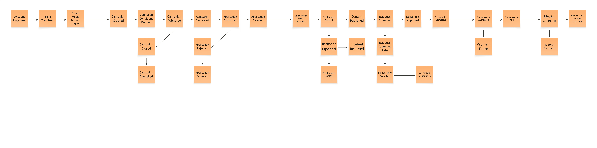

_Nota. Elaboración propia._

**Strategic EventStorming - Commands, Actors, Rules and Hotspots**

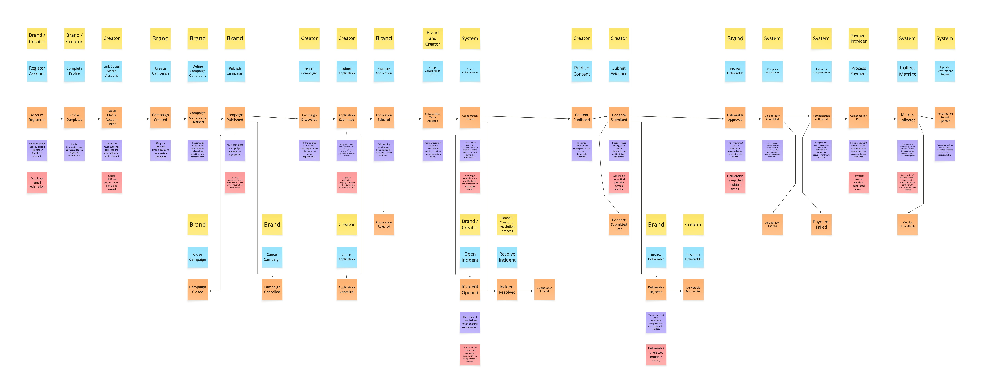

_Nota. Elaboración propia._

##### 2.5.1.1. Candidate Context Discovery

A partir del EventStorming se realizó Candidate Context Discovery con el objetivo de identificar grupos de comportamientos y conceptos que presentan alta cohesión interna y que cambian por razones diferentes respecto de otras partes del dominio.

Para la sesión de Candidate Context Discovery se utilizó principalmente la técnica start-with-simple, descomponiendo el timeline del EventStorm en grupos secuenciales de actividades relacionadas y analizando la cohesión existente entre sus eventos, reglas y responsabilidades de negocio.

A partir de esta agrupación se identificaron cambios claros de responsabilidad dentro del proceso. Las actividades relacionadas con identidad y perfiles presentan un ciclo de vida independiente de las campañas; las campañas y postulaciones corresponden a la etapa previa a la formalización de una colaboración; la colaboración concentra el cumplimiento del acuerdo, los entregables y las incidencias; las operaciones de compensación poseen reglas financieras propias; y la medición de resultados depende de procesos y fuentes diferentes a los utilizados durante la ejecución de la colaboración.

Como resultado se identificaron los siguientes Bounded Contexts candidatos:

| Bounded Context                          | Clasificación propuesta | Responsabilidad                                                                      | Principales capabilities                                                                                                        |
| ---------------------------------------- | ----------------------- | ------------------------------------------------------------------------------------ | ------------------------------------------------------------------------------------------------------------------------------- |
| **Identity & Profile Management**        | Generic Domain          | Administrar las identidades y perfiles que participan en CollabPro.                  | Registro, autenticación, recuperación de acceso, perfiles empresariales, perfiles de creadores y vinculación de redes sociales. |
| **Campaign Management**                  | Core Domain             | Administrar las oportunidades de colaboración antes de que exista un acuerdo formal. | Creación de campañas, condiciones, publicación, búsqueda, postulaciones y evaluación de postulantes.                            |
| **Collaboration Management**             | Core Domain             | Administrar el cumplimiento de un acuerdo entre una empresa y un creador.            | Formalización de colaboración, estado, entregables, evidencias, revisiones, incidencias e historial.                            |
| **Billing & Compensation Management**    | Supporting Domain       | Administrar las operaciones económicas relacionadas con CollabPro.                   | Medios de pago, suscripciones, compensaciones, transacciones y eventos de proveedores financieros.                              |
| **Performance & Attribution Management** | Supporting Domain       | Administrar la medición de resultados generados por una colaboración.                | Métricas, evidencias, enlaces de atribución, interacciones y reportes de desempeño.                                             |

**Candidate Context Discovery de CollabPro**

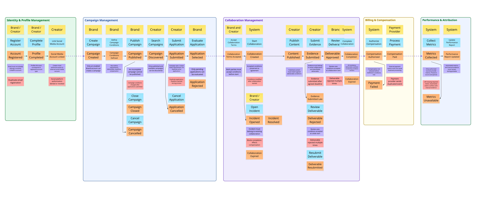

_Nota. Elaboración propia._

##### 2.5.1.2. Domain Message Flows Modeling

Para analizar la colaboración entre Bounded Contexts se utilizó Domain Storytelling. Los diagramas representan cómo los actores realizan actividades sobre los objetos de negocio y cómo estas actividades generan información que posteriormente es requerida por otros contextos.

Se consideraron tres Domain Stories principales debido a que representan los flujos que atraviesan la mayor cantidad de capacidades de CollabPro.

**Domain Story 1: Creación de campaña y formación de una colaboración**

Una empresa autenticada completa su perfil y crea una campaña. La empresa define los requisitos, entregables, plazos y condiciones de compensación y posteriormente publica la campaña.

Un creador consulta las oportunidades disponibles, revisa una campaña y registra su postulación. La empresa revisa las postulaciones y selecciona a un creador. Después de que ambas partes aceptan las condiciones, se crea una colaboración manteniendo una copia de las condiciones aceptadas.

Este flujo representa la colaboración principal entre **Identity & Profile Management**, **Campaign Management** y **Collaboration Management**.

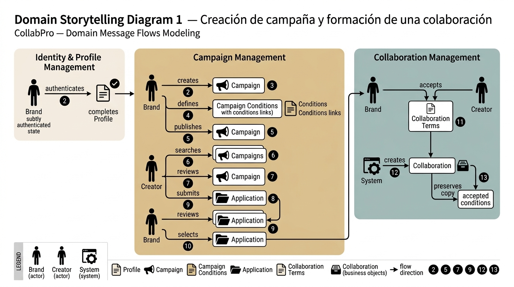

**Domain Story 2: Cumplimiento de colaboración y compensación**

El creador consulta una colaboración activa, desarrolla el contenido solicitado y registra el entregable junto con la evidencia correspondiente.

La empresa revisa el entregable. Si existe un incumplimiento, registra las observaciones y el creador puede presentar una nueva versión cuando las condiciones de la colaboración lo permitan.

Cuando todos los entregables obligatorios son aprobados y no existe una condición que impida continuar, la colaboración alcanza el estado correspondiente para su finalización. Collaboration Management informa a Billing & Compensation Management que la compensación puede ser autorizada.

Cuando la compensación es monetaria, el proveedor financiero procesa la operación y posteriormente comunica el resultado al backend de CollabPro.

Este flujo representa la colaboración entre **Collaboration Management** y **Billing & Compensation Management**.

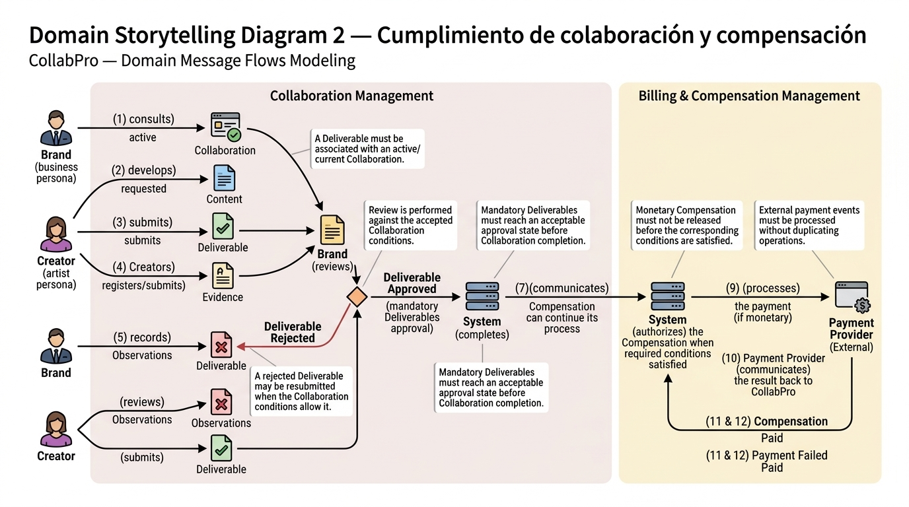

**Domain Story 3: Obtención y análisis de resultados**

Cuando una colaboración produce contenido publicado, Performance & Attribution Management puede consultar las métricas disponibles mediante una cuenta social previamente autorizada.

Las métricas obtenidas se almacenan junto con su fuente y periodo correspondiente. Cuando una métrica no puede obtenerse automáticamente, puede registrarse una evidencia adicional manteniendo explícita la diferencia entre un dato automatizado y una evidencia proporcionada por el creador.

Cuando se utiliza un mecanismo de atribución, CollabPro puede registrar interacciones relacionadas con un enlace o identificador asociado a la colaboración.

Finalmente, la empresa consulta el reporte de desempeño con la información disponible.

Este flujo representa la colaboración entre **Identity & Profile Management**, **Collaboration Management** y **Performance & Attribution Management**, además de los proveedores externos de redes sociales.

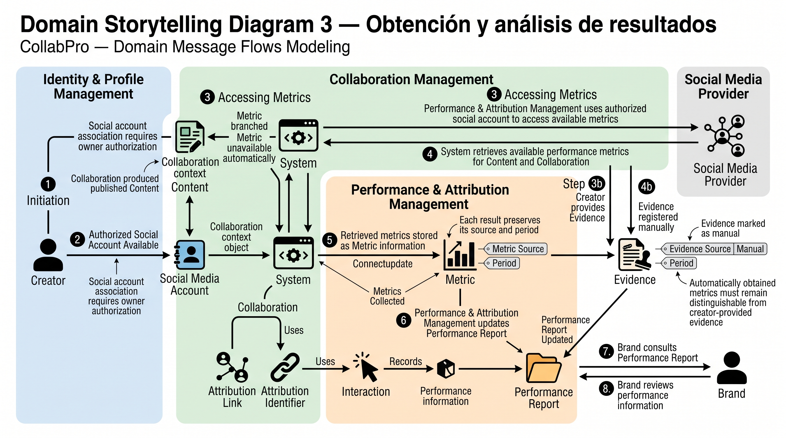

##### 2.5.1.3. Bounded Context Canvases

A partir de los contextos candidatos se elaboraron Bounded Context Canvases con el objetivo de precisar el propósito, reglas, lenguaje, capabilities y dependencias de cada contexto.

La elaboración se realizó de forma iterativa considerando Context Overview Definition, Business Rules Distillation & Ubiquitous Language Capture, Capability Analysis, Dependencies Capture y Design Critique.

**Identity & Profile Management**

| Aspecto                   | Definición                                                                                                                                                                                      |
| ------------------------- | ----------------------------------------------------------------------------------------------------------------------------------------------------------------------------------------------- |
| **Purpose**               | Proporcionar una identidad verificable dentro de CollabPro y mantener la información necesaria de empresas y creadores.                                                                         |
| **Domain Role**           | Generic Domain.                                                                                                                                                                                 |
| **Ubiquitous Language**   | Account, Brand Profile, Creator Profile, Social Media Account.                                                                                                                                  |
| **Capabilities**          | Registrar cuenta, autenticar cuenta, recuperar acceso, actualizar perfiles, vincular y desvincular redes sociales.                                                                              |
| **Business Rules**        | El correo de una cuenta debe ser único. Una cuenta mantiene un tipo definido. Una cuenta social no debe duplicarse dentro de un mismo perfil. Las asociaciones externas requieren autorización. |
| **Inbound Dependencies**  | Proveedores externos utilizados en los procesos de autorización social.                                                                                                                         |
| **Outbound Dependencies** | Proporciona identificadores y datos de referencia de empresas y creadores a otros contextos.                                                                                                    |
| **Design Critique**       | Los detalles particulares de OAuth o de proveedores externos no forman parte del modelo de dominio.                                                                                             |

**Campaign Management**

| Aspecto                   | Definición                                                                                                                                                                                                                 |
| ------------------------- | -------------------------------------------------------------------------------------------------------------------------------------------------------------------------------------------------------------------------- |
| **Purpose**               | Administrar las oportunidades comerciales disponibles antes de que exista una colaboración.                                                                                                                                |
| **Domain Role**           | Core Domain.                                                                                                                                                                                                               |
| **Ubiquitous Language**   | Campaign, Requirement, Deliverable Specification, Compensation Terms, Application.                                                                                                                                         |
| **Capabilities**          | Crear campaña, definir condiciones, publicar campaña, buscar campañas, postular, modificar o cancelar una postulación y evaluar postulantes.                                                                               |
| **Business Rules**        | Una campaña incompleta no puede publicarse. Solo se puede postular a campañas abiertas. Un creador no debe registrar una postulación duplicada. Las postulaciones solo pueden modificarse mientras permanezcan pendientes. |
| **Inbound Dependencies**  | Identity & Profile Management proporciona referencias de Brand y Creator.                                                                                                                                                  |
| **Outbound Dependencies** | Una postulación seleccionada y las condiciones aceptadas permiten iniciar el proceso correspondiente en Collaboration Management.                                                                                          |
| **Design Critique**       | Campaign no debe controlar entregables reales ni estados de ejecución de una colaboración.                                                                                                                                 |

**Collaboration Management**

| Aspecto                   | Definición                                                                                                                                                                                                                                  |
| ------------------------- | ------------------------------------------------------------------------------------------------------------------------------------------------------------------------------------------------------------------------------------------- |
| **Purpose**               | Gestionar el acuerdo y cumplimiento de una relación comercial entre una empresa y un creador.                                                                                                                                               |
| **Domain Role**           | Core Domain.                                                                                                                                                                                                                                |
| **Ubiquitous Language**   | Collaboration, Agreement, Deliverable, Evidence, Approval, Incident.                                                                                                                                                                        |
| **Capabilities**          | Crear colaboración, consultar estado, registrar entregables, registrar evidencias, revisar entregables, administrar correcciones, abrir incidencias y completar una colaboración.                                                           |
| **Business Rules**        | Una colaboración requiere condiciones aceptadas por ambas partes. Las condiciones acordadas no deben modificarse como consecuencia de cambios posteriores en la campaña. Un entregable debe validarse utilizando las condiciones aceptadas. |
| **Inbound Dependencies**  | Campaign Management proporciona la postulación seleccionada y las condiciones aceptadas.                                                                                                                                                    |
| **Outbound Dependencies** | Informa a Billing & Compensation Management cuando la compensación puede continuar y proporciona información a Performance & Attribution Management sobre contenido y colaboraciones.                                                       |
| **Design Critique**       | El procesamiento financiero y la consulta de APIs sociales permanecen fuera de este contexto.                                                                                                                                               |

**Billing & Compensation Management**

| Aspecto                   | Definición                                                                                                                                                                                                                     |
| ------------------------- | ------------------------------------------------------------------------------------------------------------------------------------------------------------------------------------------------------------------------------ |
| **Purpose**               | Administrar las operaciones económicas relacionadas con el uso de CollabPro y las compensaciones de las colaboraciones.                                                                                                        |
| **Domain Role**           | Supporting Domain.                                                                                                                                                                                                             |
| **Ubiquitous Language**   | Subscription, Payment Method, Compensation, Transaction.                                                                                                                                                                       |
| **Capabilities**          | Asociar medio de pago, crear suscripción, consultar suscripción, registrar compensación, autorizar compensación, procesar pago y gestionar eventos financieros.                                                                |
| **Business Rules**        | Subscription y Compensation representan obligaciones económicas diferentes. Una compensación monetaria no debe procesarse antes de ser autorizada. Los eventos provenientes del proveedor deben tratarse de forma idempotente. |
| **Inbound Dependencies**  | Identity & Profile Management proporciona referencias de usuario. Collaboration Management informa cuándo una compensación puede ser autorizada.                                                                               |
| **Outbound Dependencies** | Proporciona el estado de las operaciones económicas relacionadas con la colaboración.                                                                                                                                          |
| **Design Critique**       | El modelo de dominio no debe depender directamente de Stripe u otro proveedor concreto.                                                                                                                                        |

**Performance & Attribution Management**

| Aspecto                   | Definición                                                                                                                                                                                                     |
| ------------------------- | -------------------------------------------------------------------------------------------------------------------------------------------------------------------------------------------------------------- |
| **Purpose**               | Mantener información verificable sobre el desempeño generado por las colaboraciones.                                                                                                                           |
| **Domain Role**           | Supporting Domain.                                                                                                                                                                                             |
| **Ubiquitous Language**   | Performance, Reach, Impressions, Engagement, Conversion, Attribution, Metric Source.                                                                                                                           |
| **Capabilities**          | Consultar métricas, registrar snapshots, registrar evidencias, crear mecanismos de atribución y generar reportes de desempeño.                                                                                 |
| **Business Rules**        | Toda métrica debe mantener su fuente y periodo. Los datos automáticos deben diferenciarse de las evidencias manuales. Los resultados atribuibles no deben presentarse como equivalentes a causalidad absoluta. |
| **Inbound Dependencies**  | Collaboration Management proporciona la referencia de la colaboración y el contenido relacionado. Identity & Profile Management proporciona la asociación social autorizada.                                   |
| **Outbound Dependencies** | Proporciona resultados y reportes para consulta de las empresas.                                                                                                                                               |
| **Design Critique**       | Las particularidades de Instagram, TikTok, YouTube u otros servicios externos deben permanecer fuera del modelo de dominio.                                                                                    |

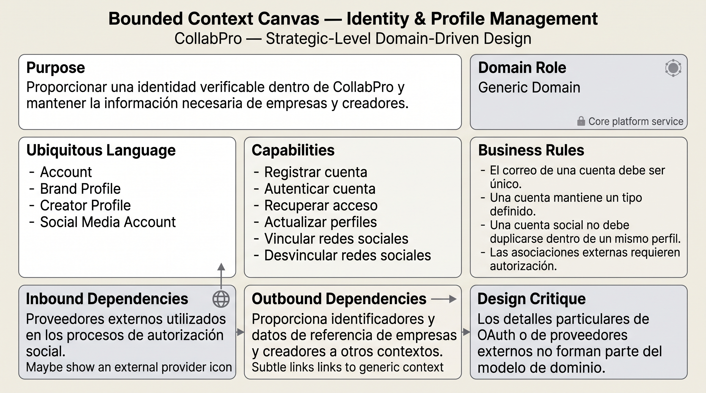

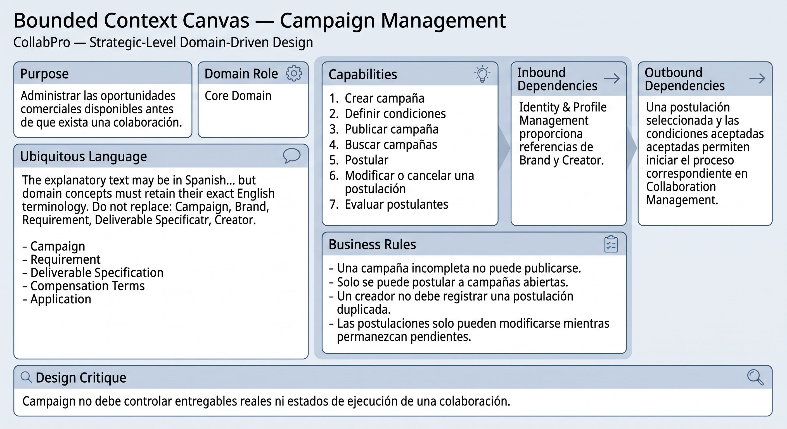

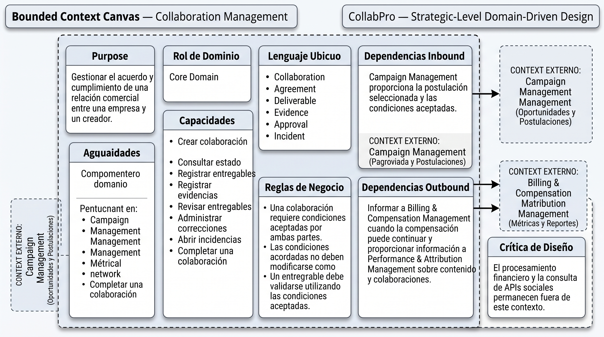

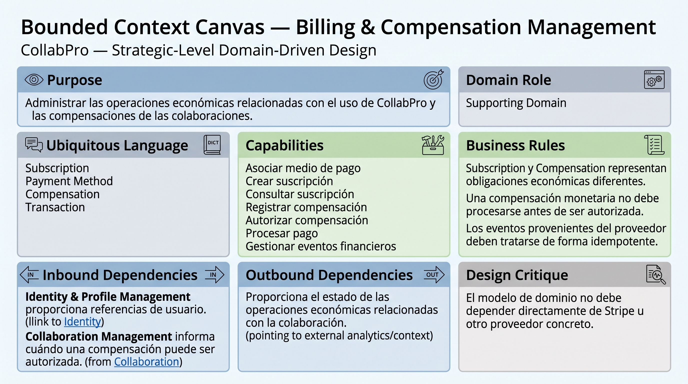

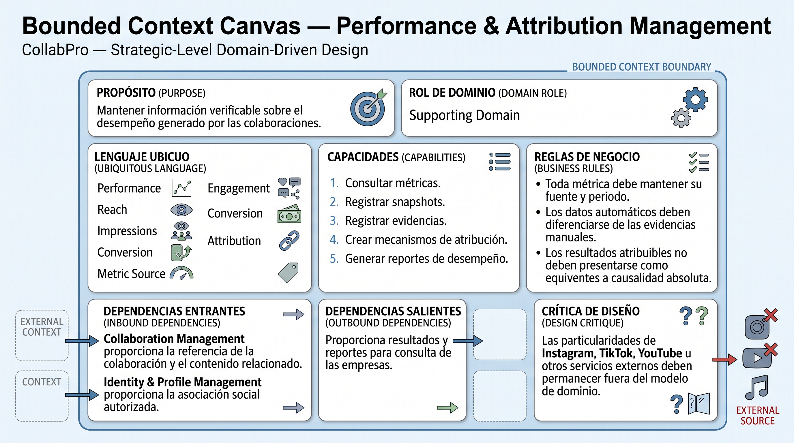

#### 2.5.2. Context Mapping

Una vez identificados y detallados los Bounded Contexts, el equipo analizó sus dependencias para establecer un Context Map que reduzca el acoplamiento entre modelos y permita mantener responsabilidades claramente delimitadas.

Durante el análisis se consideró inicialmente agrupar Campaign Management y Collaboration Management dentro de un único contexto de marketplace. Esta alternativa fue descartada debido a que una campaña representa una oportunidad disponible para múltiples creadores, mientras que una colaboración representa una relación concreta con condiciones previamente aceptadas y un ciclo de cumplimiento independiente.

También se evaluó mantener Billing & Compensation Management dentro de Collaboration Management. La alternativa fue descartada debido a que los procesos financieros poseen reglas y estados diferentes, además de depender de un proveedor externo que puede cambiar sin modificar las reglas de cumplimiento de la colaboración.

De forma similar, se consideró incorporar Performance & Attribution Management dentro de Collaboration Management. La alternativa fue descartada porque la disponibilidad y actualización de métricas depende de APIs externas y mecanismos de atribución que evolucionan independientemente del ciclo de ejecución de una colaboración.

Finalmente se descartó utilizar Shared Kernel para compartir los modelos internos entre Bounded Contexts. Cada contexto mantiene su propio modelo y únicamente comparte identificadores y contratos de integración cuando resulta necesario.

Las relaciones resultantes se resumen a continuación:

| Upstream                      | Downstream                           | Relación            | Información intercambiada                                                  |
| ----------------------------- | ------------------------------------ | ------------------- | -------------------------------------------------------------------------- |
| Identity & Profile Management | Campaign Management                  | Customer / Supplier | Identidad y referencia de Brand y Creator.                                 |
| Identity & Profile Management | Billing & Compensation Management    | Customer / Supplier | Referencia de la cuenta asociada a medios de pago o suscripción.           |
| Identity & Profile Management | Performance & Attribution Management | Customer / Supplier | Referencia de las cuentas sociales autorizadas.                            |
| Campaign Management           | Collaboration Management             | Customer / Supplier | Postulación seleccionada y snapshot de las condiciones aceptadas.          |
| Collaboration Management      | Billing & Compensation Management    | Customer / Supplier | Autorización o elegibilidad de la compensación.                            |
| Collaboration Management      | Performance & Attribution Management | Customer / Supplier | Referencia de la colaboración y contenido utilizado para medir resultados. |

En estas relaciones el contexto upstream proporciona información mediante contratos explícitos sin exponer directamente su modelo interno.

Las integraciones con proveedores externos de pagos y redes sociales se protegen mediante una Anti-Corruption Layer implementada a través de adapters. De esta manera, los conceptos utilizados por dichos proveedores no ingresan directamente al modelo de dominio de CollabPro.

El Context Map final mantiene a Campaign Management y Collaboration Management como los principales contextos del dominio, mientras Identity & Profile Management proporciona capacidades transversales de identidad, Billing & Compensation Management concentra las operaciones económicas y Performance & Attribution Management administra la medición de resultados.

**DDD Context Map**

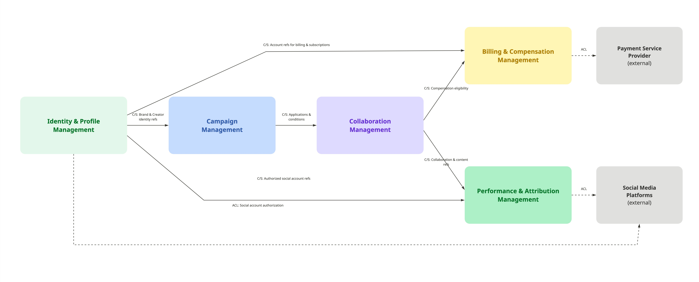

_Nota. Elaboración propia._

#### 2.5.3. Software Architecture

La arquitectura de software de CollabPro se representa utilizando C4 Model con el objetivo de visualizar la solución desde diferentes niveles de abstracción. El Context Level Diagram presenta a CollabPro como un único sistema y sus relaciones con usuarios y sistemas externos. El Container Level Diagram muestra los principales productos y unidades ejecutables de la solución. Finalmente, el Deployment Diagram representa la distribución de dichos elementos entre dispositivos, servicios de infraestructura y sistemas externos.

##### 2.5.3.1. Software Architecture Context Level Diagrams

El System Context Diagram presenta a CollabPro como el sistema central dentro del ecosistema.

Los principales usuarios son el **Brand Representative**, quien utiliza CollabPro para crear y administrar campañas, seleccionar creadores, validar entregables y consultar resultados; y el **Content Creator**, quien utiliza la solución para descubrir oportunidades, postular a campañas, administrar colaboraciones, presentar entregables y consultar compensaciones.

CollabPro interactúa con un **Payment Service Provider** para las operaciones relacionadas con suscripciones y compensaciones monetarias. Asimismo, interactúa con **Social Media Platforms** para autorizar cuentas y obtener información disponible de perfiles, publicaciones o métricas cuando los permisos concedidos lo permitan.

Estas integraciones se realizan mediante el backend de CollabPro, evitando que los clientes móviles dependan directamente de las reglas o credenciales privadas utilizadas por dichos servicios.

**Software Architecture System Context Diagram**

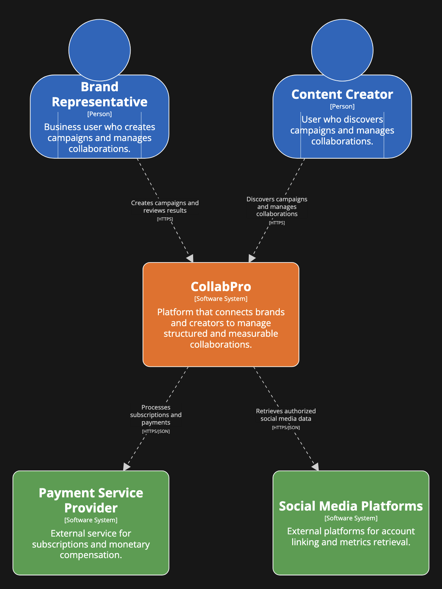

_Nota. Elaboración propia._

##### 2.5.3.2. Software Architecture Container Level Diagrams

El Container Diagram representa los productos principales que conforman CollabPro.

La solución incluye un Landing Page, una aplicación móvil nativa para Android, una aplicación móvil multiplataforma, los RESTful Web Services, el sistema de persistencia y las integraciones externas.

| Container                             | Tecnología                              | Responsabilidad                                                                                                              |
| ------------------------------------- | --------------------------------------- | ---------------------------------------------------------------------------------------------------------------------------- |
| **Landing Page**                      | HTML5, CSS3 y JavaScript                | Presentar la propuesta de valor, información del producto, idiomas disponibles y mecanismos iniciales de acceso a CollabPro. |
| **Native Android Application**        | Kotlin                                  | Proporcionar la experiencia móvil nativa para empresas y creadores.                                                          |
| **Cross-Platform Mobile Application** | Flutter                             | Proporcionar la experiencia móvil multiplataforma requerida por la solución.                                                 |
| **RESTful Web Services**              | Spring Boot Java                    | Exponer los casos de uso de CollabPro y coordinar los cinco Bounded Contexts.                                                |
| **Relational Database**               | MySQL                               | Persistir los datos administrados por los Bounded Contexts.                                                                  |
| **Evidence/Object Storage**           | Firebase Cloud Storage                | Almacenar archivos o evidencias que no deban persistirse directamente dentro de la base de datos relacional.                 |

Se propone implementar inicialmente los RESTful Web Services mediante una arquitectura modular, manteniendo cada Bounded Context como un módulo independiente dentro del backend. Esta decisión permite conservar los límites definidos por Domain-Driven Design sin introducir prematuramente la complejidad operacional de una arquitectura distribuida.

La aplicación nativa y la aplicación multiplataforma consumen los RESTful Web Services mediante HTTPS. La persistencia es accedida exclusivamente por el backend. Las integraciones con el proveedor de pagos y las plataformas sociales también se realizan desde los componentes correspondientes de Infrastructure Layer.

Las aplicaciones móviles incorporarán además almacenamiento local para aquellos datos que requieran disponibilidad dentro del dispositivo, en cumplimiento de los requisitos tecnológicos establecidos para la solución.

**Software Architecture Container Diagram**

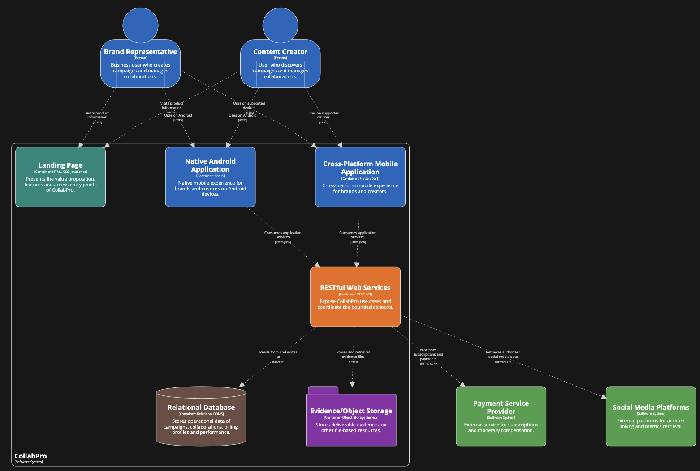

_Nota. Elaboración propia._

##### 2.5.3.3. Software Architecture Deployment Diagrams

El Deployment Diagram representa la distribución física de CollabPro entre los dispositivos de los usuarios y la infraestructura utilizada para publicar sus productos digitales.

El Landing Page se despliega mediante un servicio de hosting web estático. Los RESTful Web Services se ejecutan en una infraestructura cloud accesible públicamente mediante HTTPS y se conectan con una base de datos administrada y, cuando corresponda, con un servicio de almacenamiento de objetos para las evidencias.

La aplicación nativa Android se instala sobre dispositivos Android, mientras que la aplicación multiplataforma se distribuye en los dispositivos compatibles con la estrategia seleccionada por el equipo. Cada aplicación puede utilizar almacenamiento local dentro del dispositivo y se comunica con el backend publicado mediante conexiones HTTPS.

El backend mantiene las conexiones necesarias con los servicios externos utilizados por CollabPro, incluyendo el proveedor de pagos y las APIs autorizadas de redes sociales.

Durante AV1 este diagrama representa la arquitectura de despliegue propuesta. Los nombres concretos de los proveedores cloud, recursos y configuraciones deberán actualizarse posteriormente cuando la infraestructura definitiva sea aprovisionada y desplegada.

**Software Architecture Deployment Diagram**

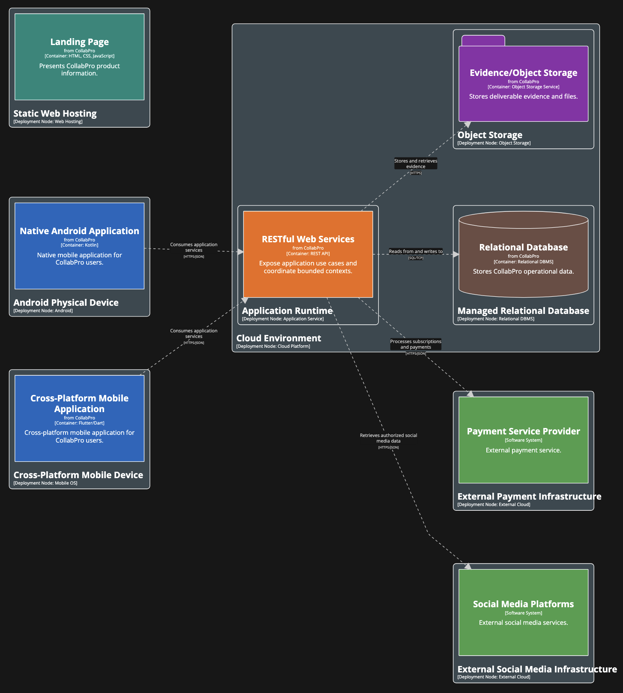

_Nota. Elaboración propia._

### 2.6. Tactical-Level Domain-Driven Design

En esta sección se presenta la perspectiva táctica de Domain-Driven Design aplicada a CollabPro. A partir de los requisitos funcionales, Technical Stories, Spike Stories, Ubiquitous Language y eventos de negocio identificados previamente, la solución se organiza internamente en cinco Bounded Contexts: Identity & Profile Management, Campaign Management, Collaboration Management, Billing & Compensation Management y Performance & Attribution Management.

Cada Bounded Context mantiene su propio modelo de dominio, reglas de negocio y responsabilidades, reduciendo el acoplamiento entre capacidades que evolucionan por razones diferentes. Para su diseño interno se consideran las capas Domain, Application, Interface e Infrastructure. La Domain Layer concentra las reglas y conceptos propios del negocio; la Application Layer coordina los casos de uso; la Interface Layer expone las capacidades del contexto a las aplicaciones cliente y otros sistemas; y la Infrastructure Layer implementa la persistencia e integración con servicios externos.

Esta separación permite que conceptos como Campaign, Collaboration, Compensation y Performance mantengan significados y ciclos de vida independientes dentro de sus respectivos límites, siguiendo los principios de Domain-Driven Design (Evans, 2003).

#### 2.6.1. Bounded Context: Identity & Profile Management

El Bounded Context Identity & Profile Management concentra las capacidades relacionadas con la creación y acceso a las cuentas de CollabPro, así como la administración de los perfiles que representan a empresas y creadores de contenido. También controla la asociación autorizada entre un perfil de creador y sus cuentas de redes sociales.

Este contexto permite mantener separadas las responsabilidades de identidad y perfil de las reglas relacionadas con campañas, colaboraciones, compensaciones y medición de resultados.

##### 2.6.1.1. Domain Layer

La Domain Layer contiene los conceptos necesarios para representar una cuenta y su información asociada. `Account` funciona como Aggregate Root y mantiene la identidad y estado de la cuenta. Dependiendo del tipo de usuario, la cuenta mantiene un `BrandProfile` o un `CreatorProfile`. En el caso de los creadores, el perfil puede contener una o más asociaciones `SocialMediaAccount`.

| Clase                | Tipo                    | Propósito                                                                       | Principales atributos                                                          | Principales métodos                                                             |
| -------------------- | ----------------------- | ------------------------------------------------------------------------------- | ------------------------------------------------------------------------------ | ------------------------------------------------------------------------------- |
| `Account`            | Aggregate Root / Entity | Representar la cuenta registrada en CollabPro y controlar su estado y tipo.     | `accountId`, `email`, `passwordHash`, `accountType`, `status`, `createdAt`     | `activate()`, `changePassword()`, `deactivate()`                                |
| `BrandProfile`       | Entity                  | Mantener la información comercial de una pyme que participa en CollabPro.       | `brandProfileId`, `businessName`, `description`, `category`, `location`        | `updateInformation()`                                                           |
| `CreatorProfile`     | Entity                  | Mantener la información profesional de un creador de contenido.                 | `creatorProfileId`, `displayName`, `biography`, `niche`, `audienceDescription` | `updateInformation()`, `linkSocialMediaAccount()`, `unlinkSocialMediaAccount()` |
| `SocialMediaAccount` | Entity                  | Representar una red social vinculada y autorizada por el creador.               | `socialMediaAccountId`, `platform`, `externalAccountId`, `username`, `status`  | `activate()`, `revoke()`                                                        |
| `EmailAddress`       | Value Object            | Representar y validar una dirección de correo utilizada por una cuenta.         | `value`                                                                        | `isValid()`                                                                     |
| `AccountType`        | Enumeration             | Identificar el tipo de cuenta dentro de CollabPro.                              | `BRAND`, `CREATOR`                                                             | N/A                                                                             |
| `AccountStatus`      | Enumeration             | Representar el estado operativo de la cuenta.                                   | `PENDING`, `ACTIVE`, `SUSPENDED`, `DISABLED`                                   | N/A                                                                             |
| `AccountRepository`  | Repository Interface    | Definir las operaciones de persistencia necesarias para el Aggregate `Account`. | N/A                                                                            | `save()`, `findById()`, `findByEmail()`, `existsByEmail()`                      |

La relación principal del Aggregate establece que una `Account` pertenece a un único tipo de usuario. Una cuenta empresarial mantiene un `BrandProfile`, mientras que una cuenta de creador mantiene un `CreatorProfile`. Un `CreatorProfile` puede asociar cero o varias instancias de `SocialMediaAccount`.

##### 2.6.1.2. Interface Layer

La Interface Layer expone las capacidades relacionadas con autenticación, perfiles y asociación de redes sociales mediante servicios REST.

| Clase                   | Propósito                                                                    | Principales operaciones                                                         |
| ----------------------- | ---------------------------------------------------------------------------- | ------------------------------------------------------------------------------- |
| `AuthController`        | Recibir las solicitudes de registro, autenticación y recuperación de cuenta. | `registerBrand()`, `registerCreator()`, `login()`, `recoverAccount()`           |
| `UserProfileController` | Exponer las operaciones de consulta y actualización de perfiles.             | `getProfile()`, `updateBrandProfile()`, `updateCreatorProfile()`                |
| `SocialMediaController` | Gestionar las solicitudes relacionadas con cuentas sociales asociadas.       | `linkSocialMediaAccount()`, `getLinkedAccounts()`, `unlinkSocialMediaAccount()` |

Los Controllers no implementan reglas de negocio directamente. Su responsabilidad consiste en recibir la solicitud, validar su estructura básica, invocar el caso de uso correspondiente en Application Layer y devolver la respuesta adecuada.

##### 2.6.1.3. Application Layer

La Application Layer coordina los casos de uso relacionados con cuentas y perfiles.

| Clase                                  | Tipo            | Responsabilidad                                             |
| -------------------------------------- | --------------- | ----------------------------------------------------------- |
| `RegisterBrandCommandHandler`          | Command Handler | Crear una cuenta empresarial y su perfil inicial.           |
| `RegisterCreatorCommandHandler`        | Command Handler | Crear una cuenta de creador y su perfil inicial.            |
| `AuthenticateAccountCommandHandler`    | Command Handler | Validar las credenciales y gestionar el acceso a CollabPro. |
| `RecoverAccountCommandHandler`         | Command Handler | Coordinar el proceso de recuperación de acceso.             |
| `UpdateBrandProfileCommandHandler`     | Command Handler | Actualizar los datos permitidos de una empresa.             |
| `UpdateCreatorProfileCommandHandler`   | Command Handler | Actualizar los datos permitidos de un creador.              |
| `LinkSocialMediaAccountCommandHandler` | Command Handler | Coordinar la asociación autorizada de una cuenta social.    |
| `GetUserProfileQueryHandler`           | Query Handler   | Recuperar la información del perfil correspondiente.        |
| `GetLinkedSocialMediaQueryHandler`     | Query Handler   | Consultar las redes sociales vinculadas por el creador.     |

Los handlers utilizan las abstracciones definidas por el dominio y coordinan servicios externos cuando el caso de uso lo requiere. De esta forma, la lógica de autenticación externa o autorización mediante OAuth no se incorpora directamente al modelo de dominio.

##### 2.6.1.4. Infrastructure Layer

La Infrastructure Layer implementa los mecanismos técnicos necesarios para persistir cuentas, gestionar credenciales e interactuar con proveedores externos.

| Clase                       | Propósito                                                                                                    |
| --------------------------- | ------------------------------------------------------------------------------------------------------------ |
| `AccountPersistenceAdapter` | Implementar `AccountRepository` utilizando el mecanismo de persistencia seleccionado para el backend.        |
| `PasswordHashingService`    | Generar y verificar representaciones seguras de las contraseñas.                                             |
| `AccessTokenProvider`       | Generar y validar las credenciales utilizadas por los servicios protegidos.                                  |
| `SocialOAuthClient`         | Encapsular la comunicación con los proveedores externos utilizados para autorizar cuentas de redes sociales. |
| `AccountRecoveryService`    | Gestionar el envío del mecanismo necesario para recuperar el acceso a una cuenta.                            |

La integración concreta con proveedores de redes sociales permanece encapsulada en `SocialOAuthClient`. Esto permite sustituir o incorporar nuevos proveedores sin modificar el modelo de dominio.

##### 2.6.1.5. Bounded Context Software Architecture Component Level Diagrams

El Component Diagram de Identity & Profile Management representa la descomposición interna del contexto dentro del backend de CollabPro. El componente de Interface expone los servicios de autenticación, perfiles y redes sociales. Los componentes de Application coordinan los casos de uso, mientras que el Domain Model mantiene las reglas relacionadas con cuentas y perfiles. Finalmente, los adapters de Infrastructure proporcionan persistencia, manejo seguro de credenciales e integración con proveedores de identidad social.

##### 2.6.1.6. Bounded Context Software Architecture Code Level Diagrams

En esta sección se representa el diseño a nivel de código del Bounded Context Identity & Profile Management mediante el Domain Layer Class Diagram y el Database Design Diagram.

###### 2.6.1.6.1. Bounded Context Domain Layer Class Diagrams

El Class Diagram muestra `Account` como Aggregate Root. Una instancia de `Account` mantiene, según su tipo, un `BrandProfile` o un `CreatorProfile`. El `CreatorProfile` puede mantener múltiples `SocialMediaAccount`. Asimismo, se representan los Value Objects, enumeraciones y la abstracción `AccountRepository`.

###### 2.6.1.6.2. Bounded Context Database Design Diagram

El Database Design Diagram representa la persistencia correspondiente a cuentas, perfiles empresariales, perfiles de creadores y cuentas sociales vinculadas. Debe conservarse la relación uno a uno entre una cuenta y su perfil, mientras que un creador puede poseer múltiples cuentas sociales asociadas.

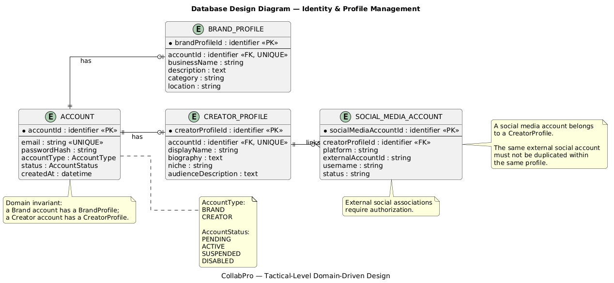

#### 2.6.2. Bounded Context: Campaign Management

El Bounded Context Campaign Management administra el ciclo de vida de las oportunidades comerciales publicadas por las empresas antes de que exista una colaboración formal. Incluye la creación de campañas, definición de requisitos y entregables esperados, publicación, búsqueda por parte de los creadores y administración de postulaciones.

La separación entre Campaign y Collaboration permite distinguir la fase de búsqueda y selección de creadores de la fase posterior de ejecución de un acuerdo ya aceptado por ambas partes.

##### 2.6.2.1. Domain Layer

`Campaign` representa el Aggregate principal del contexto y contiene las condiciones necesarias para participar. Las postulaciones son representadas mediante el Aggregate `Application`, cuyo ciclo de vida es independiente una vez que el creador presenta su candidatura.

| Clase                           | Tipo                    | Propósito                                                                                                                    | Principales atributos                                                                                            | Principales métodos                                                          |
| ------------------------------- | ----------------------- | ---------------------------------------------------------------------------------------------------------------------------- | ---------------------------------------------------------------------------------------------------------------- | ---------------------------------------------------------------------------- |
| `Campaign`                      | Aggregate Root / Entity | Representar una oportunidad de colaboración creada por una empresa.                                                          | `campaignId`, `brandId`, `title`, `objective`, `description`, `status`, `publicationDate`, `applicationDeadline` | `defineConditions()`, `publish()`, `update()`, `close()`                     |
| `CampaignRequirement`           | Entity / Value Object   | Representar una condición que debe cumplir un creador para participar.                                                       | `requirementId`, `description`, `mandatory`                                                                      | `changeDescription()`                                                        |
| `DeliverableSpecification`      | Entity                  | Definir el contenido o actividad que se espera del creador.                                                                  | `specificationId`, `contentType`, `description`, `quantity`, `deadline`                                          | `updateDeadline()`, `updateDescription()`                                    |
| `CompensationTerms`             | Value Object            | Expresar la compensación ofrecida como parte de las condiciones de campaña sin realizar todavía su procesamiento financiero. | `type`, `amount`, `currency`, `description`                                                                      | `isMonetary()`                                                               |
| `Application`                   | Aggregate Root / Entity | Representar la postulación de un creador a una campaña.                                                                      | `applicationId`, `campaignId`, `creatorId`, `message`, `status`, `submittedAt`                                   | `submit()`, `update()`, `cancel()`, `select()`, `reject()`                   |
| `CampaignStatus`                | Enumeration             | Representar el estado de una campaña.                                                                                        | `DRAFT`, `OPEN`, `CLOSED`, `CANCELLED`                                                                           | N/A                                                                          |
| `ApplicationStatus`             | Enumeration             | Representar el estado de una postulación.                                                                                    | `PENDING`, `SELECTED`, `REJECTED`, `CANCELLED`                                                                   | N/A                                                                          |
| `CampaignRepository`            | Repository Interface    | Definir la persistencia del Aggregate `Campaign`.                                                                            | N/A                                                                                                              | `save()`, `findById()`, `search()`                                           |
| `ApplicationRepository`         | Repository Interface    | Definir la persistencia de las postulaciones.                                                                                | N/A                                                                                                              | `save()`, `findById()`, `findByCampaignId()`, `existsByCampaignAndCreator()` |
| `ApplicationEligibilityService` | Domain Service          | Evaluar si un creador cumple los requisitos obligatorios definidos por una campaña.                                          | N/A                                                                                                              | `evaluate()`                                                                 |

Una `Campaign` contiene uno o más `CampaignRequirement` y `DeliverableSpecification`, además de las condiciones de compensación. Una campaña puede recibir múltiples `Application`, pero un creador no debe mantener postulaciones duplicadas activas sobre la misma campaña.

##### 2.6.2.2. Interface Layer

| Clase                   | Propósito                                                                                           | Principales operaciones                                                                                                                |
| ----------------------- | --------------------------------------------------------------------------------------------------- | -------------------------------------------------------------------------------------------------------------------------------------- |
| `CampaignController`    | Exponer las operaciones de creación, actualización, publicación y consulta de campañas.             | `createCampaign()`, `updateCampaign()`, `getCampaign()`, `searchCampaigns()`                                                           |
| `ApplicationController` | Gestionar las postulaciones realizadas por los creadores y su evaluación por parte de las empresas. | `submitApplication()`, `updateApplication()`, `cancelApplication()`, `getApplications()`, `selectApplication()`, `rejectApplication()` |

##### 2.6.2.3. Application Layer

| Clase                                    | Tipo            | Responsabilidad                                                          |
| ---------------------------------------- | --------------- | ------------------------------------------------------------------------ |
| `CreateCampaignCommandHandler`           | Command Handler | Crear una campaña en estado inicial.                                     |
| `DefineCampaignConditionsCommandHandler` | Command Handler | Registrar requisitos, entregables, fechas y condiciones de compensación. |
| `PublishCampaignCommandHandler`          | Command Handler | Verificar que la campaña pueda abrirse a postulaciones.                  |
| `UpdateCampaignCommandHandler`           | Command Handler | Coordinar las modificaciones permitidas sobre una campaña.               |
| `SearchCampaignsQueryHandler`            | Query Handler   | Recuperar campañas utilizando los criterios indicados por el creador.    |
| `GetCampaignDetailsQueryHandler`         | Query Handler   | Recuperar las condiciones completas de una campaña.                      |
| `SubmitApplicationCommandHandler`        | Command Handler | Validar requisitos y registrar una postulación.                          |
| `UpdateApplicationCommandHandler`        | Command Handler | Modificar una postulación mientras continúe pendiente.                   |
| `CancelApplicationCommandHandler`        | Command Handler | Cancelar una postulación pendiente.                                      |
| `EvaluateApplicationCommandHandler`      | Command Handler | Registrar la selección o rechazo realizado por la empresa.               |

Cuando una postulación es seleccionada, el contexto registra dicho resultado. La creación de la colaboración correspondiente pertenece al Bounded Context Collaboration Management.

##### 2.6.2.4. Infrastructure Layer

| Clase                           | Propósito                                                                          |
| ------------------------------- | ---------------------------------------------------------------------------------- |
| `CampaignPersistenceAdapter`    | Implementar las operaciones definidas por `CampaignRepository`.                    |
| `ApplicationPersistenceAdapter` | Implementar las operaciones definidas por `ApplicationRepository`.                 |
| `CampaignSearchAdapter`         | Ejecutar la búsqueda de campañas según criterios como nicho, condiciones y estado. |

Las decisiones de persistencia se mantienen separadas del modelo de dominio, permitiendo que las reglas asociadas a campañas y postulaciones no dependan de la tecnología de almacenamiento utilizada.

##### 2.6.2.5. Bounded Context Software Architecture Component Level Diagrams

El Component Diagram de Campaign Management muestra los componentes responsables de la administración de campañas y postulaciones. Los Controllers reciben las solicitudes provenientes de las aplicaciones móviles, los Application Handlers coordinan los casos de uso, el Domain Model implementa las reglas sobre campañas y postulaciones, y los Persistence Adapters almacenan sus estados.

##### 2.6.2.6. Bounded Context Software Architecture Code Level Diagrams

###### 2.6.2.6.1. Bounded Context Domain Layer Class Diagrams

El Class Diagram representa los Aggregates `Campaign` y `Application`. Una campaña contiene requisitos, especificaciones de entregables y condiciones de compensación. Las postulaciones referencian la campaña y al creador correspondiente, manteniendo su propio ciclo de vida.

###### 2.6.2.6.2. Bounded Context Database Design Diagram

La persistencia del contexto contempla la campaña, sus requisitos, especificaciones de entregables, condiciones de compensación y postulaciones. La relación entre campañas y postulaciones es de uno a muchos.

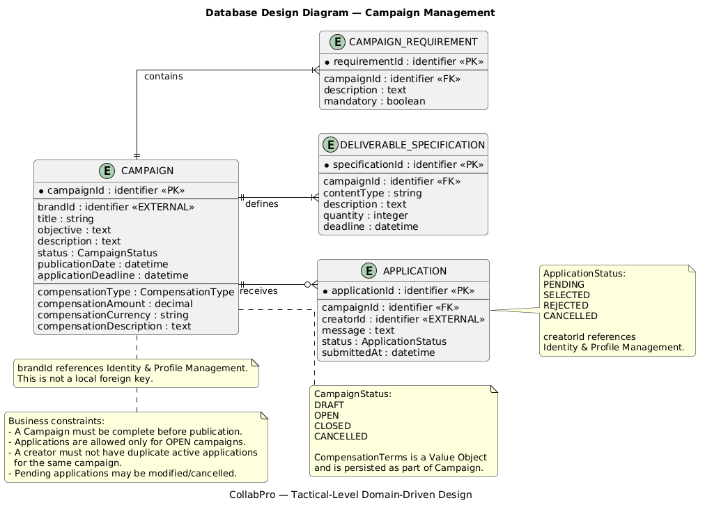

#### 2.6.3. Bounded Context: Collaboration Management

Collaboration Management controla la ejecución de una relación comercial después de que una empresa selecciona a un creador y ambas partes aceptan sus condiciones. El contexto mantiene el acuerdo aceptado, el estado de la colaboración, los entregables presentados, las evidencias de cumplimiento, las revisiones realizadas por la empresa y las incidencias que puedan surgir.

Este contexto representa uno de los núcleos principales de CollabPro debido a que concentra la trazabilidad que permite sustituir los acuerdos informales realizados mediante mensajes dispersos.

##### 2.6.3.1. Domain Layer

`Collaboration` funciona como Aggregate Root y representa la relación activa entre una empresa y un creador. Las condiciones aceptadas se conservan mediante un `AgreementSnapshot`, evitando que modificaciones posteriores de la campaña cambien las obligaciones previamente acordadas.

| Clase                     | Tipo                    | Propósito                                                                            | Principales atributos                                                                         | Principales métodos                                            |
| ------------------------- | ----------------------- | ------------------------------------------------------------------------------------ | --------------------------------------------------------------------------------------------- | -------------------------------------------------------------- |
| `Collaboration`           | Aggregate Root / Entity | Representar el acuerdo activo entre una empresa y un creador.                        | `collaborationId`, `campaignId`, `brandId`, `creatorId`, `status`, `startedAt`, `completedAt` | `activate()`, `markExpired()`, `complete()`, `cancel()`        |
| `AgreementSnapshot`       | Value Object            | Conservar las condiciones aceptadas por ambas partes al iniciar la colaboración.     | `requirements`, `deliverableTerms`, `compensationTerms`, `acceptedAt`                         | `matches()`                                                    |
| `Deliverable`             | Entity                  | Representar un entregable requerido durante la colaboración.                         | `deliverableId`, `type`, `description`, `deadline`, `status`, `submittedAt`                   | `submit()`, `resubmit()`, `approve()`, `reject()`              |
| `Evidence`                | Entity / Value Object   | Representar la evidencia presentada para demostrar el cumplimiento de un entregable. | `evidenceId`, `type`, `reference`, `submittedAt`                                              | `validateReference()`                                          |
| `DeliverableReview`       | Entity                  | Mantener el historial de decisiones realizadas sobre un entregable.                  | `reviewId`, `deliverableId`, `decision`, `observation`, `reviewedAt`                          | N/A                                                            |
| `Incident`                | Entity                  | Representar un desacuerdo o problema relacionado con la colaboración.                | `incidentId`, `type`, `description`, `status`, `openedAt`, `resolvedAt`, `resolution`         | `open()`, `resolve()`                                          |
| `CollaborationStatus`     | Enumeration             | Representar el estado de la colaboración.                                            | `PENDING`, `ACTIVE`, `UNDER_REVIEW`, `COMPLETED`, `EXPIRED`, `CANCELLED`, `DISPUTED`          | N/A                                                            |
| `DeliverableStatus`       | Enumeration             | Representar el estado de un entregable.                                              | `PENDING`, `SUBMITTED`, `LATE`, `APPROVED`, `REJECTED`, `RESUBMITTED`                         | N/A                                                            |
| `IncidentStatus`          | Enumeration             | Representar el estado de una incidencia.                                             | `OPEN`, `UNDER_REVIEW`, `RESOLVED`                                                            | N/A                                                            |
| `CollaborationRepository` | Repository Interface    | Definir las operaciones de persistencia del Aggregate.                               | N/A                                                                                           | `save()`, `findById()`, `findByBrandId()`, `findByCreatorId()` |

Una colaboración contiene uno o varios `Deliverable`. Cada entregable puede tener múltiples evidencias y revisiones a lo largo de su ciclo de vida. Una colaboración también puede registrar cero o múltiples incidencias.

La colaboración solo debe considerarse completada cuando los entregables obligatorios hayan alcanzado un estado válido para su cierre y no exista una condición que impida completarla.

##### 2.6.3.2. Interface Layer

| Clase                     | Propósito                                                               | Principales operaciones                                                                                            |
| ------------------------- | ----------------------------------------------------------------------- | ------------------------------------------------------------------------------------------------------------------ |
| `CollaborationController` | Gestionar creación, consulta, estado e historial de las colaboraciones. | `createCollaboration()`, `getCollaboration()`, `getCollaborationHistory()`                                         |
| `DeliverableController`   | Gestionar la presentación, revisión y corrección de entregables.        | `submitDeliverable()`, `getDeliverables()`, `approveDeliverable()`, `rejectDeliverable()`, `resubmitDeliverable()` |
| `IncidentController`      | Gestionar las incidencias registradas sobre una colaboración.           | `createIncident()`, `getIncidents()`, `resolveIncident()`                                                          |

##### 2.6.3.3. Application Layer

| Clase                                 | Tipo            | Responsabilidad                                                                         |
| ------------------------------------- | --------------- | --------------------------------------------------------------------------------------- |
| `CreateCollaborationCommandHandler`   | Command Handler | Crear la colaboración a partir de una postulación seleccionada y condiciones aceptadas. |
| `GetCollaborationQueryHandler`        | Query Handler   | Recuperar el estado y condiciones vigentes de una colaboración.                         |
| `SubmitDeliverableCommandHandler`     | Command Handler | Registrar un entregable y su evidencia.                                                 |
| `ReviewDeliverableCommandHandler`     | Command Handler | Registrar la aprobación o rechazo de un entregable.                                     |
| `ResubmitDeliverableCommandHandler`   | Command Handler | Registrar una nueva versión de un entregable rechazado cuando corresponda.              |
| `OpenIncidentCommandHandler`          | Command Handler | Abrir una incidencia relacionada con una colaboración.                                  |
| `ResolveIncidentCommandHandler`       | Command Handler | Registrar la resolución y cerrar una incidencia.                                        |
| `GetCollaborationHistoryQueryHandler` | Query Handler   | Recuperar las colaboraciones anteriores relacionadas con una empresa o creador.         |
| `CompleteCollaborationCommandHandler` | Command Handler | Verificar las condiciones de cierre y completar una colaboración.                       |

Cuando una colaboración satisface sus condiciones de cumplimiento, el contexto puede producir un evento de dominio que indique que la compensación puede continuar su ciclo en Billing & Compensation Management.

##### 2.6.3.4. Infrastructure Layer

| Clase                             | Propósito                                                                                                                               |
| --------------------------------- | --------------------------------------------------------------------------------------------------------------------------------------- |
| `CollaborationPersistenceAdapter` | Implementar `CollaborationRepository`.                                                                                                  |
| `EvidenceStorageAdapter`          | Almacenar o recuperar las evidencias asociadas a entregables cuando estas requieren un recurso externo de almacenamiento.               |
| `CollaborationEventPublisher`     | Propagar los eventos relevantes generados por el contexto hacia otras capacidades de la solución, sin trasladar las reglas del dominio. |

##### 2.6.3.5. Bounded Context Software Architecture Component Level Diagrams

El Component Diagram de Collaboration Management debe mostrar los Controllers de colaboración, entregables e incidencias; los handlers encargados de los casos de uso; el Domain Model compuesto por Collaboration, Deliverable e Incident; y los adapters responsables de persistencia y almacenamiento de evidencias.

##### 2.6.3.6. Bounded Context Software Architecture Code Level Diagrams

###### 2.6.3.6.1. Bounded Context Domain Layer Class Diagrams

El Class Diagram representa `Collaboration` como Aggregate Root y detalla las relaciones con `AgreementSnapshot`, `Deliverable`, `Evidence`, `DeliverableReview` e `Incident`, además de sus enumeraciones y `CollaborationRepository`.

###### 2.6.3.6.2. Bounded Context Database Design Diagram

La persistencia de este contexto debe conservar la colaboración y el snapshot de sus condiciones, sus entregables, evidencias, revisiones e incidencias. El modelo debe permitir mantener trazabilidad histórica de las revisiones y correcciones.

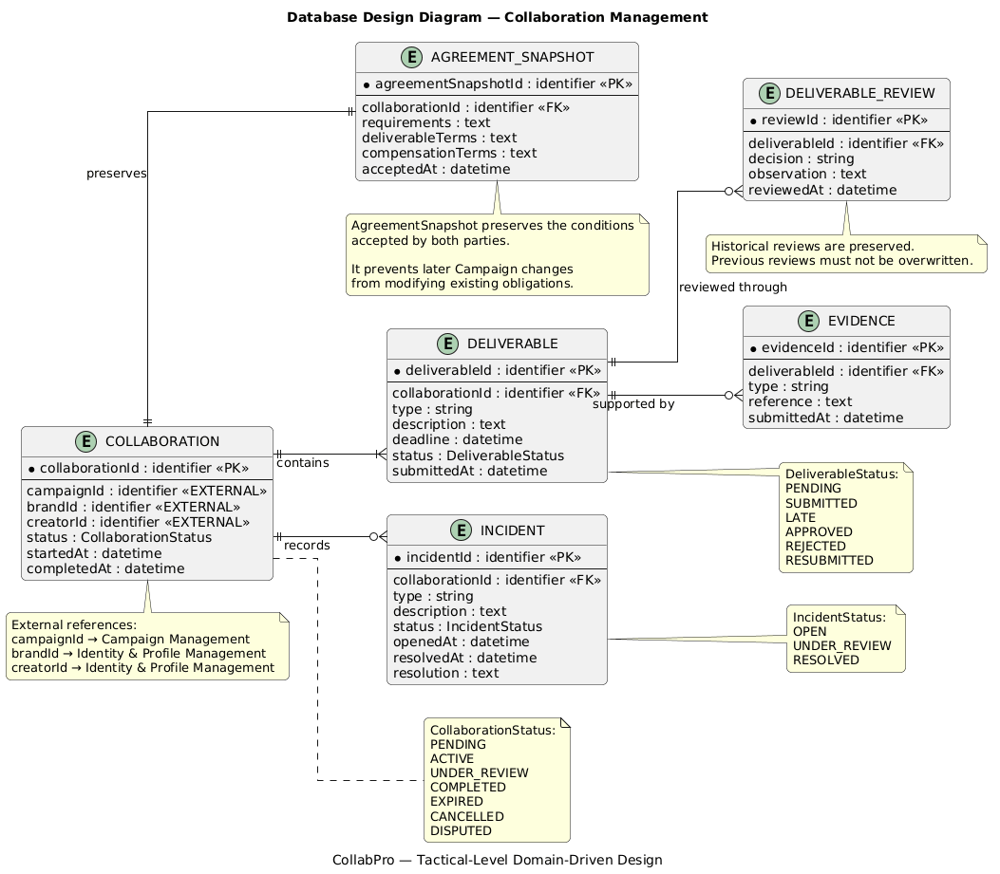

#### 2.6.4. Bounded Context: Billing & Compensation Management

Billing & Compensation Management concentra los procesos económicos de CollabPro. Separa el modelo comercial de suscripción de la plataforma del modelo de compensación asociado a las colaboraciones entre empresas y creadores.

El contexto debe distinguir entre una suscripción pagada por una empresa para utilizar las funcionalidades de CollabPro y una compensación acordada con un creador por el cumplimiento de una colaboración. Asimismo, la compensación puede ser monetaria o no monetaria, según las condiciones establecidas entre las partes.

##### 2.6.4.1. Domain Layer

| Clase                      | Tipo                    | Propósito                                                                            | Principales atributos                                                                                   | Principales métodos                                                               |
| -------------------------- | ----------------------- | ------------------------------------------------------------------------------------ | ------------------------------------------------------------------------------------------------------- | --------------------------------------------------------------------------------- |
| `PaymentAccount`           | Aggregate Root / Entity | Representar la configuración financiera asociada a un usuario.                       | `paymentAccountId`, `accountId`, `status`                                                               | `addPaymentMethod()`, `removePaymentMethod()`                                     |
| `PaymentMethod`            | Entity                  | Representar un medio habilitado para realizar o recibir operaciones económicas.      | `paymentMethodId`, `providerReference`, `type`, `status`                                                | `activate()`, `disable()`                                                         |
| `Subscription`             | Aggregate Root / Entity | Representar la suscripción contratada por una empresa.                               | `subscriptionId`, `brandId`, `planCode`, `status`, `startedAt`, `renewalDate`                           | `activate()`, `renew()`, `suspend()`, `cancel()`                                  |
| `Compensation`             | Aggregate Root / Entity | Representar el valor acordado para un creador dentro de una colaboración.            | `compensationId`, `collaborationId`, `creatorId`, `type`, `amount`, `currency`, `description`, `status` | `markPending()`, `authorizeRelease()`, `markPaid()`, `markAffectedByIncident()`   |
| `PaymentTransaction`       | Entity                  | Mantener la referencia y estado de una operación procesada por un proveedor externo. | `transactionId`, `providerReference`, `amount`, `currency`, `status`, `processedAt`                     | `confirm()`, `fail()`, `refund()`                                                 |
| `Money`                    | Value Object            | Representar un monto monetario y su moneda.                                          | `amount`, `currency`                                                                                    | `isPositive()`                                                                    |
| `CompensationType`         | Enumeration             | Identificar la forma de compensación.                                                | `CASH`, `PRODUCT`, `SERVICE`, `CREDIT`, `BARTER`                                                        | N/A                                                                               |
| `CompensationStatus`       | Enumeration             | Representar el estado de la compensación.                                            | `PENDING`, `READY`, `PROCESSING`, `PAID`, `AFFECTED`, `CANCELLED`                                       | N/A                                                                               |
| `SubscriptionStatus`       | Enumeration             | Representar el estado de una suscripción.                                            | `PENDING`, `ACTIVE`, `SUSPENDED`, `CANCELLED`                                                           | N/A                                                                               |
| `PaymentAccountRepository` | Repository Interface    | Definir persistencia de cuentas y medios de pago.                                    | N/A                                                                                                     | `save()`, `findByAccountId()`                                                     |
| `SubscriptionRepository`   | Repository Interface    | Definir persistencia de suscripciones.                                               | N/A                                                                                                     | `save()`, `findByBrandId()`                                                       |
| `CompensationRepository`   | Repository Interface    | Definir persistencia de compensaciones.                                              | N/A                                                                                                     | `save()`, `findByCollaborationId()`                                               |
| `PaymentGateway`           | Domain Port             | Abstraer las operaciones necesarias sobre un proveedor externo de pagos.             | N/A                                                                                                     | `preparePaymentMethod()`, `createSubscription()`, `initiatePayment()`, `refund()` |

La existencia de `PaymentGateway` evita que el modelo dependa directamente de un proveedor específico. La tecnología concreta deberá establecerse de acuerdo con los resultados obtenidos en la Spike Story relacionada con la viabilidad del proveedor de pagos.

##### 2.6.4.2. Interface Layer

| Clase                      | Propósito                                                            | Principales operaciones                      |
| -------------------------- | -------------------------------------------------------------------- | -------------------------------------------- |
| `BillingController`        | Gestionar la asociación de medios de pago.                           | `linkPaymentMethod()`, `getPaymentMethods()` |
| `SubscriptionController`   | Gestionar la creación y consulta de suscripciones.                   | `createSubscription()`, `getSubscription()`  |
| `CompensationController`   | Consultar e iniciar las operaciones relacionadas con compensaciones. | `getCompensation()`, `initiatePayment()`     |
| `PaymentWebhookController` | Recibir y validar eventos enviados por el proveedor externo.         | `receivePaymentEvent()`                      |

##### 2.6.4.3. Application Layer

| Clase                                       | Tipo            | Responsabilidad                                                                                                    |
| ------------------------------------------- | --------------- | ------------------------------------------------------------------------------------------------------------------ |
| `LinkPaymentMethodCommandHandler`           | Command Handler | Coordinar la asociación de un medio de pago.                                                                       |
| `CreateSubscriptionCommandHandler`          | Command Handler | Crear y activar una suscripción mediante el proveedor correspondiente.                                             |
| `GetSubscriptionQueryHandler`               | Query Handler   | Consultar el estado vigente de la suscripción.                                                                     |
| `CreateCompensationCommandHandler`          | Command Handler | Registrar la compensación asociada a una nueva colaboración.                                                       |
| `AuthorizeCompensationCommandHandler`       | Command Handler | Permitir la liberación de la compensación una vez satisfechas las condiciones externas necesarias.                 |
| `InitiateCompensationPaymentCommandHandler` | Command Handler | Iniciar una operación monetaria cuando la compensación corresponda a efectivo.                                     |
| `GetCompensationQueryHandler`               | Query Handler   | Consultar el estado de la compensación.                                                                            |
| `HandlePaymentProviderEventHandler`         | Event Handler   | Interpretar un evento validado del proveedor y actualizar la transacción correspondiente sin duplicar operaciones. |

##### 2.6.4.4. Infrastructure Layer

| Clase                              | Propósito                                                                                |
| ---------------------------------- | ---------------------------------------------------------------------------------------- |
| `PaymentAccountPersistenceAdapter` | Implementar `PaymentAccountRepository`.                                                  |
| `SubscriptionPersistenceAdapter`   | Implementar `SubscriptionRepository`.                                                    |
| `CompensationPersistenceAdapter`   | Implementar `CompensationRepository`.                                                    |
| `ExternalPaymentGatewayAdapter`    | Implementar `PaymentGateway` utilizando el proveedor seleccionado.                       |
| `PaymentWebhookVerifier`           | Verificar autenticidad e integridad de los eventos recibidos desde el proveedor externo. |

El Spike relacionado con Stripe se utiliza como investigación de viabilidad. Por ello, el dominio no depende de Stripe de manera directa y conserva la abstracción `PaymentGateway`.

##### 2.6.4.5. Bounded Context Software Architecture Component Level Diagrams

El Component Diagram debe mostrar los componentes de medios de pago, suscripciones y compensaciones, así como la integración del backend con el proveedor de pagos externo. La comunicación con dicho proveedor se realiza exclusivamente mediante el adapter definido en Infrastructure Layer.

##### 2.6.4.6. Bounded Context Software Architecture Code Level Diagrams

###### 2.6.4.6.1. Bounded Context Domain Layer Class Diagrams

El Class Diagram presenta los Aggregates `PaymentAccount`, `Subscription` y `Compensation`, junto con `PaymentMethod`, `PaymentTransaction`, el Value Object `Money`, sus enumeraciones y las abstracciones de persistencia y comunicación con proveedores financieros.

###### 2.6.4.6.2. Bounded Context Database Design Diagram

El Database Design Diagram representa las cuentas financieras, medios de pago tokenizados o referenciados mediante el proveedor, suscripciones, compensaciones y transacciones. No se almacenan directamente datos sensibles completos del medio de pago; se conserva únicamente la referencia necesaria proporcionada por el proveedor seleccionado.

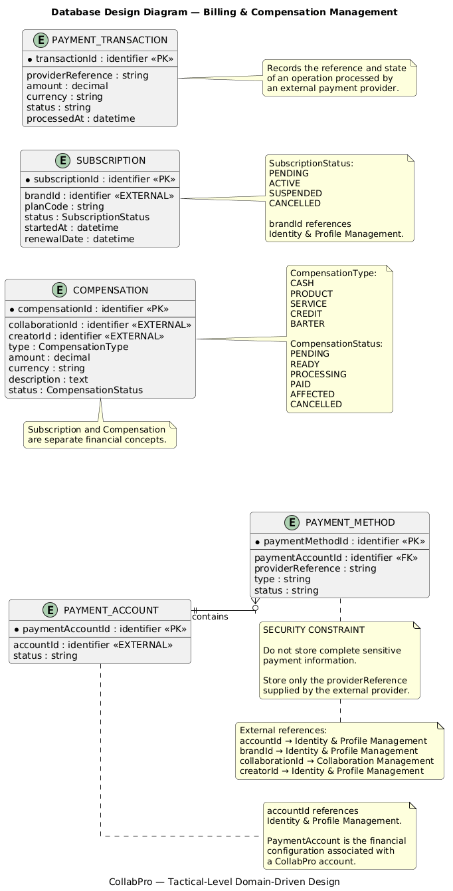

#### 2.6.5. Bounded Context: Performance & Attribution Management

Performance & Attribution Management concentra las capacidades utilizadas para registrar, consultar e interpretar los resultados obtenidos por una colaboración. El contexto administra las métricas provenientes de fuentes autorizadas, evidencias adicionales y mecanismos de atribución como enlaces asociados a una colaboración.

La separación de este contexto permite mantener las reglas de medición desacopladas del ciclo operacional de una colaboración y de las particularidades de cada proveedor de red social.

##### 2.6.5.1. Domain Layer

| Clase                   | Tipo                    | Propósito                                                                                           | Principales atributos                                                                         | Principales métodos                                          |
| ----------------------- | ----------------------- | --------------------------------------------------------------------------------------------------- | --------------------------------------------------------------------------------------------- | ------------------------------------------------------------ |
| `PerformanceReport`     | Aggregate Root / Entity | Consolidar los resultados disponibles para una colaboración.                                        | `performanceReportId`, `collaborationId`, `periodStart`, `periodEnd`, `updatedAt`             | `addMetricSnapshot()`, `addEvidence()`, `calculateSummary()` |
| `MetricSnapshot`        | Entity                  | Registrar una métrica obtenida en un momento y periodo determinados.                                | `metricSnapshotId`, `metricType`, `value`, `source`, `capturedAt`, `periodStart`, `periodEnd` | `updateValue()`                                              |
| `PerformanceEvidence`   | Entity                  | Registrar evidencia suministrada cuando una métrica no puede obtenerse automáticamente.             | `evidenceId`, `type`, `reference`, `submittedAt`, `verificationStatus`                        | `verify()`, `reject()`                                       |
| `AttributionLink`       | Entity                  | Representar un enlace o identificador utilizado para relacionar interacciones con una colaboración. | `attributionLinkId`, `collaborationId`, `token`, `destination`, `status`                      | `activate()`, `deactivate()`                                 |
| `AttributedInteraction` | Entity                  | Registrar una interacción asociada al mecanismo de atribución.                                      | `interactionId`, `attributionLinkId`, `interactionType`, `occurredAt`                         | N/A                                                          |
| `MetricType`            | Enumeration             | Identificar las métricas utilizadas por CollabPro.                                                  | `REACH`, `IMPRESSIONS`, `ENGAGEMENT`, `CLICKS`, `CONVERSIONS`                                 | N/A                                                          |
| `MetricSource`          | Value Object            | Identificar el origen y nivel de confiabilidad del dato registrado.                                 | `provider`, `sourceType`                                                                      | `isAutomated()`                                              |
| `PerformanceRepository` | Repository Interface    | Definir la persistencia del Aggregate de desempeño.                                                 | N/A                                                                                           | `save()`, `findByCollaborationId()`                          |
| `SocialMetricsProvider` | Domain Port             | Abstraer la consulta autorizada de métricas disponibles en servicios externos.                      | N/A                                                                                           | `getAvailableMetrics()`                                      |

Los datos proporcionados automáticamente y las evidencias suministradas manualmente deben mantenerse diferenciados mediante su `MetricSource`, permitiendo que la empresa conozca el origen de la información presentada.

##### 2.6.5.2. Interface Layer

| Clase                           | Propósito                                                                | Principales operaciones                                        |
| ------------------------------- | ------------------------------------------------------------------------ | -------------------------------------------------------------- |
| `PerformanceController`         | Exponer los resultados y evidencias correspondientes a una colaboración. | `getMetrics()`, `registerEvidence()`, `getPerformanceReport()` |
| `AttributionController`         | Crear y consultar los mecanismos de atribución.                          | `createAttributionLink()`, `getAttributionResults()`           |
| `AttributionTrackingController` | Registrar las interacciones generadas por enlaces de atribución.         | `trackInteraction()`                                           |

##### 2.6.5.3. Application Layer

| Clase                                       | Tipo            | Responsabilidad                                                                     |
| ------------------------------------------- | --------------- | ----------------------------------------------------------------------------------- |
| `RefreshMetricsCommandHandler`              | Command Handler | Solicitar al proveedor autorizado las métricas disponibles y actualizar el reporte. |
| `RegisterPerformanceEvidenceCommandHandler` | Command Handler | Registrar evidencia proporcionada por un creador.                                   |
| `CreateAttributionLinkCommandHandler`       | Command Handler | Crear un identificador de atribución para una colaboración.                         |
| `RecordAttributedInteractionCommandHandler` | Command Handler | Registrar una interacción asociada a un mecanismo de atribución.                    |
| `GetPerformanceReportQueryHandler`          | Query Handler   | Consolidar la información disponible para su consulta por la empresa.               |
| `GetAttributionResultsQueryHandler`         | Query Handler   | Recuperar los resultados asociados a los mecanismos de atribución.                  |

##### 2.6.5.4. Infrastructure Layer

| Clase                               | Propósito                                                                                 |
| ----------------------------------- | ----------------------------------------------------------------------------------------- |
| `PerformancePersistenceAdapter`     | Implementar `PerformanceRepository`.                                                      |
| `SocialMetricsProviderAdapter`      | Implementar `SocialMetricsProvider` utilizando las APIs autorizadas que resulten viables. |
| `AttributionPersistenceAdapter`     | Gestionar la persistencia de enlaces e interacciones atribuidas.                          |
| `PerformanceEvidenceStorageAdapter` | Gestionar evidencias externas asociadas a métricas cuando corresponda.                    |

Las APIs concretas utilizadas para obtener datos de redes sociales se determinarán en función de los resultados de las Spike Stories de OAuth y medición de campañas. Por ello, el Domain Layer permanece independiente de Instagram, TikTok, YouTube u otro proveedor específico.

##### 2.6.5.5. Bounded Context Software Architecture Component Level Diagrams

El Component Diagram representa la coordinación entre los componentes de resultados, métricas, evidencias y atribución. También representa la comunicación con los servicios externos utilizados para obtener información autorizada de las redes sociales.

##### 2.6.5.6. Bounded Context Software Architecture Code Level Diagrams

###### 2.6.5.6.1. Bounded Context Domain Layer Class Diagrams

El Class Diagram representa `PerformanceReport` como Aggregate Root y sus relaciones con `MetricSnapshot`, `PerformanceEvidence`, `AttributionLink` y `AttributedInteraction`, junto con los Value Objects, enumeraciones y la abstracción `SocialMetricsProvider`.

###### 2.6.5.6.2. Bounded Context Database Design Diagram

El Database Design Diagram debe distinguir las métricas obtenidas automáticamente de las evidencias ingresadas manualmente y mantener la relación de cada dato con la colaboración correspondiente. También debe representar los enlaces de atribución y las interacciones asociadas.

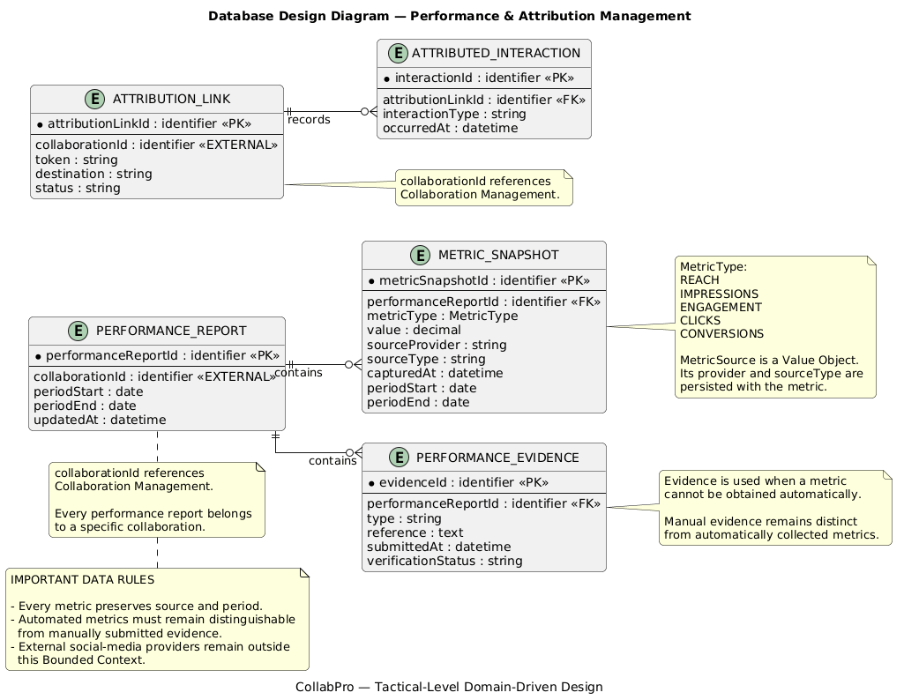

---

## Conclusiones

- Las entrevistas y el análisis del problema permitieron confirmar que las pymes necesitan una forma más ordenada de gestionar colaboraciones con creadores de contenido.

- El Needfinding y la definición de requisitos ayudaron a identificar las principales necesidades de ambos segmentos y a priorizar las funcionalidades iniciales de CollabPro.

- La aplicación de Domain Driven Design permitió organizar el dominio del negocio y establecer una base clara para la arquitectura y el desarrollo de la solución de CollabPro.

---

## Bibliografía

- Evans, Eric. (2003). _Domain-Driven Design: Tackling Complexity in the Heart of Software_. Addison-Wesley.
- BrandMe. (s.f.). _Membresías para marcas_. Consultado el 12 de septiembre de 2026. https://brandme.la/membresias-marcas/
- Influencity. (s.f.). _Influencer marketing platform for brands & agencies_. Consultado el 12 de septiembre de 2026. https://influencity.com/platform/
- Instituto Nacional de Defensa de la Competencia y de la Protección de la Propiedad Intelectual. (2024). _Guía de publicidad para influencers 2024_. INDECOPI. https://www.gob.pe/institucion/indecopi/informes-publicaciones/5870366-guia-de-publicidad-para-influencers-2024
- Interactive Advertising Bureau Perú, & PricewaterhouseCoopers. (2024). _Informe de inversión publicitaria digital 2024_. IAB Perú. https://iabperu.com/wp-content/uploads/2025/03/PwC-e-IAB-Informe-de-Inversion-en-Publicidad-Digital-2024-version-reducida.pdf
- SocialPubli. (s.f.). _Influencer marketing campaigns_. Consultado el 12 de septiembre de 2026. https://socialpubli.com/brands
